# CLion安装配置

!> 注意：现在CLion已免费开放全部功能，只需登录即可使用全部功能，无需付费

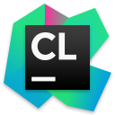

## CLion简介：

CLion是**JetBrains**旗下适用于 C 和 C++ 的跨平台 IDE，有以下优点。

- ​    配置简单：只需要点几下鼠标就可以完成编译器配置。
- ​    语法查错：很多语法错误可以在编译之前就报错并标注出来。
- ​    潜在问题警告：如可能出现的死循环，野指针，数组越界，全局变量和局部变量同名等。
- ​    调试方便：可以查看变量情况，内存情况，对应汇编指令。
- ​    更加智能的自动补全
- ​    统一代码风格：设置代码风格后，会自动标注并纠正，有助于小白养成良好习惯。

那么，代价是什么？CLion的缺点同样明显：巨能吃内存，随随便便打开一个项目就能占用内存到1G。性能开销很大，在重新加载cmake或切换编译器时，都会有非常明显的卡顿。

相比于VScode的“毛坯房”，CLion就是专为 C 和 C++ 建造的“精装房”。

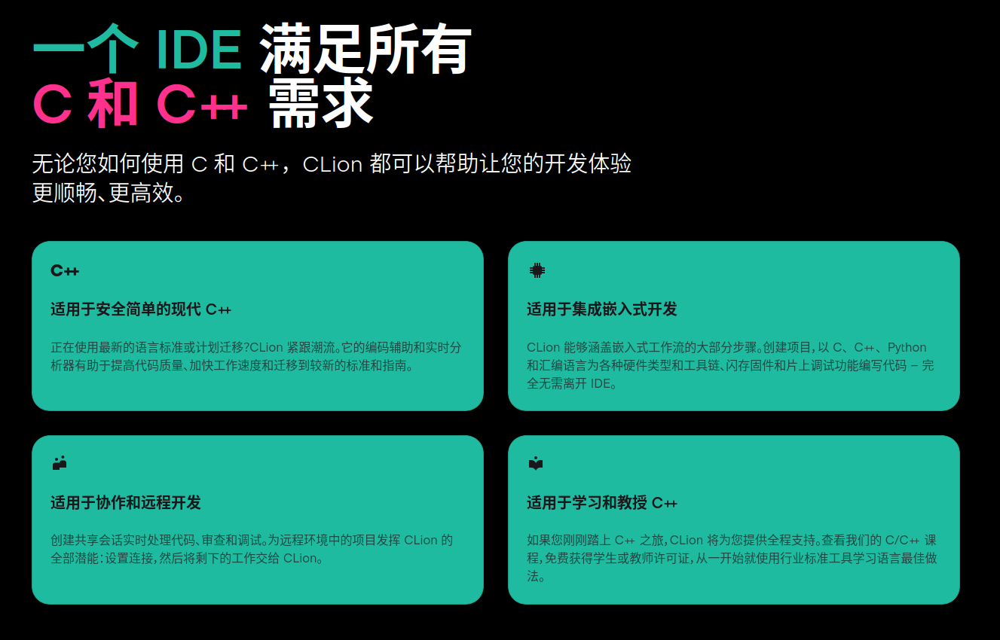

## 安装包下载：

方法一：

> 官网下载链接：[CLion:JetBrains 出品的 C 和 C++ 跨平台 IDE](https://www.jetbrains.com.cn/clion/)

本地文件：

暂时无法在飞书文档外展示此内容

方法二：

如果你使用 Ubuntu 16.04 或更高版本，可以使用命令行安装 CLion。

```
sudo snap install clion --classic
```

## 解压安装：

CLion-xxxx.x.x是你下载的CLIon版本，例如：CLion-2024.1.4

解压安装包

```Bash
gzip -d CLion-xxxx.x.x.tar.gz
tar -xvf CLion-xxxx.x.x.tar
```

将安装包复制到`\opt`中

```Bash
sudo cp -rf cLion-xxxx.x.x /opt
```

Stop，注意，CLion为付费软件，如需要破解，先看这篇文章：[CLion激活](https://sip23ceo24h.feishu.cn/wiki/K76TwpRBoiJvfYkbaCIcfc5Fnag)

执行安装并启动程序

```Bash
 cd /opt/cLion-xxxx.x.x/bin
 sh clion.sh
```

安装完成

每次启动需要执行命令 `sh /opt/cLion-xxxx.x.x/bin/clion.sh`，这个麻烦待会解决，先解决语言问题。

设置中文

打开设置，选择Plugins(插件)，搜索Chinese，如下图所示，安装并重启IDE就设置完成了

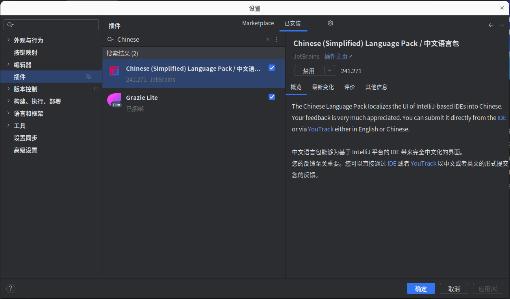

## 创建快捷方式：

每一次启动它都需要执行 `sh /opt/cLion-xxxx.x.x/bin/clion.sh`，通过创建桌面快捷方式解决这个麻烦

```Bash
gedit ~/.local/share/applications/clion.desktop
```

在打开的文本编辑器中，输入以下内容：

注意clion-xxxx.x是你安装的版本，在`/opt`目录下可以看到

```TOML
[Desktop Entry]
Type=Application
Name=CLion
Exec=/opt/clion-xxxx.x/bin/clion.sh
Icon=/opt/clion-xxxx.x/bin/clion.png
Comment=The Drive to Develop
Categories=Development;IDE;
```

保存并关闭文件

在终端中，运行以下命令以使`.desktop`文件可执行：

```Bash
chmod +x ~/.local/share/applications/clion.desktop
```

现在，你可以在应用程序菜单中找到CLion的快捷方式，点击即可启动CLion

## 配置项目：

如果只是刚入门，只使用C++的库，可以先不了解这个主题的内容，一般下载好就可以使用了

1. ### 编译器配置

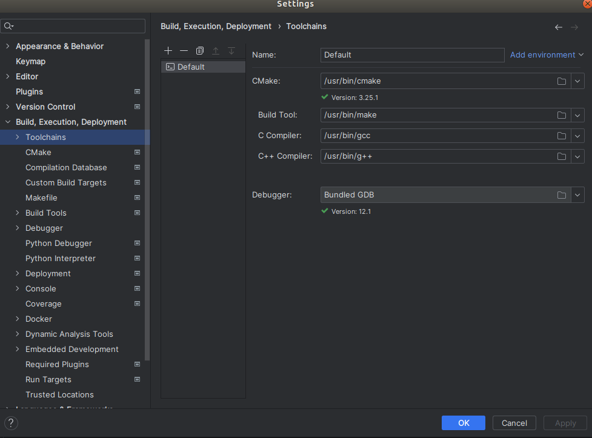

1. ### cmake配置

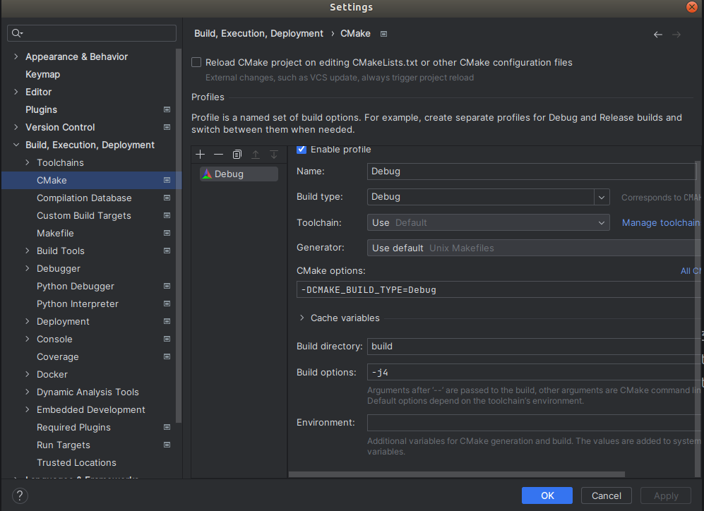

1. ### clion是如何运行项目的

clion是通过cmake编译运行项目的，而cmake编译运行项目可以分为三个步骤：

一是`cmake <source tree>` ，比如`cmake ..` ，用于生成了项目文件project files；

二是`cmake --build .` build的功能就是依据当前系统的编译器自适应的构建项目（或者说编译链接项目），当你明确知道自己系统的编译器是Unix Makefiles，也可以直接使用`make`进行项目构建；

三是运行编译好的可执行文件，比如`./main`;

回归到clion中，前面两个步骤其实就是配置编译器的路径和cmake的命令行参数，配置好后运行一个项目其实也和cmake一样分为三个步骤：

一是`cmake ..` ，clion在打开项目时会自动`cmake ..`一遍，默认是生成在cmake-build-debug文件夹中，当然也可以手动执行：右键项目，选择`reload cmake project`；每当你修改了CMakeLists.txt文件后都需要r`eload cmake project`，所以我建议设置一个r`eload cmake project`的快捷键；

二是`cmake --build .` ，就是对应clion中的build按钮的功能，如果报错说：Error: could not load cache，那就是你没有完成步骤一的`reload cmake project` ；

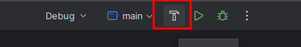

三是`./main`，clion中的run按钮，其实run按钮会同时完成步骤二和步骤三，也就是run会先build，然后运行可执行文件；

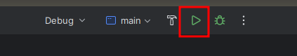

最后一个七星瓢虫一样的图案就是调试代码，比起VScode调试代码还要配置半天要简单多了。

## 添加库文件路径：

若要使用库文件，但CLion默认的寻找路径没有包含到，需要这样添加，下面用OpenCV举例子。

新创建的项目并没有能搜索到OpenCV的路径。

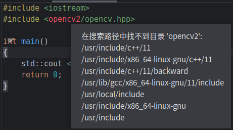

在CMakeLists.txt中添加` find_package(OpenCV REQUIRED) `和 

```
target_link_libraries(OpenCV_Project  ${OpenCV_LIBS})
```

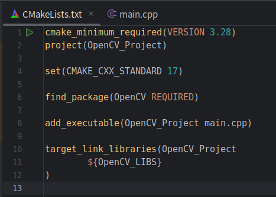

右键点击左侧的 cmake-build-debug 文件夹 选择 重新加载CMake项目  相当于重新make后去加载路径

此时就找到了OpenCV的路径

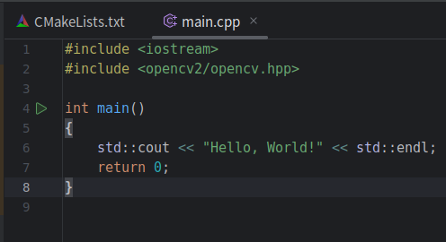

当前目录的一些头文件可以用以下方式：

我需要使用 `nx_refs/include/nx_refs.h` 这个头文件

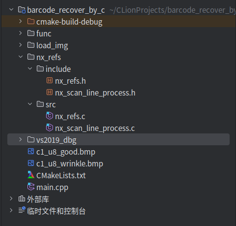

在CMakeLists.txt 添加：

```CMake
link_directories (${PROJECT_SOURCE_DIR}/nx_refs)
include_directories(${PROJECT_SOURCE_DIR}/nx_refs)
```

记得在`add_executable`后面加上该文件（我这边nx_refs.c中包含了nx_refs.h，只需要加nx_refs.c）

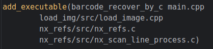

## 调试ROS项目：

## 调试ROS2项目：

本教程介绍如何将 CLion 用作 IDE，以开发使用 colcon 构建的 ROS2 应用程序 [colcon](https://colcon.readthedocs.io/en/released/)。

下面是用来测试的工作空间，包含简单的发布者和订阅者，可以直接解压出来使用。

暂时无法在飞书文档外展示此内容

## 参考文章：

> 原文链接：[Ubuntu下安装Clion_ubuntu安装clion-CSDN博客](https://blog.csdn.net/caiqidong321/article/details/130126200)
> 
> 原文链接：[CLion安装、配置、使用、调试(完全小白向)-CSDN博客](https://blog.csdn.net/annesede/article/details/133940779)
> 
> 原文链接：[ROS2 setup tutorial | CLion](https://www.jetbrains.com.cn/en-us/help/clion/ros2-tutorial.html)