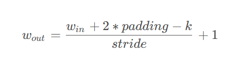
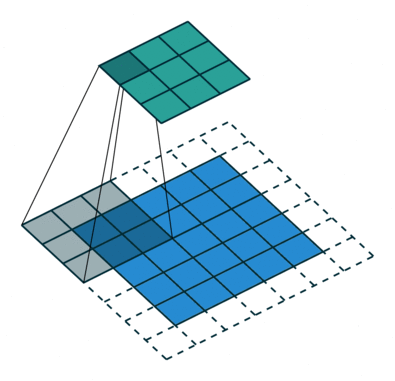
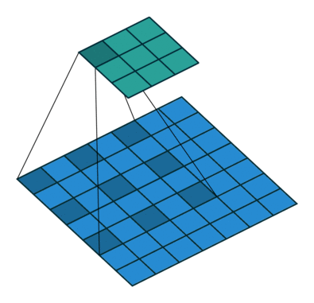
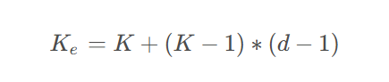

# 深度学习基础

## 初识神经网络

神经网络是如何实现对图像的识别的？即使在光照条件和画质条件不好的情况下也可以，是黑魔法吗？

当然不，计算机从来就没有什么黑魔法，神经网络也不是一个黑盒子，但在具体认识神经网络之前先把它看做黑盒子。

> 讲个冷笑话，一只鸡走进去一个盒子，走出来的时候变成了一只鸭子，请问这个盒子里有什么？
>
> 
>
> 答是：盒子里有变压(鸭)器。

回到原本的问题，神经网络是如何实现对图像的识别的？同样的我们先来看看神经网络完成一个什么样的工作。

和上面冷笑话一样，往变压(鸭)器里输入的是鸡，输出的是鸭，而往神经网络里输入的是图片，输出的是识别结果，这时候我们来猜一下神经网络里是什么？

暂时无法在飞书文档外展示此内容

它似乎和我们学过的一种名为“函数”的表达式一样，往f(x)里输入的是x，输出的是y，可以对应起来，图像就相当于x，识别结果就相当于y，神经网络就是f(x)，f(x)是x对于y的一个表达式，那么神经网络就是图像对于识别结果的一个表达式。

## 神经网络的结构

### 卷积层

在卷积神经网络中，卷积操作是指将一个**可移动的小窗口**（称为数据窗口）与图像进行**逐元素相乘然后相加**的操作。这个小窗口其实是一组固定的权重，它可以被看作是一个特定的滤波器（filter）或**卷积核**。

**应用：**用于提取图像特征，改变图像尺寸和维度

#### **特征图尺寸计算**

其中，padding为特征图填充圈数，主要目的是确保卷积核能够覆盖输入图像的边缘区域，同时保持输出特征图的大小，k为卷积核大小，stride为步长。

**例如：**输入图片大小为200 × 200 200×200200×200，依次经过一层卷积（kernel size 5 × 5 ，padding 1，stride 2），pooling（kernel size 3 × 3，padding 0，stride 1），又一层卷积（kernel size 3 × 3，padding 1，stride 1 ）之后，输出特征图大小为多少？

**解答：**经过第一次卷积后的大小为: 本题 （ 200 − 5 + 2 ∗ 1 ） / 2 + 1 为 99.5 （200-5+2*1）/2+1 为99.5，取99。经过第一次池化后的大小为：（ 99 − 3 ） / 1 + 1 为 97，经过第二次卷积后的大小为：（ 97 − 3 + 2 ∗ 1 ） / 1 + 1 为 97

#### **反卷积**

反卷积又叫做转置卷积，在计算机中计算的时候，转置卷积先将卷积核转为稀疏矩阵C的形式，然后计算的时候正向传播的时候左乘这个稀疏矩阵C的转置，反向传播的时候左乘这个稀疏矩阵C。

> 稀疏矩阵是一种特殊类型的矩阵，其大多数元素都是零或接近零

**反卷积的运算过程与卷积正好相反，是正向传播时左乘C的转置，反向传播时左乘C**

#### 1x1卷积作用

1. 实现卷积核通道数的降维和升维；
2. 减少参数量和计算量(先用少量普通卷积核再升维，或先降维再普通卷积等可以减少参数量以及计算量)；
3. 实现多个特征图的线性组合，而且可实现与全连接层的等价效果。

#### 深度可分离卷积DSConv

1. 对数据进行通道分离
2. 对每个数据分别进行卷积核数为1的卷积(DW，Conv参数不共享)
3. 将映射堆叠在一起
4. 使用点卷积升维(PW)

####  空洞卷积

空洞卷积（Dilated Convolution），也称为膨胀卷积或者孔卷积，通过在卷积核中引入间隔（dilation rate），使卷积核在输入特征图上跳跃式地执行卷积操作，从而扩大了感受野，而不增加参数量。

在物体检测中，它可以用于提取不同尺度的特征以便于检测不同大小的物体。

其中，K为空洞卷积的卷积核，d为空洞数。

**优点：**

1. 更大的感受野：它可以捕获更广泛区域的信息，有助于处理多尺度的特征。
2. 参数效率：与传统的卷积相比，它不增加参数数量，因此在一定程度上减少了模型的复杂性。
3. 降低过拟合：由于参数量较少，它有助于降低模型的过拟合风险。

### 关于神经网络的一些特点

#### 神经网络的深度和宽度

神经网络的深度决定了网络的表达能力，早期的backbone设计都是直接堆叠卷积层，它的深度指的是神经网络的层数；后来的backbone设计采用了更高效的module（或block）堆叠的方式，每个module是由多个卷积层组成，这时深度指的是module的个数。

神经网络的宽度决定了网络在某一层学习到的信息量，指的是卷积神经网络中最大的通道数，由卷积核数量最多的层决定。通常的结构设计中卷积核的数量随着层数越来越多的，直到最后一层feature map达到最大，这是因为越到深层，feature map的分辨率越小，所包含的信息越高级，所以需要更多的卷积核来进行学习。通道越多效果越好，但带来的计算量也会大大增加，所以具体设定也是一个调参的过程，并且各层通道数会按照8×的倍数来确定，这样有利于GPU的并行计算。

## 推荐公开数据集网站：

> https://opendatalab.com/
>
> https://www.kaggle.com/
>
> https://www.flyai.com/
>
> https://tianchi.aliyun.com/
>
> https://aistudio.baidu.com/datasetoverview