# Git

Git 是一个免费且开源的分布式版本控制系统旨在处理从小到大的所有事情 非常快速和高效的大型项目。

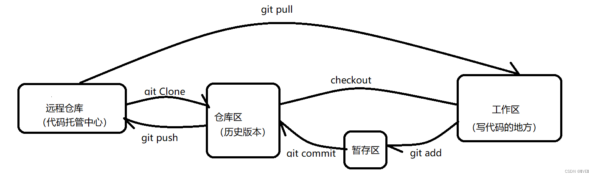

## 安装

- windows ： 在`cmd`或`powershell`中输入`winget install --id Git.Git -e --source winget`安装
- Ubuntu ： 默认安装，没有的话`sudo apt install git`

## 常用命令

### 克隆

```terminal
# 克隆远程仓库到本地（常用）
git clone <repo_url>

# 克隆指定分支的代码
git clone -b <branch> <repo_url>
```

### 本地仓库

```terminal
# 初始化当前目录为 Git 仓库
git init

# 加入远程仓库
git remote add origin <repo_url>

# 暂存更改
git add 

# 提交到本地参考
git commit -m "message"

# 推送代码到远程仓库
git push

# 在克隆的仓库下拉取最新代码
git pull
```

## 忽略文件

编译时会产生很多文件，这些文件会被git记录下来，造成臃肿，我们并不希望提交的时候提交这些编译产物，因此需要屏蔽他们。在git中，可以通过创建`.gitignore`文件，在里面写入不想要记录的文件名来屏蔽

```terminal
touch .gitignore

# 文件内容举例

build/
install/
log/
*.txt
```

## VScode

vscdoe给我们提供了可视化的git操作面板。现在提供如何使用vscode提交代码的教程

- 创建仓库

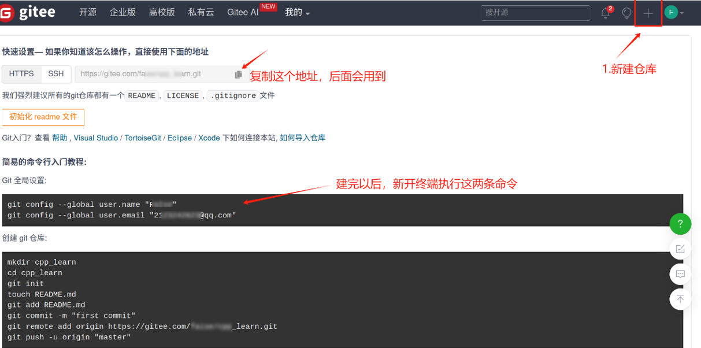

- 初始化仓库

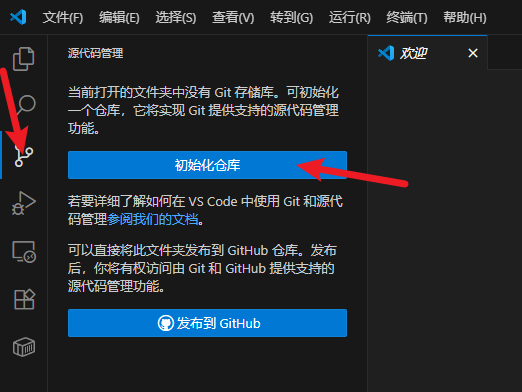

- 添加远程仓库

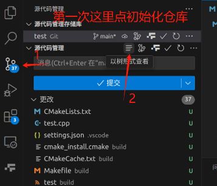

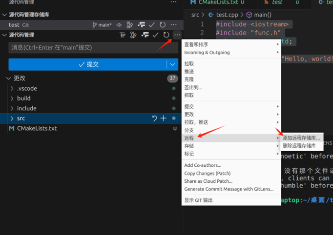

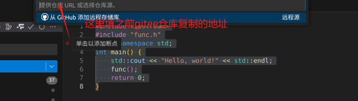

- 暂存更改

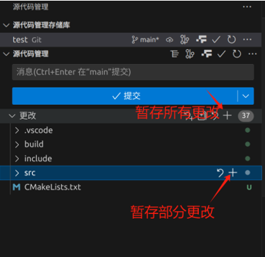

- 提交代码

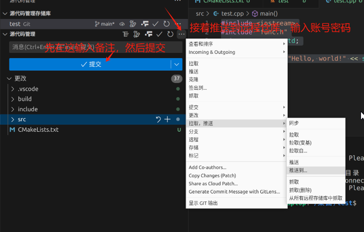

## [Gitee](https://gitee.com/)

- 按图示箭头点击

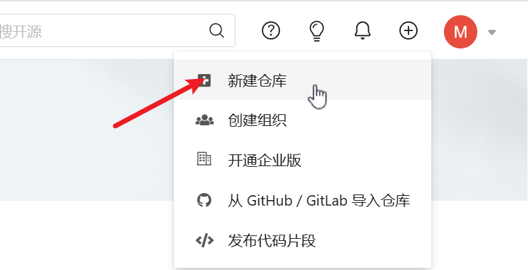

- 这里只需要设置仓库名称，然后点创建

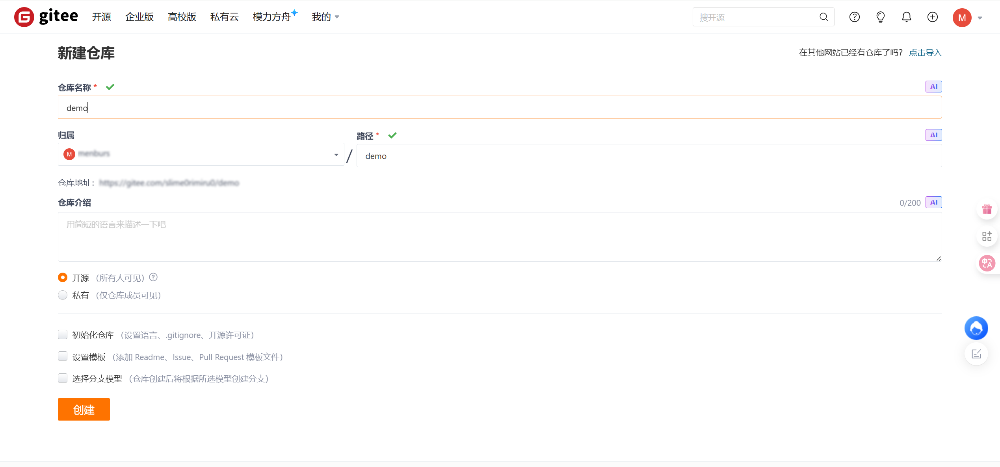

- 这里照着教程设置即可
  - 点击SSH
  - 依次在终端输入`Git全局设置`下的两行命令
  - 接下来分成是否已有仓库，即是自己在本地的项目里执行过`git init`。如果没有，选`创建 git 仓库`，如果有，选`已有仓库`。依次输入命令即可
  - 注意一开始的`mkdir`和`cd`这两个，注意路径问题

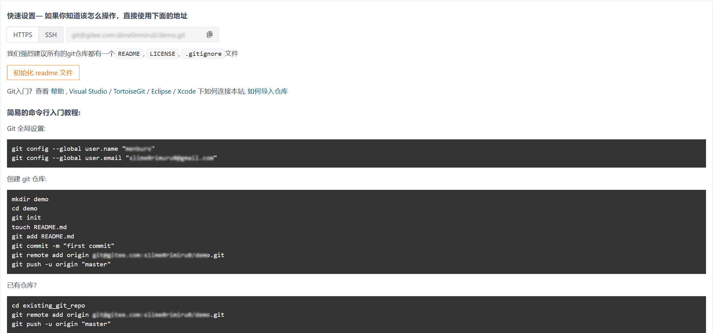

## [Github](https://github.com/)