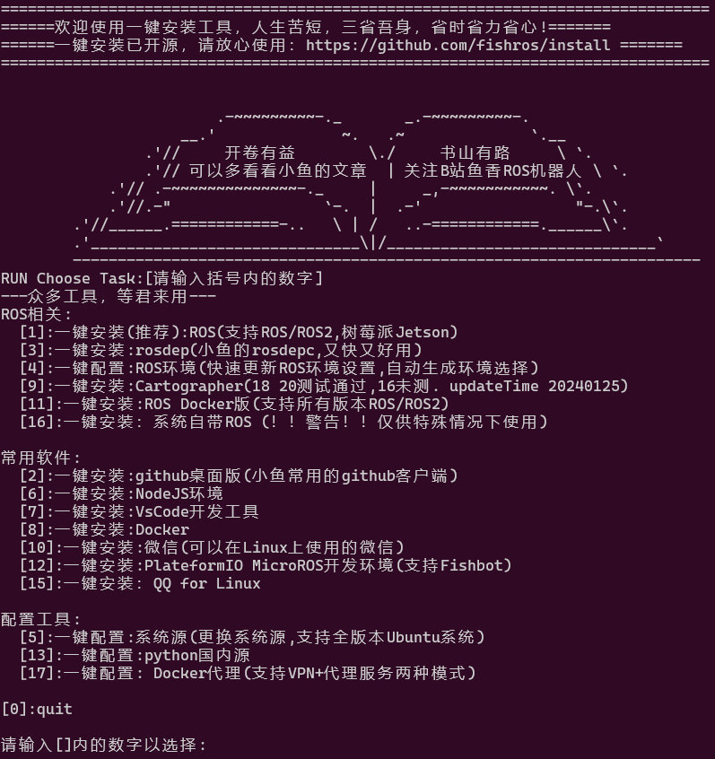
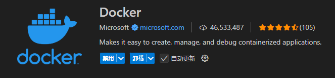
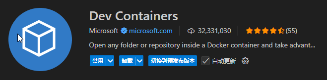
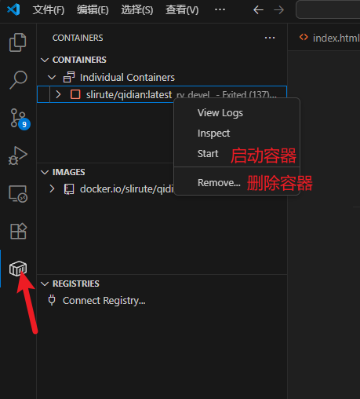
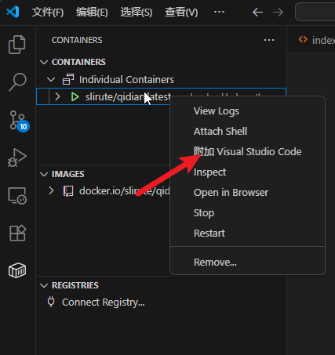

# Docker

Docker 可以让开发者打包他们的应用以及依赖包到一个轻量级、可移植的容器中，然后发布到任何流行的 Linux 机器上，也可以实现虚拟化。

容器是完全使用沙箱机制，相互之间不会有任何接口（类似 iPhone 的 app）,更重要的是容器性能开销极低。

## 安装

docker的安装分`Docker Engine`和`Docker Desktop`两种，这里只讲`Docker Engine`

- 法一：鱼香ros（推荐）

输入以下命令，选择docker安装

```bash
wget http://fishros.com/install -O fishros && . fishros
```



安装后还需要将用户加入 docker 用户组才能用 docker 命令

```bash
sudo usermod -aG docker $USER
```

- 法二：Docker Engine 安装（官方）

环境：Ubuntu

卸载系统自带 docker

```bash
for pkg in docker.io docker-doc docker-compose podman-docker containerd runc; do sudo apt-get remove $pkg; done
```

添加 docker 仓库

```bash
# 加入密钥
sudo apt-get update
sudo apt-get install ca-certificates curl
sudo install -m 0755 -d /etc/apt/keyrings
sudo curl -fsSL https://download.docker.com/linux/debian/gpg -o /etc/apt/keyrings/docker.asc
sudo chmod a+r /etc/apt/keyrings/docker.asc

# 加入资源库
echo \
  "deb [arch=$(dpkg --print-architecture) signed-by=/etc/apt/keyrings/docker.asc] https://download.docker.com/linux/debian \
  $(. /etc/os-release && echo "$VERSION_CODENAME") stable" | \
  sudo tee /etc/apt/sources.list.d/docker.list > /dev/null
sudo apt-get update
```

安装 docker

```bash
sudo apt-get install docker-ce docker-ce-cli containerd.io docker-buildx-plugin docker-compose-plugin
# 添加用户到 docker 组
sudo usermod -aG docker $USER
```

> 更多安装信息请看[docker install](https://docs.docker.com/engine/install/)

## 常用命令

```bash
# 拉取镜像
docker pull <镜像名:版本>

# 查看已下载的镜像
docker images
docker image ls 

# 查看已启动了的容器
docker container ls

# 查看创建的全部容器
docker ps -a

# 启动容器
docker start <容器名>

# 关闭容器
docker stop <容器名>

# 重启容器
docker restart <容器名>

# 进入容器终端
docker exec -it <容器名> bash

# 进入容器的logs
docker attach <容器名>

# 容器开机自启动
docker container update --restart=always <容器名>


```

## 镜像操作

```bash
# 将镜像打包成压缩文件
docker save <镜像名:版本> -o xxx.tar

# 通过压缩包加载镜像
docker load -i <xxx.tar>

# 重命名镜像名， TAG 由 docker images 看到
docker tag <旧镜像名:版本> <新镜像名:新版本>

# 发送镜像
docker save <镜像名:版本> | ssh user@ip "docker load"
```

## 容器构建

拥有一个 docker 镜像（image）后，想使用它就需要构建一个容器（container），相当于镜像是一个模板，每次使用时基于模板创建一个叫容器的虚拟机

基础的容器构建命令如下

```bash
docker run <镜像名:版本>
```

但我们一般都不会运行这么简单的命令

下面给出一条构建命令来讲解

```bash
docker run -it --name rv_runtime_ \
--privileged  -p 2222:22 -p 8765:8765 --restart always \
-v /dev:/dev -v $HOME/.ros:/root/.ros -v ~/rmvision2025:/ros_ws \
slirute/qidian:latest \
bash
```

- `-it`：允许用户与容器进行交互，类似于一个终端会话
- `--name rv_runtime_`：为容器指定名称 `rv_runtime_`，便于后续管理（如启动/停止）
- `--privileged`：赋予容器特权模式（相当于root），允许容器访问`/dev`的设备（摄像头、USB设备等）
- `-p 2222:22`：将主机的 2222 端口映射到容器的 22 端口，访问主机的222端口就是访问容器的22端口
- `--restart always`：容器退出时自动重启
- `-v ~/rmvision2025:/ros_ws`：将主机的`~/rmvision2025`挂载到容器中的`/ros_ws`目录，这样容器能访问到主机的文件
- `slirute/qidian:latest`：镜像:版本 ，指定使用的 Docker 镜像
- `bash`：容器启动后执行的命令，容器需要一个进程维持运行，如果进程结束，容器就会关闭

### 网络模式

容器的网络模式分为NAT模式和镜像模式，NAT是由主机给容器分发地址，镜像则是和主机共用端口和ip地址

## 已有镜像

```bash
# 2024赛季使用镜像
docker pull shark277/qidian:1.0

docker run -it --volume="/dev:/dev" --ipc=host --device /dev/dri --privileged  --env="DISPLAY" --env="QT_X11_NO_MITSHM=1" -v /dev/shm:/dev/shm  --volume="/tmp/.X11-unix:/tmp/.X11-unix:rw"  -v /home/blackpoor/dockerCode:/home --name qidian qidianimage bash

# 2025赛季使用镜像
docker pull slirute/qidian:latest

docker run -it --name rv_devel_ \
--privileged -p 2222:22 -p 8765:8765 \
-v /dev:/dev -v $HOME/.ros:/root/.ros -v ~/rmvision2025:/ros_ws \
slirute/qidian:latest \
ros2 launch foxglove_bridge foxglove_bridge_launch.xml

```

## Dockerfile

`Dockerfile`是构建镜像的文件名称，通过在`Dockerfile`中编写命令来自定义构建镜像

`Dockerfile`每一行是一个命令，`Dockerfile`的编写使用的是 CLI 命令，每一行的开端是一个关键字

在`Dockerfile`运行以下命令既可构建出镜像

```bash
docker build -t <image:version> . --progress=plain
```

- `--progress=plain`：查看构建过程

### FROM

制作 image 需要基于一个已有镜像，这里以 Ubuntu22 的 image 为例

```dockerfile
FROM ubuntu:22.04 
FROM ubuntu:22.04 AS amd64
FROM amd64 AS final
```

- `AS amd64`：重命名`ubuntu:22.04`为`amd64`,可加可不加

### RUN

`RUN` 是构建 image 内容的主要命令，后面接的是一连串的 CLI 命令，不能中断

每一个`RUN`代表一层，层数越多，相同操作构建的镜像大小越大，所以构建镜像是应经可能减少`RUN`的使用

```dockerfile
RUN apt update && apt install -y \
    vim && \
    apt clean && rm -rf /var/lib/apt/lists/* /tmp/* /var/tmp/*
```

### SSH

在构建镜像时，需要克隆下私有仓库，但明文使用密钥是危险的，所以在`Dockerfile`中这样写

```dockerfile
RUN --mount=type=ssh \
    mkdir -p ~/.ssh && \
    ssh-keyscan -H gitee.com >> ~/.ssh/known_hosts && \
    git clone git@gitee.com:ouzhigui/rmvision2025.git
```

使用以下命令构建镜像

```bash
eval "$(ssh-agent -s)"
ssh-add ~/.ssh/id_rsa
DOCKER_BUILDKIT=1 docker build -t <image:version> . --ssh default
```

### 外部传参数

在构建镜像时传入变量

```dockerfile
ARG THREADS=1
ENV THREADS=${THREADS}
```

构建时

```bash
docker build -t <image:version> . --build-arg THREADS=$(nproc)
```

### 启动脚本

用于在容器启动时自动配置环境变量并执行用户指定的命令

```dockerfile
RUN cat <<EOF > /rm_entrypoint.sh
#!/bin/bash
set -e

if [ -f "/opt/ros/\$ROS_DISTRO/setup.bash" ]; then
    source "/opt/ros/\$ROS_DISTRO/setup.bash"
fi

exec "\$@"
EOF
RUN chmod +x /rm_entrypoint.sh
ENTRYPOINT ["/rm_entrypoint.sh"]
```

## 上传镜像

上传镜像到 dcoker 社区上以便于别人下载

- 先去[Docker](https://www.docker.com/)注册个账号
- 终端使用`docker login`登陆账号
- 修改本地镜像名字`docker tag <image:version> [dockerhub-username]/[repository-name]:[tag]`
    - `[dockerhub-username]`是你的 Docker Hub 用户名
    - `[repository-name]`是你希望在 Docker Hub 上创建或使用的仓库名称（可以和你本地的镜像名称不同）
    - `[tag]`是你给镜像的版本标签（例如：latest 或 v1.0）。如果不指定标签，默认为 lates
- 推送镜像`docker push myusername/my-app:v1.0`

## VScode 开发

- 安装vscdoe扩展`Docker`、`Dev Containers`





- 使用扩展控制容器和附加进容器（在vscode中使用容器里的文件和终端）





## 跨平台构建镜像

> 前言：在一些 arm 架构的开发版上常常应为 CPU 性能弱，内存不足导致编译缓慢，为了直接部署环境使用 docker ，但开发板本身的性能导致了编译进度缓慢。借助 Docker 的 buildx 插件和 QEMU 模拟器，可以轻松实现**跨平台构建**，利用上 x86 的大内存和 CPU

- Docker Buildx: 是一个 Docker CLI 插件，它扩展了 docker build 命令，使其能够利用 Moby BuildKit 提供的全部功能。其最重要的特性之一就是支持多平台构建，允许您在单一主机上为多种不同的体系结构构建镜像。

- QEMU (Quick Emulator): 是一个开源的机器模拟器和虚拟化器。在跨平台构建 Docker 镜像的场景下，QEMU 允许您的 x86 主机模拟 ARM 环境，从而能够执行 ARM 架构的指令。buildx 会自动利用 QEMU 来运行非本地架构的二进制文件

### 环境

Docker

```bash
docker --version
docker buildx version
```

输入如下

```bash
qd@qd:~$ docker --version
docker buildx version
Docker version 28.5.1, build e180ab8
github.com/docker/buildx v0.29.1 a32761aeb3debd39be1eca514af3693af0db334b
```

如果提示命令不存在，请升级您的 Docker 版本

#### 安装 QEMU 和 binfmt_misc 支持

为了让 x86 内核能够识别并执行 ARM 等其他架构的二进制文件，需要配置 binfmt_misc。最简单的方法是运行一个特权容器来注册 QEMU 处理器模拟器

```bash
docker run --rm --privileged multiarch/qemu-user-static --reset -p yes
```

这个命令会下载并运行一个镜像，该镜像会自动为多种架构（包括 arm64 和 arm/v7）配置 QEMU 模拟器。只需运行一次即可

#### 创建和使用 Buildx 构建器

buildx 使用“构建器（builder）”实例来执行构建任务。默认情况下可能有一个构建器，但为了获得更好的多平台构建支持，建议创建一个新的构建器

```bash
docker buildx create --name <名字> --use
```

- `--name <名字>`: 为您的构建器指定一个名称（您可以自定义）。
- `--use`: 创建后立即切换到这个新的构建ter。

创建后，可以检查构建器的状态，确保它支持您需要的目标平台

```bash
docker buildx inspect --bootstrap
```

在输出的 Platforms 部分，能看到 linux/amd64（您的本地架构）以及 linux/arm64, linux/arm/v7 等多种其他架构。这表明环境已准备好进行跨平台构建

### 构建跨平台镜像

dockerfile 并不需要改变

```bash
docker buildx build --platform linux/arm64 -t <image:version> . --load
```

## 常见问题

### 无法开机自启loaded failed failed LSB

```bash
systemctl list-units --type=service # 查看已启动服务
# 出现如下则本教程适用
docker.service
loaded failed failed  LSB: Create lightweight, portable, self-sufficient containers.
```

运行`wget -qO- ``https://get.docker.com/`` | sh`即可解决

```bash
systemctl list-unit-files | grep docker //查看是否自启动

systemctl enable docker.service //运行开机自启
```

