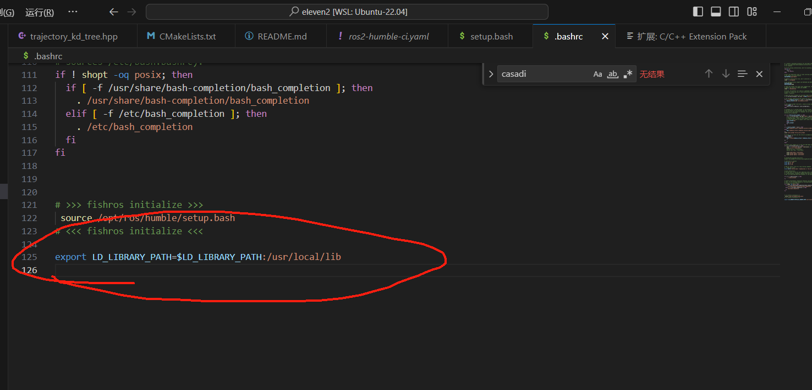
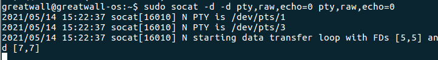

# Linux的零碎教程

> 存放一些在使用 Linux 中的常见操作和行为

## **Linux将一个文件夹或文件夹下的所有内容复制到另一个文件夹**

将一个文件夹下的所有内容复制到另一个文件夹下

> `cp -r /home/packageA/* /home/cp/packageB/` 或 `cp -r /home/packageA/. /home/cp/packageB/` 这两种方法效果是一样的。

方法示例：


## **linux下解压zip文件命令：**

```Bash
1、把/home目录下面的data目录压缩为data.zip
zip -r data.zip data #压缩data目录
2、把/home目录下面的data.zip解压到databak目录里面
unzip data.zip -d databak
3、把/home目录下面的a文件夹和3.txt压缩成为a123.zip
zip -r a123.zip a 3.txt
4、把/home目录下面的t.zip直接解压到/home目录里面
unzip t.zip
5、把/home目录下面的a1.zip、a2.zip、a3.zip同时解压到/home目录里面
unzip a*.zip
6、把/home目录下面w.zip里面的所有文件解压到第一级目录
unzip -j wt.zip
```

## linux下run文件怎么安装：

如何在Linux下使用run文件安装软件

> 原文链接：[linux下run文件怎么安装:如何在Linux下使用run文件安装软件-CSDN博客](https://blog.csdn.net/weixin_44591885/article/details/133082715)

在Linux下安装run文件的步骤如下：打开终端，使用cd命令进入run文件所在的目录。asdf

在Linux下安装run文件的步骤如下：

1. 打开终端，使用cd命令进入run文件所在的目录
2. 使用`chmod +x `命令赋予可执行权限，例如：**`chmod +x filename.run`**
3. 使用`./filename.run`命令运行run文件，例如：**`./filename.run`**
4. 根据提示操作，一般会提示按回车键确认，或者输入yes/no等，按照提示操作即可。

## **Linux中PATH、 LIBRARY_PATH、 LD_LIBRARY_PATH的区别:**

[Linux中PATH、 LIBRARY_PATH、 LD_LIBRARY_PATH的区别_ld_library_path library_path 区别-CSDN博客](https://blog.csdn.net/weixin_48859611/article/details/113986310)



**Export** 

用于在程序运行期间查找**动态链接库**，**指定动态库的位置**。

**LD_LIBRARY_PATH**

> **主要是用于指定动态链接器（ld）查找****ELF****可执行文件运行时所依赖的动态库（so）的路径。即用于在程序运行期间查找****动态链接库****时，指定除了系统默认路径(/usr/lib)之外的路径.**

## **linux下串口调试 虚拟串口安装：**

1. 安装socat：

```Bash
sudo apt-get install socat
```

\2. 链接虚拟串口：

```Bash
sudo socat -d -d pty,raw,echo=0 pty,raw,echo=0
```

可以看到控制台消息如下，/dev/pts/1与/dev/pts/3虚拟通信了。接下来可以通过cutecom等串口工具进行调试。



原文链接：[实现Linux虚拟串口(使用socat)_在linux中运行虚拟串口管理软件-CSDN博客](https://blog.csdn.net/yaojinjian1995/article/details/116793505)

## **Cutecom串口工具安装与使用：**

[[Ubuntu\]Cutecom工具安装与使用_cutecom怎么用-CSDN博客](https://blog.csdn.net/weixin_49553049/article/details/114877684?ops_request_misc=&request_id=&biz_id=102&utm_term=ubuntu安装cutecom&utm_medium=distribute.pc_search_result.none-task-blog-2allsobaiduwebdefault-1-114877684.nonecase&spm=1018.2226.3001.4187)

## **Linux下USB设备节点ttyUSB名不固定的问题，生成固定USB转串口设备节点**

[Ubuntu下串口号端口号ttyUSB0和ttyUSB1不固定?-CSDN博客](https://blog.csdn.net/m0_37827405/article/details/89287876?ops_request_misc=&request_id=&biz_id=102&utm_term=固定dev/ttyusb0串口发数据每次固定的对应的USB口&utm_medium=distribute.pc_search_result.none-task-blog-2~all~sobaiduweb~default-1-89287876.nonecase)

## linux下使用vscode无法使用F5编译(变成Fn的功能键)

[ubuntu的键盘F1～F12没有反应/出现问题(被系统强制为功能键了)](https://blog.csdn.net/u012011079/article/details/128173294#:~:text=一、修改配置. 二、)

```Shell
echo options hid_apple fnmode=2 | sudo tee /etc/modprobe.d/hid_apple.conf

echo options hid_apple fnmode=0 | sudo tee /etc/modprobe.d/hid_apple.conf

sudo update-initramfs -u -k all

sudo reboot//重启
```

## ubuntu与windows时间不同步

```Bash
sudo apt-get install ntpdate      //在Ubuntu下更新本地时间
sudo ntpdate time.windows.comsudo 
hwclock --localtime --systohc     //将本地时间更新到硬件上
```

## ubuntu右键没有"从终端中打开"

```Shell
sudo apt update

sudo apt install nautilus-extension-gnome-bash

//注销后重新登录
```

## ubuntu下ssh连接密钥

[SSH生成SSH密钥(公钥和私钥)-CSDN博客](https://blog.csdn.net/qq_43420088/article/details/139775270)

## ubuntu修改grub默认启动项

https://zhuanlan.zhihu.com/p/552895466

## ROS2 下 `ros2 topic list`没有响应

输入即可

```bash
ros2 daemon start
```
