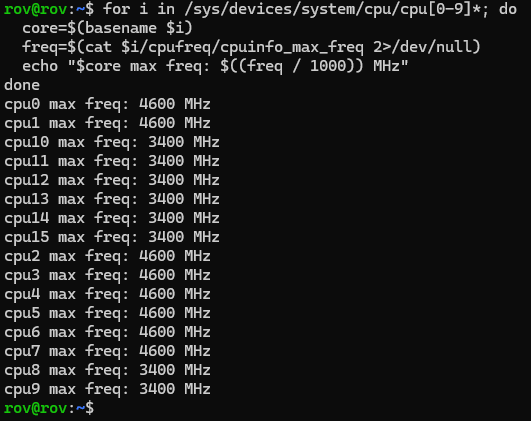

# 关闭 CPU 核心

在使用 Linux 时，我们有时会因为各种原因想要关闭特定的 CPU 核心，想减少功耗，关闭小核

## 查看频率

```bash
for i in /sys/devices/system/cpu/cpu[0-9]*; do
  core=$(basename $i)
  freq=$(cat $i/cpufreq/cpuinfo_max_freq 2>/dev/null)
  echo "$core max freq: $((freq / 1000)) MHz"
done

```

输出如下


## 关闭核心

以 root 用户运行以下命令即可关闭，把`cpu1`替换成你想关闭的核心,该命令可以临时关闭核心，重启后失效

```bash
sudo su
echo 0 > /sys/devices/system/cpu/cpu1/online
```

## 自启动

使用 systemd 服务实现开机自动关闭核心

- 创建服务文件

```bash
sudo nano /etc/systemd/system/disable-cpu-cores.service
```

- 服务内容

```terminal
[Unit]
Description=Disable CPU cores at boot
After=sysinit.target

[Service]
Type=oneshot
ExecStart=/bin/bash -c "echo 0 > /sys/devices/system/cpu/cpu1/online"
ExecStart=/bin/bash -c "echo 0 > /sys/devices/system/cpu/cpu2/online"

[Install]
WantedBy=multi-user.target
```

- 启用并启动服务

```bash
sudo systemctl enable --now disable-cpu-cores.service
```

- 使用`htop`验证核心数有没有减少
