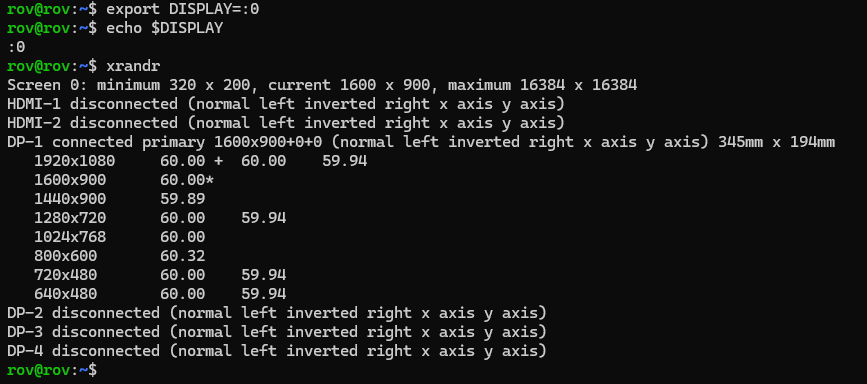

# xrandr

X11 窗口系统配置管理工具

## 查看显示器

```bash
# 查看当前输出的显示器
echo $DISPLAY
# 指定输出的显示器
export DISPLAY=:0
# 查看显示屏输出的端口名
xrandr
```

输入如下



- `$DISPLAY`是我们在终端中想操作的显示器指代，会影响到后面`xrandr`控制的屏幕
- `DP-1`是目前在使用的显示器，在使用的显示器下面都会显示多个可选的分辨率

## 修改分辨率

输入用`xrandr`获得的分辨率数据，以下命令是修改成分辨率`1920x1080`和帧率`60`

```bash
xrandr --output HDMI-1 --mode 1920x1080 --rate 60
```

## 创建新分辨率

创建新分辨率时请保证`DISPLAY`存在，即必须接上物理显示屏，并设置终端环境的`DISPLAY`为物理显示器的

- 使用 cvt 生成对应的 Modeline

```bash
cvt 1024 600
# 输出如下

# 1024x600 59.85 Hz (CVT) hsync: 37.35 kHz; pclk: 49.00 MHz
Modeline "1024x600_60.00"   49.00  1024 1072 1168 1312  600 603 613 624 -hsync +vsync
```

- 添加新模式

```bash
xrandr --newmode "1024x600_60.00"   49.00  1024 1072 1168 1312  600 603 613 624 -hsync +vsync
```

- 添加到显示器

```bash
xrandr --addmode DP-1 "1024x600_60.00"
```

- 应用新分辨率

```bash
xrandr --output DP-1 --mode "1024x600_60.00"
```

## 开机自启

设置完分辨率后我们发现重启就失效了，需要把命令全部冲打一遍，如果想要开机就自动设置分辨率的话，可以参考以下设置方法

- 创建切换分辨率脚本

```bash
nano ~/set-resolution.sh
```

输入以下内容

```bash
#!/bin/bash
#sleep 5    # 等待 5s 延迟，可能需要
xrandr --newmode "1024x600_60.00"   49.00  1024 1072 1168 1312  600 603 613 624 -hsync +vsync
xrandr --addmode DP-1 "1024x600_60.00"
xrandr --output DP-1 --mode "1024x600_60.00"
echo "分辨率脚本已运行" >> ~/xrandr_log.txt
```

赋予可执行权限

```bash
chmod +x ~/set-resolution.sh 
```

- 创建自启动桌面文件

```bash
mkdir -p ~/.config/autostart
nano ~/.config/autostart/set-resolution.desktop
```

输入以下内容

```bash
[Desktop Entry]
Type=Application
Exec=/home/用户名/set-resolution.sh
Hidden=false
NoDisplay=false
X-GNOME-Autostart-enabled=true
Name=SetResolution
Comment=Set custom resolution at startup
```

## 自启动脚本

### 开启脚本

如何使用

```bash
chmod +x setup_resolution_once.sh
# 用法示例 
./setup_resolution_once.sh 1024 500 DP-1
# 如果不传参数，默认使用 1024x600 DP-1
./setup_resolution_once.sh
```

脚本内容

```bash
#!/bin/bash

# ========= 🧩 参数处理 =========
RES_WIDTH=${1:-1024}
RES_HEIGHT=${2:-600}
OUTPUT_NAME=${3:-"DP-1"}
REFRESH=60
MODE_NAME="${RES_WIDTH}x${RES_HEIGHT}_${REFRESH}.00"
SCRIPT_PATH="$HOME/.local/bin/set-resolution.sh"
AUTOSTART_PATH="$HOME/.config/autostart/set-resolution.desktop"
LOGFILE="$HOME/xrandr_setup_log.txt"
# ==============================

echo "📋 配置参数：${RES_WIDTH}x${RES_HEIGHT} @${REFRESH}Hz on ${OUTPUT_NAME}"

# 创建目录
mkdir -p ~/.local/bin
mkdir -p ~/.config/autostart

# ======= ✨ 写入分辨率设置脚本 =======
cat > "$SCRIPT_PATH" <<EOF
#!/bin/bash
sleep 5
echo "[\$(date)] 设置分辨率开始" >> "$LOGFILE"

# 获取 Modeline 并解析
read -r MODE_NAME MODE_PARAMS <<< \$(cvt $RES_WIDTH $RES_HEIGHT $REFRESH | grep Modeline | sed 's/Modeline //')

# 检查模式是否已存在
if ! xrandr | grep -q "\$MODE_NAME"; then
    xrandr --newmode \$MODE_NAME \$MODE_PARAMS
    xrandr --addmode "$OUTPUT_NAME" \$MODE_NAME
fi

# 设置输出分辨率
xrandr --output "$OUTPUT_NAME" --mode \$MODE_NAME
echo "[\$(date)] 分辨率设置完成: \$MODE_NAME 到 $OUTPUT_NAME" >> "$LOGFILE"
EOF

chmod +x "$SCRIPT_PATH"

# ======= 🧷 写入自启动文件 =======
cat > "$AUTOSTART_PATH" <<EOF
[Desktop Entry]
Type=Application
Exec=$SCRIPT_PATH
Hidden=false
NoDisplay=false
X-GNOME-Autostart-enabled=true
Name=SetResolution
Comment=Auto set resolution at startup
EOF

chmod +x "$AUTOSTART_PATH"

# ======= ✅ 结果输出 =======
echo "✅ 脚本和自启动项已生成！"
echo "📜 脚本位置：$SCRIPT_PATH"
echo "🚀 自启动项：$AUTOSTART_PATH"
echo "🧾 日志查看：cat $LOGFILE"

```

### 删除自启动

```bash
rm -rf ~/.local/bin/set-resolution.sh ~/.config/autostart/set-resolution.desktop
```
