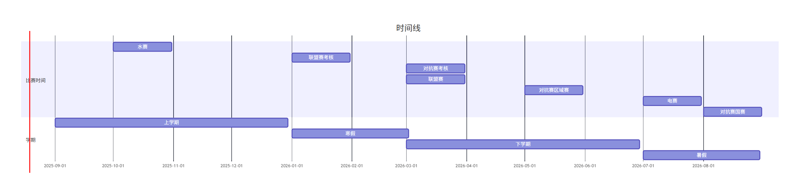

# 学习路线

[培训资料汇总](https://gitee.com/slime0rimiru0/2026-rm_training)

[OpenCV培训资料](https://gitee.com/slime0rimiru0/opencv_education)

## 大一上（第一阶段）

 [算法组第一阶段学习路线.pdf](算法组第一阶段学习路线.pdf)

- 导论
- Ubuntu与CMake
- C++（四讲）
- Git和markdown

进行一次C++考核，使用git提交到gitee，考查规范

## 寒假（第二阶段）

 [算法组第二阶段学习路线.pdf](算法组第二阶段学习路线.pdf)

- 视觉组 —— OpenCV、PNP
- 导航组 —— ROS2（赵虚左）、C++11

对视觉组进行考核，opencv装甲板识别+仿射变换+PNP。对人员初步筛选，有能者在大一下有比赛的会带上

## 大一下（第三阶段）

 [算法组第三阶段学习路线.pdf](算法组第三阶段学习路线.pdf)

- 视觉组——ROS2（赵虚左）、相机模型、神经网络
- 导航组——鱼香ROS

放网课，不开设线下课，主要在群里提供答疑

考虑在联盟赛前进行一次小测试，有能者带去调车打RM

## 暑假（正式队员）

对视觉组考核ros2和pnp，解算装甲板三维坐标，算yaw、pitch发布话题，实车检验

```gantt
 title 时间线
    dateFormat  YYYY-MM
    section 比赛时间
    水赛: 2025-10,30d
    联盟赛考核:  2026-1,30d
    对抗赛考核:  2026-3, 30d
    联盟赛:      2026-3, 30d
    对抗赛区域赛: 2026-5,30d
    电赛:   2026-7,30d
    对抗赛国赛: 2026-8,30d
    section 学期
    上学期: 2025-9,120d
    寒假:   2026-1,60d
    下学期: 2026-3,120d
    暑假: 2026-7,60d
```


