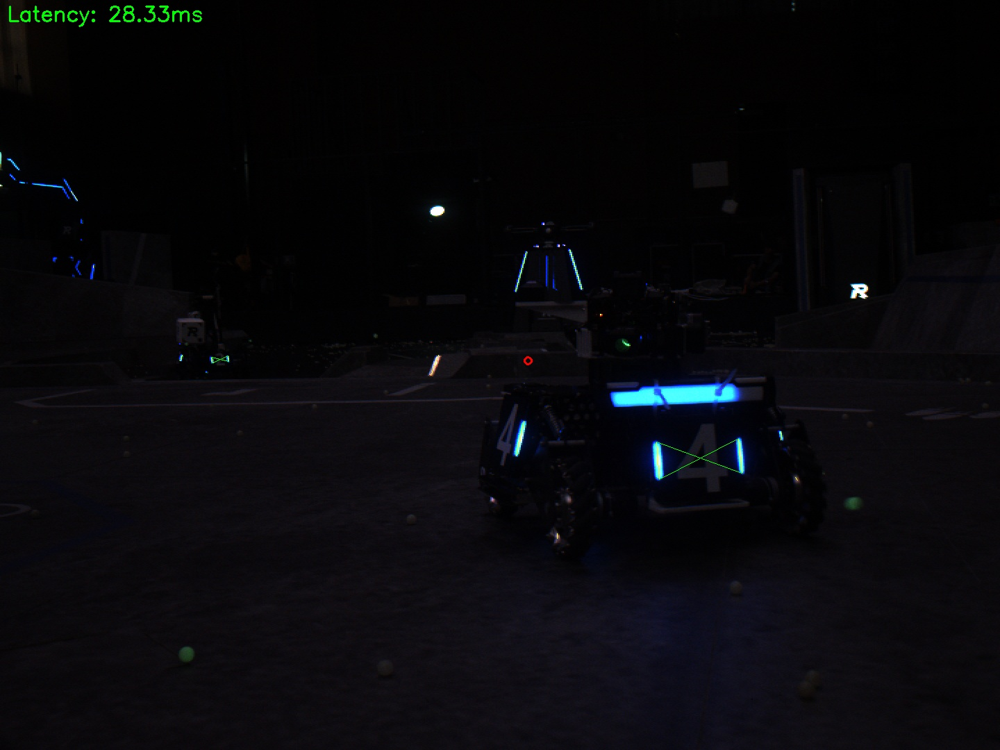

# 寒假考核

考核是为了检验梯队的学习成果，把握梯队的学习进度以做适应性调整，同时找到能一起做项目的成员重点培养

> 涉及的知识会在学习路线中有所提及
>
> 考核期间可以询问题目问题和技术引导，但不能明确告知答案，应让考核成员独立思考，适当给予引导

## 基础题

- 使用 gitee 仓库提交考核的内容
  - 仓库中不应有编译产物（build文件夹等，学会`.gitignore`的使用）
  - 要使用 `include`和`src`文件夹来分别存放头文件和源文件
- 使用 OpenCV 识别装甲板的角点（装甲板灯条）
  - 可视化角点，并可视化角点顺序（角点的识别应稳定，不能有误识别）
  - 可视化识别的装甲板颜色（动态分辨红蓝装甲板）
  - 可视化装甲板的中心点
- 使用透视变换得到装甲板贴纸
  - 可视化正视图的装甲板贴纸
- 使用 cmake 编写程序
- 撰写运行程序的教程 README.md（相当于使用说明书）
  - 需要让审核的能根据写的 README.md 就能运行代码，运行不起来算考核失败

以下图片仅供参考

> 涉及知识点：
>
> cmake、OpenCV、Ubuntu 命令、markdown 编写

## 提高题

提高题考查梯队的自主学习能力和信息检索能力，是需要自己查找资料完成的

- 使用 YAML 开源库`yaml-cpp`实现传参
  - 通过修改 yaml 文件即可修改识别用的视频路径
- PNP测距并可视化装甲板坐标系下的 xyz 轴
  - 可视化装甲板相对于相机的三维坐标
  - 可视化装甲板坐标系的 xyz 轴（重投影）

> 涉及知识点：
>
> cv::solvepnp 函数、相机模型、yaml-cpp 库
