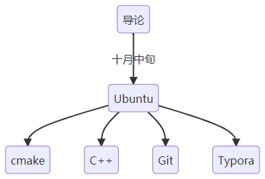

# 算法组第一阶段学习路线

**C++** （重点编程语⾔）
学习参考：[黑马程序员匠心之作|C++教程从0到1入门编程,学习编程不再难](https://www.bilibili.com/video/BV1et411b73Z)
学习进度：10⽉中旬（开始培训的时间）到12⽉初左右 ⾄少学到类与对象—友元这⼀部分 （具体到P120） 之后寒假继续学习⾄容器vector（203P ）
学习要求：跟着视频敲代码，复现后⾃⼰尝试模仿着写，可以做笔记记录 
学习⽬标：学会⾯向对象编程，简单来说就是多用Class类

**Ubuntu**（开发系统）
学习参考：[Windows 和 Ubuntu 双系统的安装和卸载](https://www.bilibili.com/video/BV1554y1n7zv/)
学习要求：熟悉安装的流程,系统相关指令等
后续的学习均是基于Ubuntu进行

**CMake**（编译⼯具）
学习参考：[CMake 保姆级教程](https://subingwen.cn/cmake/CMake-primer/)
学习要求：在vscode中下载CMake和CMake Tools⼯具；会编写基本的CMakeLists⽂件；

**Typora** (记录笔记的⼯具)
学习参考：[8分钟让你快速掌握Markdown ](https://www.bilibili.com/video/BV1JA411h7Gw)、[软件下载](https://github.com/wyf9661/typora-free)
学习要求：在使用中熟悉Typora的所有指令
typora使用一种名为markdown的语法，是许多程序员爱用的一种文字编辑语言

**Git** (代码托管⼯具)
学习参考：[给傻子的Git教程（国内版）](https://www.bilibili.com/video/BV1bRN2enEtV)
学习要求：学会建立仓库，提交代码。后续的作业都会使用git提交。
