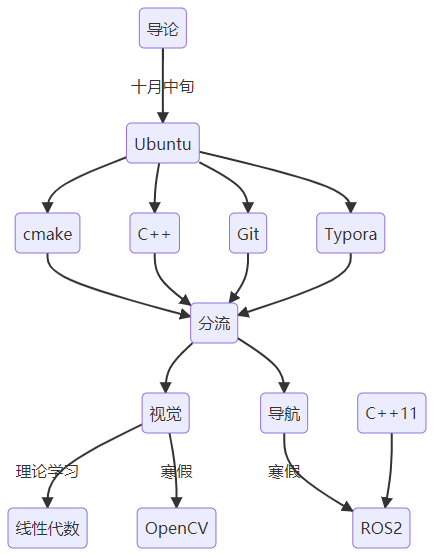

# 第二阶段学习路线

## 视觉组

**OpenCV**(计算机视觉/机器视觉/传统视觉)
学习资料：[4h上手C++版Opencv](https://www.bilibili.com/video/BV11A411T7rL)、OpenCV4快速入门（书籍）
学习要求：学习图像色彩空间变换、图像的裁剪、滤波、形态学操作，最终要能学会颜色识别和轮廓检测
主要学习视频内容，书籍可以辅助理解

**线性代数**
学习资料：[【官方双语/合集】线性代数的本质 - 系列合集](https://www.bilibili.com/video/BV1ys411472E)、[【完整版-麻省理工-线性代数】全34讲+配套教材（想学得深入的可以看这个）](https://www.bilibili.com/video/BV1ix411f7Yp)
学习要求：理解线性代数的本质，理解线性代数在空间变换、坐标变换上的应用

## 导航组

**c++11新特性**
学习资料：[bilibli视频](https://www.bilibili.com/video/BV1bX4y1G7ks)[c++11实用特性](https://www.bilibili.com/video/BV1bX4y1G7ks)、[文字版c++11实用特性](https://subingwen.cn/cplusplus/)
学习要求：学习ROS2会用到部分c++11新特性，遇到了来学相应部分
视频和文字版是同一作者，看个人喜好看视频还是文字

**ROS2**(机器⼈操作系统)
学习资料：[ROS2理论与实践](https://www.bilibili.com/video/BV1VB4y137ys)
学习要求：学习课程里的c++内容，了解ros的通信形式，能够自己编写节点，能看懂urdf、launch启动文件和使用基本的ros命令和可视化工具