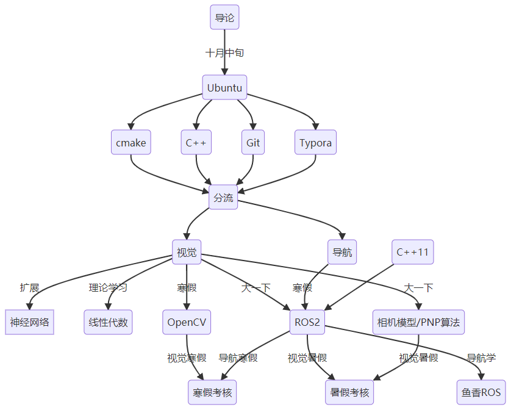

# 第三阶段学习路线

## 视觉组

**ROS2**(机器⼈操作系统)
学习资料：[ROS2理论与实践](https://www.bilibili.com/video/BV1VB4y137ys)
学习要求：学习课程里的c++内容，了解ros的通信形式，能够自己编写节点，能看懂urdf、launch启动文件和使用基本的ros命令和可视化工具

**c++11新特性**
学习资料：[bilibli视频](https://www.bilibili.com/video/BV1bX4y1G7ks)[c++11实用特性](https://www.bilibili.com/video/BV1bX4y1G7ks)、[文字版c++11实用特性](https://subingwen.cn/cplusplus/)
学习要求：学习ROS2会用到部分c++11新特性，遇到了来学相应部分
视频和文字版是同一作者，看个人喜好看视频还是文字

**相机模型**
学习资料：[计算机视觉之三维重建](https://www.bilibili.com/video/BV1mT4y1o7Q2)
学习要求：过一遍前3P即可，有个基本的概念，建议学了线性代数再来看
**PNP算法**
学习资料：[视觉组第六次培训：装甲板位姿解算](https://www.bilibili.com/video/BV1dw411B7Bz)

理论学习

**线性代数**
学习资料：[【官方双语/合集】线性代数的本质 - 系列合集](https://www.bilibili.com/video/BV1ys411472E)、[【完整版-麻省理工-线性代数】全34讲+配套教材（想学得深入的可以看这个）](https://www.bilibili.com/video/BV1ix411f7Yp)
学习要求：理解线性代数的本质，理解线性代数在空间变换、坐标变换上的应用

**神经网络（深度学习）**
基本编成语言：python
学习资料：[黑马程序员python教程](https://www.bilibili.com/video/BV1qW4y1a7fU)
Pytorch（深度学习框架）
学习资料：[《PyTorch深度学习实践》完结合集](https://www.bilibili.com/video/BV1Y7411d7Ys)、[1.1Faster RCNN理论合集](https://www.bilibili.com/video/BV1af4y1m7iL)
深度学习神经网络方面，可以看[这个视频入门](https://www.bilibili.com/video/BV1Y7411d7Ys)，看完可以自己设计一个简单的神经网络去实现图像分类。不建议新手去看太多书或者高校课程的理论知识。视觉方面建议大家学习路线先是了解深度学习的核心思想，理论，然后接触最简单的图像分类，然后是目标检测，再是其他任务的神经网络，比如关键点检测，图像分割等等。看入门课程再看这个来了解怎么用神经网络去实现目标检测。[这个](https://www.bilibili.com/video/BV1af4y1m7iL)是很经典的几个目标检测神经网络，也算是目标检测神经网络的鼻祖，放到现在效果肯定是达不到要求，但是现在很多网络的核心思想依然是和它一样的。之后再去了解热门且应用最广的yolo系列

## 导航组

**鱼香ros2**(导航)
学习资料：[【鱼香ROS】动手学ROS2|ROS2基础入门到实践教程|小鱼带你手把手学习ROS2](https://www.bilibili.com/video/BV1gr4y1Q7j5/)
学习要求：在学完ROS2后来学习鱼香ROS里的导航部分，从第六章仿真开始学