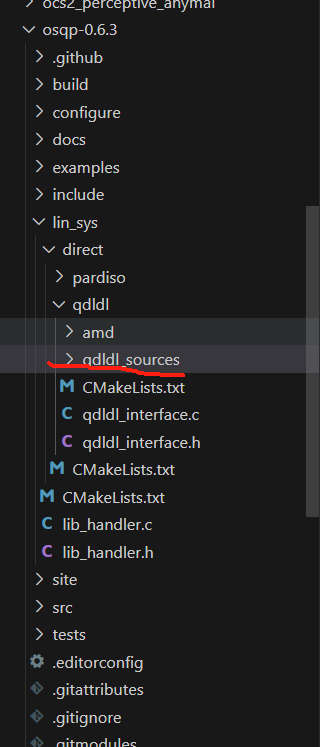

# MPC开发环境配置

## Ipopt环境安装：

[非线性优化求解器IPOPT-CSDN博客](https://blog.csdn.net/nudt_zrs/article/details/123239598?ops_request_misc=%7B%22request%5Fid%22%3A%22170427557616800227446500%22%2C%22scm%22%3A%2220140713.130102334..%22%7D&request_id=170427557616800227446500&biz_id=0&utm_medium=distribute.pc_search_result.none-task-blog-2~all~top_click~default-2-123239598-null-null.142^v99^pc_search_result_base3&utm_term=Ipopt &spm=1018.2226.3001.4187)

### 参考博客：

**Linux | Ubuntu 20.04安装ipopt和cppAD | 安装全流程+报错解决**

[Linux | Ubuntu 20.04安装ipopt和cppAD | 安装全流程+报错解决_csdn ipopt anzhaung-CSDN博客](https://blog.csdn.net/weixin_42301220/article/details/127946528?ops_request_misc=%7B%22request%5Fid%22%3A%22170483320416800184173637%22%2C%22scm%22%3A%2220140713.130102334..%22%7D&request_id=170483320416800184173637&biz_id=0&utm_medium=distribute.pc_search_result.none-task-blog-2~all~baidu_landing_v2~default-1-127946528-null-null.142^v99^pc_search_result_base3&utm_term=libcoinmumps.so.3&spm=1018.2226.3001.4187)

The IPOPT solver comes with a feature to detect the presence of 'libhsl.so'/'libhsl.dll' at runtime. Here is a report on how to obtain this 'libhsl.so'/'libhsl.dll'.

**IPOPT的安装需要安装libhsl.so库。**

###  方式2：源码安装

1. 安装依赖

```Bash
sudo apt-get install gcc g++ gfortran git patch wget pkg-config liblapack-dev libmetis-dev libblas-dev 
```

1. 创建一个存放所有跟`Ipopt`相关的文件夹，便于管理

```Bash
mkdir ~/Ipopt_pkg
cd Ipopt_pkg
```

#### 安装`ASL` 

ASL已经上传飞书。


```Bash
git clone https://github.com/coin-or-tools/ThirdParty-ASL.git
cd ThirdParty-ASL
sudo ./get.ASL
#如上面命令行不行就尝试 sudo bash ./get.ASL
sudo ./configure
#如上面命令行不行就尝试 sudo bash ./configure
sudo make
sudo make install
cd ..
```

#### **安装HSL**

**HSL安装包**  **coinhsl文件**已上传飞书。  一定要下载**coinhsl文件在目录中**


这个安装需要两个步骤，注意！第一步你可能要多动动小手。

**coinhsl文件压缩包在文档中**

```Bash
 git clone https://github.com/coin-or-tools/ThirdParty-HSL.git
 cd ThirdParty-HSL
 #注意这里要把步骤a.的文件coinhsl解压拷贝到ThirdParty-HSL目录下再执行下面的命令
sudo ./configure
#如上面命令行不行就尝试 sudo bash ./configure
sudo make
sudo make install
cd ..
```

#### 安装MUMPS

```Bash
git clone https://github.com/coin-or-tools/ThirdParty-Mumps.git
cd ThirdParty-Mumps
sudo ./get.Mumps
#如上面命令行不行就尝试 sudo bash ./get.Mumps
sudo ./configure
#如上面命令行不行就尝试 sudo bash ./configure
sudo make
sudo make install
cd ..
```


网络问题无法获取MUMPS_5.6.2.tar.gz文件**，已经上传飞书。**


应对注释掉bash文件中的下载命令，后再sudo bash ./get.Mumps，运行脚本文件。

#### 安装`Ipopt`

```Bash
git clone https://github.com/coin-or/Ipopt.git
cd Ipopt
mkdir build
cd build
sudo ../configure
#如上面命令行不行就尝试sudo bash ../configure
sudo make
sudo make test
sudo make install
```

**完善环境1.0**

```Bash
sudo mkdir /usr/local/include/coin
sudo cp /usr/local/include/coin-or/* /usr/local/include/coin -rf
```


**出现找不到 libcoinmumps.so库的错误。**

 libcoinmumps.so.3: cannot open shared object file: No such file or director  

运行下面命令行来链接库。能找到 `.so` 文件，但不符合命名规则，创建软链接即可

```Bash
sudo ln -s /usr/local/lib/libcoinmumps.so.3 /usr/lib/libcoinmumps.so.3
sudo ln -s /usr/local/lib/libcoinhsl.so.2 /usr/lib/libcoinhsl.so.2
sudo ln -s /usr/local/lib/libipopt.so.3 /usr/lib/libipopt.so.3
```


 Test passed都通过后 证明ipopt库安装成功了。

###  Ipopt测试

进入 IPOPT 源码文件夹如下位置，用官方例子测试

```Bash
cd Ipopt/build/examples/Cpp_example
sudo make
./cpp_example
```


**出现找不到 libcoinhsl.so.2库的错误。**

libcoinhsl.so.2: cannot open shared object file: No such file or director  

运行下面命令行来链接库。能找到 `.so` 文件，但不符合命名规则，创建软链接即可

```Bash
sudo ln -s /usr/local/lib/libcoinmumps.so.3 /usr/lib/libcoinmumps.so.3
sudo ln -s /usr/local/lib/libcoinhsl.so.2 /usr/lib/libcoinhsl.so.2
sudo ln -s /usr/local/lib/libipopt.so.3 /usr/lib/libipopt.so.3
```

## **CppAD+Ipopt +OSQP/OSQP-eigen环境安装与测试：**

[Linux系统下eigen、osqp、osqp-eigen具体安装步骤(测试报错的人必看!)_linux 安装eigen-CSDN博客](https://blog.csdn.net/weixin_44724063/article/details/133387322?ops_request_misc=%7B%22request%5Fid%22%3A%22170617838016800222825799%22%2C%22scm%22%3A%2220140713.130102334..%22%7D&request_id=170617838016800222825799&biz_id=0&utm_medium=distribute.pc_search_result.none-task-blog-2~all~sobaiduend~default-2-133387322-null-null.142^v99^pc_search_result_base3&utm_term=osqp安装&spm=1018.2226.3001.4187)


### 2.1 osqp库安装

**这里需要指定版本**，不指定的话，后面编译安装 osqp-eigen 库时会报错。等后续 osqp-eigen 的版本更新，对新版的 osqp 库适配后应该就可以不用再指定了。 **注意要下载：release-0.6.3版本。**

```Bash
git clone --recursive -b release-0.6.3 https://github.com/oxfordcontrol/osqp.git
cd osqp
mkdir build && cd build
cmake .. 
make
sudo make install
```

**如出现一下报错**




，证明在以下文件夹下qdldl_sources的代码为空，则需要下载一份qdldl的源代码。

https://github.com/osqp/qdldl/tree/7d16b70a10a152682204d745d814b6eb63dc5cd2

### 如果安装错了需要进行osqp的卸载操作:

进行osqp的卸载操作，网上给的命令也是含糊其词，可能大佬知道，但是对我这种Linux萌新是真不友好，很多人直接给了语句说sudo make uninstall即可卸载osqp但是你运行了肯定没用，你需要在你下载的osqp文件中由你创建的build中执行该命令才有效，卸载osqp-eigen也是一样操作即可

```Bash
cd ~ //转移到主目录
cd osqp
cd build
sudo make uninstall //卸载完毕
// 你可以去osqp的安装目录/usr/local/include/osqp中看，这里面的文件应该是全部删除完毕了
// osqp安装目录不止/usr/local/include/osqp
sudo find / -name osqp //该命令可以查找osqp的安装目录/usr/local里面的才是安装文件
```

### 2.2 osqp-eigen安装

osqp-eigen 的最新版本为 `v0.8.0`，**其能够适配 osqp 的版本为** **`v0.6.3`**。

```Bash
git clone https://github.com/robotology/osqp-eigen.git
cd osqp-eigen
mkdir build && cd build
cmake .. 
make -j8
sudo make install
```

### **CppAD+Ipopt +OSQP/OSQP-eigen安装环境测试：**

https://github.com/CHH3213/testCPP/tree/master?tab=readme-ov-file

飞书上已经上传了zip文件。

下载源码：

```Go
git clone https://github.com/coin-or/CppAD.git 
```

下载完成后，进入`CppAD`文件夹，然后执行以下命令：

```Go
cd CppAD
mkdir build
cd build
cmake ..
make 
sudo make install
```

### 报错：osqp.h: No such file or directory 12 | #include <osqp.h>


**解决：**

```Bash
    sudo cp /usr/local/include/osqp/* /usr/local/include
```

**/usr/bin/ld: /home/qidian/rm_qd_driver/devel/.private/rm_local_planner/lib/librm_local_planner.so: undefined reference to `CppAD::local::temp_fileabi:cxx11'**

```Plain

```

## qpOASES:

```Python
git clone https://github.com/coin-or/qpOASES

mkdir build
cd build
sudo make -j8
sudo make install
```

https://github.com/coin-or/qpOASES

## casadi 库的安装

要先安装IPOPT库，**在安装成功IPOPT库后casadi 库才能编译成功。**

```Bash
#git clone git@github.com:casadi/casadi 
 git clone https://github.com/casadi/casadi
cd casadi
 
 

mkdir build
 
cd build
 
 #cmake编译时不要使用教程上提供的“cmake -DWITH_PYTHON=ON ..”换成如下指令，否则会报can not load shared library "libcasadi_nlpsol_ipopt.so"
#cmake -DWITH_IPOPT=ON -DWITH_SLICOT=ON -DWITH_LAPACK=ON 
#-DWITH_QPOASES=ON -DWITH_OPENCL=ON -DWITH_OSQP=ON -DWITH_CLANG=ON ..

#如OPENCL  CLANG没有安装的话，-DWITH_OPENCL=ON -DWITH_CLANG=ON -DWITH_QPOASES=ON DWITH_LAPACK=ON -DWITH_CLANG=ON就不用添加。
#-DWITH_OPENCL=ON
cmake -DWITH_IPOPT=true DWITH_LAPACK=ON -DWITH_OSQP=ON  ..
# 如出现clange的报错   the CMake files: CLANG_DEP_clangAST ，就把LAPACK去掉。
cmake -DWITH_IPOPT=true -DWITH_OSQP=ON  ..
 
#cmake .. -DCMAKE_BUILD_TYPE=RELEASE 可不看，另一种编译方式。
 
sudo make -j8
 
sudo make install
```

#### WITH_QPOASES requires WITH_LAPACK.:

i met a problem.

-- Flag needed for enabling C++11 features: -std=c++11

-- x86_64 architecture detected - setting flag -fPIC

CMake Error at CMakeLists.txt:627 (message):

WITH_QPOASES requires WITH_LAPACK.

-- Configuring incomplete, errors occurred!

See also "/home/ubuntu/casadi/build/CMakeFiles/CMakeOutput.log".

how can i solve it? thank you.

```Python
Pass a cmake option: -DWITH_LAPACK=ON
```

## acado

https://blog.csdn.net/weixin_46479223/article/details/133743263?ops_request_misc=%257B%2522request%255Fid%2522%253A%2522170918625216800192230672%2522%252C%2522scm%2522%253A%252220140713.130102334..%2522%257D&request_id=170918625216800192230672&biz_id=0&utm_medium=distribute.pc_search_result.none-task-blog-2~all~sobaiduend~default-1-133743263-null-null.142^v99^pc_search_result_base3&utm_term=acado%E7%9A%84%E5%AE%89%E8%A3%85&spm=1018.2226.3001.4187

## acados安装：

https://docs.acados.org/