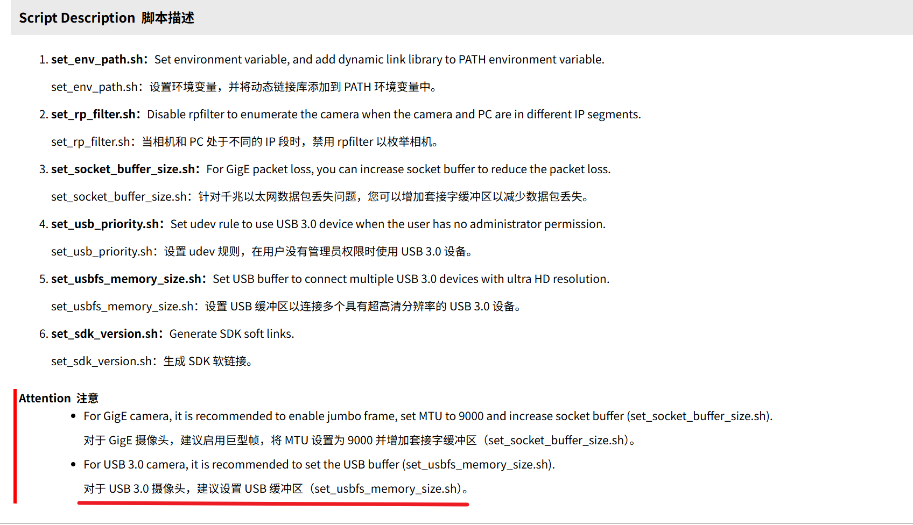

# 273 经验总结

## 海康工业相机

我们使用的相机为 CS016-10UC ,这款在分辨率和帧率上符合 RM 比赛要求，但每年用这个相机都会有人遇到问题

1. 相机使用时掉线，掉相机

- 用带锁的相机线把 micor b 接口锁紧
- 在使用多相机同时使用时，第一个启动正常，启动第二个时两个相机均掉线。提高 USB 缓冲区，推测是相机的 buff 爆了

> 这图是海康文档里的，下了 MVS 的话在`/opt/MVS/doc`里

2. 比赛前要给相机打胶

在赛场上的碰撞是很激烈了，可能会让镜头松了，不要使用默认的那个能手动拧紧焦距的

在确认镜头跳到合适焦距和光圈后用螺丝拧紧或直接打胶，不要再动了

镜头连接处其实也会松的，点名轮腿，电控在调时多次蹦迪把镜头接口都震松了

## 赛事考核

平时多记录下开发进度，多记录遇到的问题，记得写每个时间点的规划

这样你写赛季评审的时候会轻松很多，肚子才有墨水

## 传承

多写文档，有记录留下来

没留下文档和记录，相当于断代，每年都做重复工作

## 多看官方文档比在 csdn 找好多
