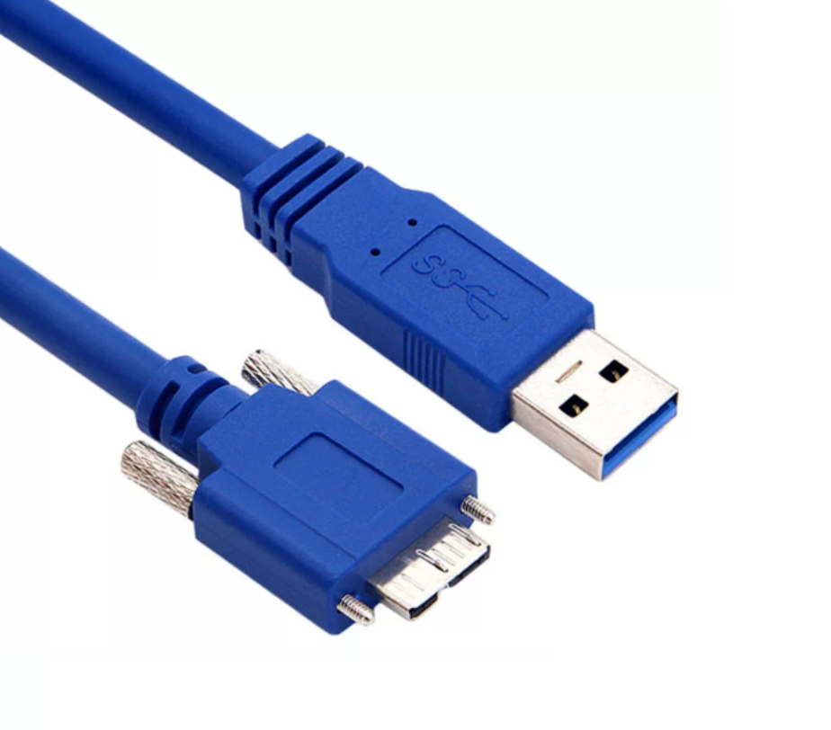
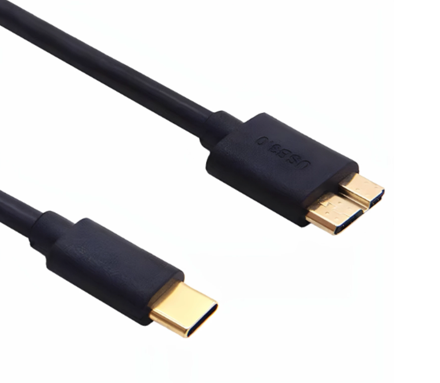
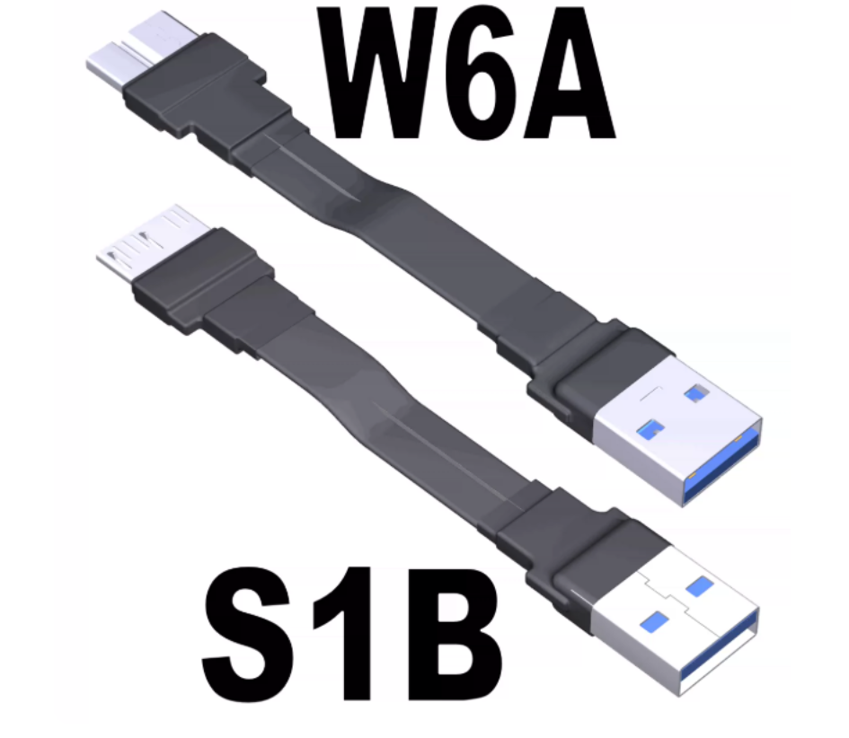

# 产品选型

## 相机

相机的选型主要看 靶面尺寸、像元尺寸、分辨率（x万像素）、帧率，越大越好，也越消耗性能

- MV-CS016-10UC
  - RM 各队使用最多的一款相机
  - 1/2.9 3.45μm 160万 249fps
- MV-CS020-10UC
  - 中科大25年哨兵用
  - 1/1.7 4.5μm 200万 90fps
- MV-CU013-A0UC
  - 上科大26年用
  - 1/2 4.8μm 130万 201fps
- MER2-230-168U3C
  - 价格与性能成正比，有钱才买的
  - 1/1.2 5.86μm 230万 168fps

> 更好的相机是为了更好的图像质量和更大的分辨率提高 pnp 精度，部分相机也能提高有效自瞄距离

## 镜头

相机与镜头一一对应，不同的相机搭配同一个镜头的视场角FOV不一样

使用[海康镜头选型工具](https://www.hikrobotics.com/cn/machinevision/service/machinevisionTool/?id=3)确认不同相机在同 FOV 下都需要多少 mm 的镜头

以下给出参考 FOV，以 CS016-10UC 为例

- 3米：6mm
- 5米：8mm
- 8米：12mm

## 相机线

正式名称为 USB-A 转 micro-b ，需要 USB3.0 速率

- 优先买这种带有锁紧螺丝的

- 不可使用任何转接器接相机。例如不能使用 type- 转 usb-a 器来做兼容，需要买 type-c 转 micro-b 线（又叫硬盘线）

- 避雷软排线，绝对不要买

## miniPC

miniPC 分成 x86 和 arm 架构

### x86

电脑主要关注 CPU 型号，看架构、频率、大小核、线程

内存：尽量上双通道，8G勉强、16G够用、32G舒服

CPU：i5-1240P 起步，i5 起步

品牌：有钱直接买 NUC ，没钱看雷神、摩方

> 有群友说 12代 比 13代好，理由在于 12 的 igpu 更好

### arm

唯一选择：Jetson Orin NX 8G/16G

过后想发展嵌入式Linux的话再买块 达妙科技 卖的 nx底板 就好了

> 不要用国产，会变得不幸
