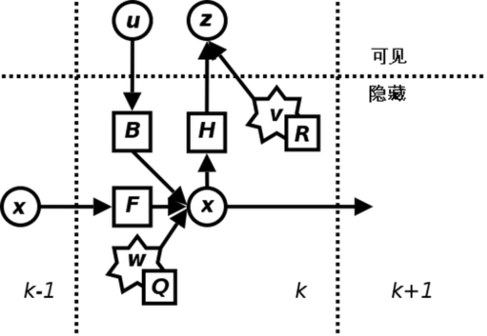
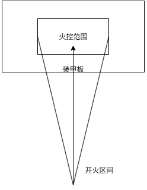
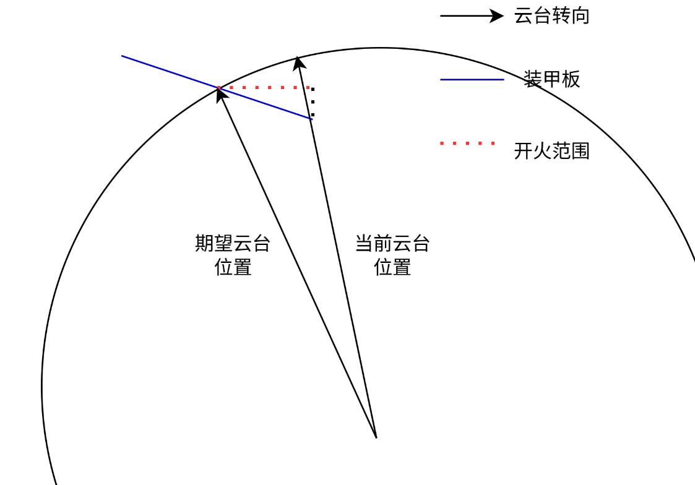
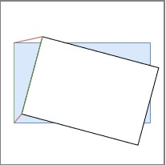
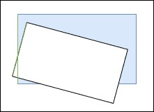

RM_Vision

RM_Vision是一套为robomaster比赛提供自动瞄准装甲板和能量机关的项目。该项目基于中南大学fyt战队2024赛季开源[FYT2024_vision](https://github.com/CSU-FYT-Vision/FYT2024_vision)

## 项目结构

### 项目框架

本项目使用ros2作为通信架构。ros2使用DDS通信，能够将功能模块化并通过网络在局域网内进行模块间的相互通信，且自动支持多线程功能，能够充分利用CPU的性能

### 项目树

```txt
.
├── rm_auto_aim (自瞄算法)
|
├── rm_auto_record (自动录包)
|
├── rm_bringup (启动及参数文件)
|
├── rm_hardware_driver
|   |
│   ├── hik-camera (海康相机驱动)
|   |
│   └── rm_serial_driver (串口驱动)
|
├── rm_interfaces (自定义msg、srv)
|
├── rm_robot_description (机器人urdf文件，坐标系的定义)
|
├── rm_rune (打符算法)
|
├── rm_upstart (自启动配置)
|
└── rm_utils (工具包) 
    |
    ├── logger (日志库)
    |
    └── math (包括PnP解算、弹道补偿等)
```

## 节点

### armor_detector

装甲板识别节点，处理相机节点的图像，算出装甲板角点和三维位置

### 自瞄（ArmorSolver）

装甲板处理节点

该节点通过订阅`armor_detector`发布的装甲板信息来做数据处理，得到识别到的装甲板信息（角点、中心点、大小装甲板、数字、离图像中心距离、在图像中的大小），然后根据信息对卡尔曼滤波器做预测更新，得到目标车辆的状态，然后根据状态确认击打目标点信息，并把相关信息发给下位机用于控制云台

#### 装甲板信息

装甲板信息是一切信息处理的开头，获得了装甲板信息才有后续的所有操作，下面解释每个参数的作用

- `number`：装甲板数字分类，用于区别不同车辆来持续跟踪同一目标
- `type`：装甲板的大小，早期会使用它作为平衡步兵兵种的判断条件，现在用于三分法求解YAW判断装甲板坐标系下装甲板的角点位置
- `distance_to_image_center`：在像素坐标系下装甲板到图像中心的距离，初始化时选择跟踪对象的判断条件
- `area`：装甲板在图像中的面积大小，目前无作用
- `pose`：数据类型为`geometry_msgs/Pose`，装甲板中心在相机坐标系下的信息，有位置信息和姿态信息，后面会转换到世界坐标系下做处理

#### 坐标变换

从识别节点获得的装甲板信息是不能直接使用的（在摄像头坐标系看到的坐标），因为两者的状态均会发生变化，目标会自己移动，摄像头会在云台动时也跟着动。我们需要先把信息转换到一个不变的坐标系上，这里称之为世界坐标系（`odom`），云台坐标系则称之为`gimbal`。所以我们获得装甲板信息后需要先把它的`pose`坐标变换到`odom`坐标系上，再来进行数据处理

#### 状态估计

##### 卡尔曼公式

有了装甲板的信息后，我们期望获得装甲板的状态来预测 $dt$ 后装甲板的位置来提前瞄准。在状态估计上我们选择主流的方案，使用扩展卡尔曼来对整车建模进行状态估计。卡尔曼的公式如下

预测：

$$
x_{k|k-1} = F * x_{k-1|k-1}
$$

$$
P_{k|k-1} = F * P_{k-1|k-1}* F^T + Q
$$

更新:

$$
K = P_{k|k-1} * H^T * (H * P_{k|k-1} * H^T + R)^{-1} 
$$

$$
x_{k|k} = x_{k|k-1} + K * (z_k - H * x_{k|k-1}) 
$$

$$
P_{k|k} = (I - K * H) * P_{k|k-1}
$$

这里不涉及复杂的计算，只讨论要输入什么，得到什么



> 扩展卡尔曼和卡尔曼的区别在于观测量需要进行非线性转换，使用雅可比矩阵将非线性转换成线性，公式上并无区别

##### 观测量（输入）

这里我们采用对整车进行建模，将车与装甲板关联起来，建立起整车中心与每块装甲板之间的关系

 

由于规则，每块装甲板均成对称分布，所以在已知整车中心$x_{c}、y_{c}、z_{c}$ 和整车中心到装甲板中心的二维平面长度 $r$，以及装甲板的角度 $\theta$ 和相对于整车中心的高度 $dz$ ，那么便可以根据以下公式推出装甲板的位置
$$
x_{a} =x_{c} -cos(\theta )*r
$$

$$
y_{a} =x_{c} -sin(\theta )*r
$$

$$
z_{a} =z_{c} +dz
$$


> $z_{c}$ 可以是跟踪装甲板的 $z_{a}$

同理，知道装甲板的 $x_{a}、y_{a}、z_{a}$和 装甲板的角度 $\theta$ （我们也称之为 $yaw$ ）、半径 $r$ 就可以反推出整车中心，这里的 $r$ 一开始使用默认值，后面由卡尔曼计算出来

$$
x_{c} =x_{a} +cos(\theta )*r
$$

$$
y_{c} =x_{a} +sin(\theta )*r
$$

$$
z_{a} =z_{c}
$$

> $yaw$ 指的是坐标系之间的欧拉角关系，这里指世界坐标系转换到装甲板坐标系 $yaw$ 轴转动的角度

#### 状态量（输出）

对整车进行建模，得到机器人的运动状态信息$x_{c}$、$v_{x}$、、$y_{c}$、$v_{y}$、$z_{c}$、$v_{z}$、$yaw$、$v_{yaw}$、$r$、$dz_{a}$

后续根据目标状态信息预测、计算弹道

#### 跟踪器

使用卡尔曼时需要注意，当目的丢失过久时，即 $dt$ 过大时，不宜更新卡尔曼。为此需要设计一个跟踪器，当判断跟丢装甲板时重置卡尔曼滤波器

以下是两种跟踪方法：

1. 当预测得到的装甲板与当前识别的装甲板的欧几里得距离和 $dyaw$ 都在小于给定值时，认为跟踪到装甲板

2. 当欧几里得距离小于给定值，但 $dyaw$ 大于给定值时，认为发生了切板，即识别的是底盘在旋转的机器人另一块装甲板

跟踪器共有四个状态：

- `DETECTING` ：短暂识别到目标，需要更多帧识别信息才能进入跟踪状态（该状态不会控制云台）
- `TRACKING` ：跟踪器正常跟踪目标中（开始跟踪自瞄）
- `TEMP_LOST` ：跟踪器短暂丢失目标，通过卡尔曼滤波器预测目标
- `LOST` ：跟踪器完全丢失目标

#### 决策器

获得机器人状态后，根据目标运动状态预测 $dt$ 时间后的装甲板位置，然后选择最近的装甲板计算弹道进行击打

##### 预测时间

知道目标状态量后，预测下一时刻装甲板的位置，然后提前击打，这是决策器的逻辑，需要预测的时间由下面几个影响因素组成

|  名称   |                            时间点                            |                             说明                             |
| :-----: | :----------------------------------------------------------: | :----------------------------------------------------------: |
|   img   |                      相机曝光时间的中点                      |                                                              |
| predict | 经过图像识别，预测器预处理完成后，开始进行运动和目标解算的时间点 | 在目标解算时，只能预测目前解算后面的几个延迟，前面的延迟可以在本帧测量 |
|  send   |                预测结束，准备发出信号的时间点                |           分离出这个时间点时因为这个时间点可以测量           |
| control |            电控接收到信号后，电机开始运动的时间点            |                                                              |
|  fire   |                 信号所指示的子弹发射的时间点                 | control 到 fire 的间隔包括转动需要的时间、子弹下落和加速需要的时间 |
|   hit   |                 信号所指示的子弹击中的时间点                 |                                                              |

> 注意是时间点，而不是时间段

img -> sned ：这段时间都是可测量的

send -> control ：这段时间可以忽略不计

control -> fire ：这里称之为开火延迟，这段存在几十毫秒的延迟，这是因为电控没法一收到指定就马上发射子弹，需要先转动拨盘推动弹丸到摩擦轮，然后加速弹丸。在这之中需要保证开火延迟稳定，因此对电控提出更高的要求

fire -> hit ：从发射子弹到打中这段时间，这段延迟是最大的，不可忽略，打中的目标在求出 $dt$ 前是无法准确预知的，需要逼近处理

##### 选板

在获得 $dt$ 时间后的目标姿态后，需要选择打击位置，这里期望能找到角度合适（max_orientation_angle）的装甲板，然后控制云台转动到指定未知击打装甲板

角度是指装甲板相对于相机的 $yaw$ ，近似成装甲板相对于枪管的角度，角度不合适的装甲板的允许击打角度是极其严格的，转动角度不对就容易造成子弹落空或直接打到装甲板灯条
$$
yaw_{camera} = yaw_{EKF} - yaw_{gimbal}
$$
在瞄准平移目标时，直接瞄准跟踪的装甲板即可，不需要选择装甲板

在瞄准正在小陀螺的目标时，则需要选板，这时基于能否在 max_orientation_angle 内找到装甲板又分成两种情况直接（direct）和间接（indirect）

###### direct

跟踪一个旋转目标时，在 max_orientation_angle 内的装甲板有且仅有一个，直接选择即可

当跟踪多个目标时，需要引入旋转代价，计算在 max_orientation_angle 内的装甲板那块转动云台的角度最小

###### indirect

在 max_orientation_angle 内没有找到装甲板，并且这时目标正在旋转，此时寻找即将出现在 max_orientation_angle 的装甲板，然后在算出到 -max_orientation_angle 或 +max_orientation_angle 处还需要的角度 armor_to_wait ，计算旋转角度 armor_to_wait 需要的时间，对该装甲板再做预测，预测后的位置即是等待击打的位置，先转动云台到该位置等待开火指令


##### 火控

在要到达给定yaw、pitch前给出开火指令。自瞄会一直发送ywa、pitch，直到枪管刚好在此时的火控范围就发出开火指令，在指定范围内开火比在指定角度开火更容易发射子弹，因为电机控制的角度并不一定会和发出的角度完全一致



上图是一个简单的火控思路，假设装甲板一直正对着枪管，以下给出一个复杂点的火控思路，根据装甲板角度动态调整开火区间

弦长计算公式：
$$
c = \left | 2r \cdot \sin\left(\frac{\theta}{2}\right)  \right |	
$$

> $c$ 是当前开火范围，$r$ 是云台到装甲板中心的距离，$\theta$ 是当前云台角度到期望云台角度差 $yaw\_diff$ 或 $pitch\_diff$ 

理想开火区间：
$$
s = \frac{r}{2} *e*\cos \theta 
$$

> $s$ 是理想开火区间，$r$ 是装甲板长度或宽度，$e$ 是 $r$ 的误差比例，$\theta$ 是装甲板相对于相机的旋转角度

当 $c < s$ 时，便是开火时机



##### 弹道模型

在击打装甲板中，$yaw$一般是准的，而$pitch$则会收到重力、空气阻力等的影响，弹道并不完全是一条直线，为此需要补偿$pitch$

- 理想重力模型


$$
t =x/v_x \\
y=v_yt+\frac{1}{2} gt^{2}
$$

> $g$ 是重力加速度

该方法需要迭代角度`angle`直到 y 与真实的 z (目标与枪管的高度)逼近

- 空气阻力模型

r是空气阻力系数，g是重力加速度
$$
r = \begin{cases}
1 \times 10^{-4} &  \mathit{resistance} < 1 \times 10^{-4} \\
\mathit{resistance} & \text{otherwise}
\end{cases}
\\
t = \frac{e^{r x} - 1}{r \cdot v_x}  \\

y = v_y\cdot t - \frac{1}{2} g t^2
$$

#### SloveYawPnp

该类用于优化装甲板的YAW值。通过假定YAW值，然后将假定的装甲板从装甲板坐标系重投影回像素坐标系，与像素坐标系下的真装甲板做差，差值越小则代表假定的YAW越接近真实YAW值

##### 三分法

做差求出的YAW在区间$(-\pi/2 ,\pi/2)$上呈下凸函数，存在一个唯一的极小值，三分法便是用来求极小值的。做差得出的值我们这里称之为`cost`。为了不让三分法持续太久，还需要限制迭代次数，或者迭代到一定精度停止迭代

<video src="images/三分法可视化.mp4"></video>

##### 做差实现

做差分成像素做差和角度做差两部分。

- 像素$pixel$

   $$
   cost =（重投影角点与真角点间的距离+线段的差）/重投影线段
   $$
   

   yaw越接近，差值越小，分子越小，cost越小
   

- 角度$angular$

    $$
    cost = 重投影线段*两线段夹角/重投影线段
    $$
    
    
    夹角使用的弧度制。yaw越接近，两线段越重合，夹角越小，cost越小
    

在算出两个cost后，还要进行权重划分，当yaw越接近0时应该越相信$pixel$，yaw越大时越相信$angular$。这里可以使用三角函数（$sin(\theta ),cos(\theta )$）来实现，$\theta$ 在一开始可以使用$\pi$/4使权重相同，后面使用预测的yaw输入


### hik-camera

海康相机驱动节点

### rm_serial_driver

串口驱动节点

### rune_detector

### rune_solver
