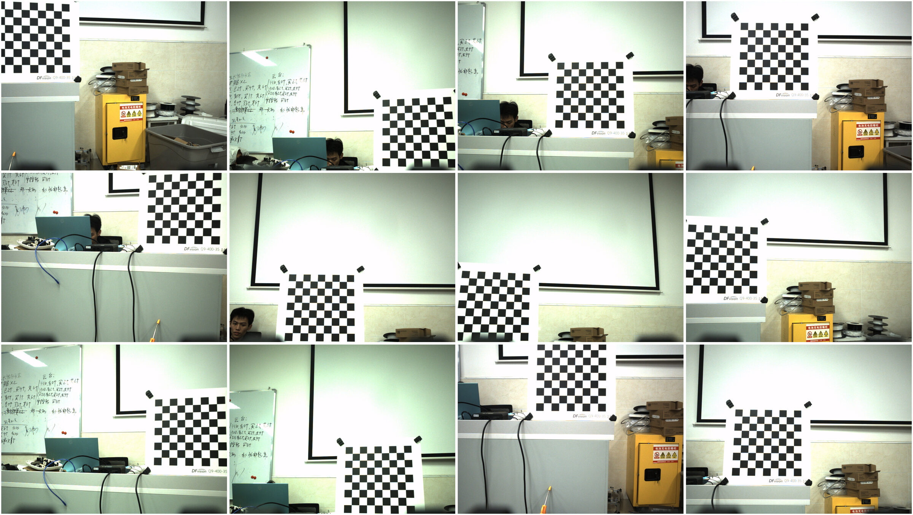

# 相机外参标定

> 相机外参是描述相机坐标系与世界坐标系之间变换关系的参数。简单来说，它定义了相机在三维世界中的位置和指向。

我们的场景下是标定相机坐标系与云台坐标系的关系

相机外参由旋转（rpy）和平移（xyz）参数组成，相机坐标系零点即位`cv::solvePnP`输出的`tvec`的零点

## 相机外参的影响

由于机械装配误差，相机必定不与云台完全平行对齐，造成的主要问题是子弹落点偏高偏低。在 RM 工况下主要是外参的`pitch`带来的影响最大，其他两个角度的误差较小（一般在 0.5 deg 以内）

错误的外参`pitch`会导致目标从相机坐标系变换到世界坐标后的高低`z`异常，进而引发弹道解算补偿的`cmd_pitch`异常，最终表现就是子弹落点异常

## 手动标定

有时由于环境条件所限，只能以最低条件完成外参标定。在此提供一些简单的标定方法

### xyz

假设入射瞳在世界坐标系下的位置为 $P_{pupil}$，空间两点为 $X_{near}$ 和 $X_{far}$。当相机绕轴旋转 $R$ 时，若旋转中心即为 $P_{pupil}$。在旋转前后，入射瞳的坐标始终为 $P_{pupil}$。点 $X$ 在相机坐标系下的方向向量 $v = R \cdot (X - P_{pupil})$。对于原本重合的两点（即 $X_{near} - P_{pupil} = k(X_{far} - P_{pupil})$），旋转后的方向向量 $v_{near}$ 和 $v_{far}$ 依然保持线性缩放关系，即在图像上坐标依然重合。基于此可以得到以下方法测量光心位置：

- 在视野中对齐一近一远两个物体(如窗框和远处的树)
- 旋转相机
- 观察两物体是否发生相对位移(视差)
- 前后移动相机，直到旋转时两者无相对位移

此时相机的旋转轴即穿过光学中心(更准确地说是入射瞳 Entrance Pupi)。这种方法不需要任何计算，精度取决于人眼的观察极限,通常可达毫米级

### rpy

在 RM 工况下一般标定好`pitch`就能达到很好的效果。

>! 虽然笔者也在使用以下方法，但由于测试次数较少，难以提供能必定标定成功的保障

- 法一：基于斜率变化调节

我们知道，目标相对地面高度固定时，目标前后移动，相机识别到并坐标变换到世界坐标系的高度`z`是不变的，基于此原理作为闭环调节`pitch`直到`z`无明显出现斜坡变化

> `rmvision2025`中提供脚本`calibrate_gimbal2camera_pitch.py`和对应的开关`enable_pitch_calibration`降低标定压力，只需前后移动目标即可自动收集数据标定

- 法二：基于`z_world`不变调节

来自[rmvision](https://github.com/rm-vision-archive/rm_vision)作者`陈君`语录

```
好多人问我 solvePnP 出来结果不准的问题，我做个我自己的心得分享：solvePnP 的输入参数有 objectPoints - 世界坐标系下的控制点的坐标 imagePoints - 在图像坐标系下对应的控制点的坐标 cameraMatrix - 相机的内参矩阵 distCoeffs - 相机的畸变系数，而输出的平移向量就是相机与装甲板的距离，而这个距离与上述四个参数都有关，不单是相机标定准就能解决的。

先讲相机内参问题，如果使用 Matlab 的工具箱，标定后能够获得相机与棋盘格的距离，如果该距离准确则可以排除相机内参的问题。多次标定后观察结果是否大致相同也能排除标定过程的不当。而装甲板处于图像中心时畸变影响一般不大，暂不考虑。

若标定正确，则 objectPoints 和 imagePoints 是大部分同学没考虑到的点。这两个参数是互相匹配的，若 objectPoints 对应的是装甲板两个灯条上下边缘的两点，则输入的 imagePoints 也应是图像中装甲板两个灯条上下边缘的两点。以传统视觉为例，如果相机的曝光时间及预处理的阈值设置不当，那么识别器得到的点可能没有正确的匹配 objectPoints，导致 solvePnP 结果出现偏差。可以通过放大图像仔细观察 imagePoints 是否正确落在装甲板的灯条边缘来。

在保证输入参数都正确的情况下，采用 EPnP 的方法一般都能得到相对准确的距离。
```

## 手眼标定(Calibrate HandEye)

手眼标定分成**眼在手上**和**眼在手外**，本节只讨论眼在手上的情况

手眼标定通常被建模为经典方程：$AX = XB$ 。这里不谈论标定原理，感兴趣的自己找教程看公式推理。这里只需要知道在实际标定算法（如 Tsai 算法）中，永远是**先求解旋转，再求解平移**

这意味着手眼标定的旋转矩阵是会准的，但是平移不一定

标定程序：[OpenCV Calibration](https://gitee.com/slime0rimiru0/open-cv_-calibration)


标定技巧：

- 标定时标定版不动，机器人不动，只动云台旋转轴（笔者没试过动机器人可不可以）
- 准确的内参很重要，尽量保证重投影误差在 0.1 px
- 必须使用高精度标定板（例如氧化铝标定板）
- 标定的环境光照要极佳，使角点分明（笔者大多在下午标效果好）
- 收集标定图像时要停稳再收集
- 收集标定图像的角度变化要大
- 要保证`solvePnP`解算精度高

以下是笔者标定成功的一个例子



标定好后输出如下：

```
开始计算手眼标定参数...
Start calibrate_handeye (RobotWorldHandEye) !!! 
calibrateRobotWorldHandEye Latency:0.00400744 s
gimbal2camera:
  xyz: "\"0.080026 0.000657 0.085610\""
# 相机同理想情况的偏角: yaw0.11 pitch2.66 roll0.22 degree
  rpy: "\"0.003914 0.046497 0.001975\""
# 标定板到世界坐标系原点的水平距离: 1.41 m
# 标定板同竖直摆放时的偏角(gimbal2camera/FLU): yaw-5.56 pitch8.93 roll0.20 degree
lower_machine_rpy_range_deg:
  roll: [-0.61, -0.03]
  pitch: [-14.72, 4.87]
  yaw: [-17.72, 11.91]
lower_machine_rpy_range_sample_count: 12
手眼标定结果已保存到 handeye_calibration.yaml
标定完成，程序退出
```

> 笔者这里使用的是`calibrateRobotWorldHandEye`分支，非`master`分支
>
> 多次标定看结果是否稳定来判断是否标定成功，输出的标定板姿态也可以当作参考

