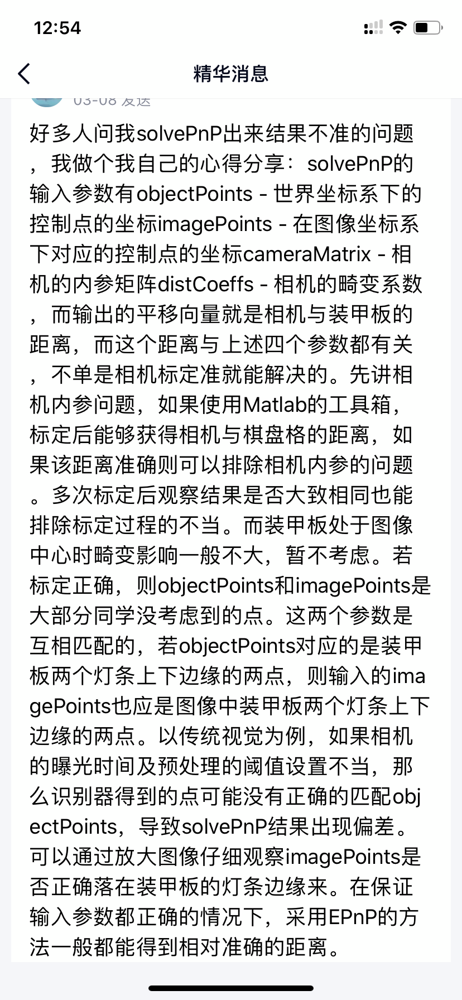
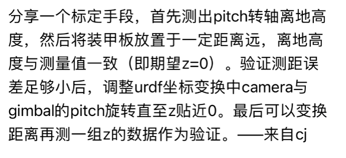

# 🎯 自瞄系统部署与优化指南

本文档指导如何将自瞄系统部署到机器人车上并进行定制化配置和性能调优。

> **ℹ️ 注意：** 调试时推荐在**自己的电脑**上运行 [foxglove](https://foxglove.dev/)，并通过 SSH 远程连接 NUC，以避免 NUC 负载过大导致的卡顿。

-----

## 🛠️ 电控系统要求

在开始视觉调试前，请确保电控系统满足以下性能指标，以保证后续调优的有效性：

  * **串口通信频率：** 必须达到 **1 kHz**，确保每 1 毫秒都有一个对应值。
  * **子弹散布：** 在 **5 米**范围内应尽可能小，最好集中在一个弹丸大小内。
  * **云台响应：** **Yaw/Pitch 响应速度要快**。建议电控 **PID 增加前馈**以快速跟上视觉发出的目标角度。
  * **发弹延迟（开火延迟）：** 必须保持**稳定**。

-----

## 💻 NUC（工控机）性能设置

对于每台新的 NUC，请进行以下配置以最大化其性能和散热：

  * **目的：**
      * 解锁大功率模式，提高 NUC 性能。
      * 关闭 Intel 小核（如有）。
      * 风扇转速拉最高，提高散热。
  * **配置详情：** 参见 [NUC 设置](/environment_configuration/NUC_setting.md)。

-----

## 💿 系统环境配置（一次性操作）

系统统一使用 **Ubuntu 22.04**（测试环境），统一用户名`qidian`，密码`qd`。以下步骤仅需在刷系统后操作一次。

### 1\. 串口设备路径修复（Ubuntu 22.04）

Ubuntu 22.04 用户需执行以下命令，否则可能无法识别 `/dev/ttyUSB` 设备：

```bash
# 输入后重启并重新插拔设备即可
sudo apt remove brltty
```

### 2\. SSH 远程连接与网络配置

为了方便远程控制 NUC 和提供网络连接：

  * 设置 NUC 的静态 IP 为 `192.168.137.x`。
  * 设置**自己电脑**的 IP 为 `192.168.137.1`。
      * IP 设置详见：[网络共享](/environment_configuration/Shared_network)
  * 开启 NUC 的 SSH 服务端。
      * SSH 开启详见：[SSH](/Introduction_to_Linux/SSH)

### 3\. 固定串口设备地址

为避免设备拔插后串口路径（如 `/dev/ttyUSB0` 变为 `/dev/ttyUSB1`）变化，需要固定其路径：

  * 固定串口路径教程详见：[固定设备地址](/environment_configuration/Fixed_equipment_address.md)

### 4\. 拉取代码

请确保已配置 Git 密钥，否则需使用 `scp` 拷贝代码：

| 方式 | 命令 |
| :--- | :--- |
| **网络克隆 (推荐)** | `git clone git@gitee.com:ouzhigui/rmvision2025.git ~/rmvision2025` |
| **SCP 传输** | `scp -r rmvision2025/ qidian@192.168.137.x:~/` |

> **⚠️ 注意：** 私有仓库需配置 SSH 密钥才能访问。配置教程见 [SSH](/Introduction_to_Linux/SSH) 中 SSH 密钥部分。

### 5\. Docker 环境设置

#### 5.1. 安装 Docker

  * 安装步骤详见：[安装 docker](/Introduction_to_Linux/Docker)

#### 5.2. 拉取镜像

选择对应架构的镜像：

  * **x86：** `docker pull slirute/qidian:latest`
  * **arm：** `docker pull slirute/qidian:arm64v8`

> **🚀 快速传输：** 如果自己电脑已有镜像，可使用以下命令传输到 NUC，省去下载时间：
> `docker save slirute/qidian:latest | ssh qidian@192.168.137.x "docker load"`

#### 5.3. 构建容器

**关键挂载：**

  * `-v /dev:/dev`：访问串口和摄像头。
  * `-v $HOME/.ros:/root/.ros`：用于保存 ROS 日志。
  * `-v ~/rmvision2025:/ros_ws`：**必须**，将代码挂载到容器内，容器会自动 `source /ros_ws/install/setup.bash`。

| 场景 | 容器名称 | 启动命令 |
| :--- | :--- | :--- |
| **Foxglove 调试** | `rv_devel_` | `docker run -it --name rv_devel_ --privileged --network host -v /dev:/dev -v $HOME/.ros:/root/.ros -v ~/rmvision2025:/ros_ws slirute/qidian:latest ros2 launch foxglove_bridge foxglove_bridge_launch.xml` |
| **自启动/运行时** | `rv_runtime_` | `docker run -it --name rv_runtime_ --privileged --network host --restart always -v /dev:/dev -v $HOME/.ros:/root/.ros -v ~/rmvision2025:/ros_ws slirute/qidian:latest bash -c "source /ros_ws/src/rm_upstart/rm_watch_dog.sh"` |

-----

## ⚙️ 编译与运行

**注意：** 任何配置修改**只**需修改 `src/rm_bringup/config` 下的各个 `yaml` 文件。

### 1\. 编译与运行流程

```bash
# 1. 进入调试容器
docker exec -it rv_devel_ bash

# 2. 进入工作空间
cd /ros_ws

# 3. 编译（仅需在代码有C++/Python源码逻辑修改时执行）
colcon build --symlink-install --parallel-workers 4

# 4. 运行自瞄系统
ros2 launch rm_bringup bringup.launch.py
```

  * `--symlink-install`：使用软链接安装，修改 `src` 下的 **Python/YAML** 文件后**无需重新编译**即可生效。
  * `--parallel-workers 4`：限制编译线程数（建议 4 核 NUC 设置为 4），避免内存不足。

-----

## 🚀 调车步骤

调车过程中，请在**自己电脑**上开启 Foxglove 并连接 NUC，按顺序进行以下调试。

### 1\. 标定相机内参

  * **操作：** 标定相机内参。
  * **修改文件：** 将内参结果写入 `camera_info.yaml`。

### 2\. 验证识别数据准确性

  * **准备：** 开启自瞄（无串口时，设置 `launch_params.yaml` 中 `virtual_serial` 为 `true`）。
  * **Foxglove 检查点：**
      * `图像`面板：话题 `/armor_detector/result_img/compressed`。
      * `原始消息`面板：话题 `/armor_detector/armors`。
      * `参数`面板：修改曝光 `/camera_driver.exposure_time` 和增益 `/camera_driver.gain`。
  * **步骤：**
    1.  增益拉到最高，然后调节曝光。
    2.  改变装甲板的距离和角度，观察识别到的装甲板位置（norm）。
    3.  要求：测距误差建议在 **3 cm 以内**。
    4.  验证准确后，将当前的曝光、增益值写入 `node_params/camera_driver_params.yaml`。
  * **测距不准的常见原因：** 内参标错、曝光/增益不匹配、装甲板角点位置不对（尝试调节 `node_params/armor_detector_params.yaml`）。



### 3\. 验证坐标变换（电控数据）

  * **目的：** 验证电控发来的 Yaw/Pitch 角度数据是否正确。
  * **操作：** 改变云台的 Yaw/Pitch 值。
  * **Foxglove 检查点：** `三维`面板，查看坐标轴的变换是否正确。
  * **要求：** 电控发来的数据应满足：Yaw 向左为正，Pitch 向下为正，Roll 左倾为正。

### 4\. 标定相机外参

  * **目的：** 建立相机光心与云台（gimbal）之间的空间联系。
  * **修改文件：** `launch_params.yaml` 中的 `dom2camera` 的 `xyz` 和 `rpy`。
      * **`xyz` (米)：** 相机光心相对于云台的位置（基于 ROS 坐标系），可由图纸或实际测量得到。
      * **`rpy` (弧度)：** 相机与云台坐标系轴线的角度差，一般重点调节 **Pitch**。
  * **核心验证方法 (调节 Pitch)：**
      * 在装甲板**高度不变**的情况下，移动装甲板或车体。
      * Foxglove 检查话题 `/armor_solver/measurement.z`（装甲板在世界坐标系下的 Z 高度）。
      * **理想情况：** 该值应**保持不变**。



### 5\. 系统参数调优

#### 5.1. 串口时间补偿（Serial Node）

  * **调节参数：** `serial_driver_params.yaml` 中的 `timestamp_offset` (单位：秒)。
  * **步骤：**
    1.  开自瞄，识别静止装甲板。
    2.  Foxglove `图表`查看 `/armor_solver/measurement.x` 的值。
    3.  **左右晃动云台**，使云台姿态发生变换。
    4.  在 Foxglove `参数`面板中，改变 `/serial_driver.timestamp_offset` 的值，目标是**降低曲线的波动范围**。

#### 5.2. 卡尔曼观测噪声（Armor Solver Node）

  * **调节参数：** `armor_solver_params.yaml` 中 `ekf` 的 `r_x`, `r_y`, `r_z`, `r_yaw`（观测误差）。
  * **原则：** 一般 `r_x = r_y`，`r_yaw` 误差较小可不改。
  * **计算步骤：**
    1.  识别静止装甲板。
    2.  Foxglove `图表`调出 `/armor_solver/target.position` 的相应值，记下**稳态值**。
    3.  **左右晃动云台**（装甲板不能离开图像）。
    4.  记录晃动过程中曲线的**极大值**和**极小值**。
    5.  使用公式计算误差值并写入 YAML 文件：
        $$\text{误差} = \left(\frac{\text{极大值}-\text{极小值}}{4}\right)^{2} \div \text{稳态值}$$

### 6\. 打弹测试与延迟补偿

**修改文件：** `armor_solver_params.yaml`

#### 6.1. 角度补偿（Angle Offset）

  * **调节参数：** `armor_solver_params.yaml` 里的 `angle_offset`。
  * **目的：** 补偿机械装配误差导致的相机与枪管不平行。
  * **步骤：**
    1.  开自瞄，击打 **2-4 米正对枪管**的静止装甲板。
    2.  观察子弹落点与装甲板中心的误差。
    3.  小幅度修改 `angle_offset`，手动矫正 Yaw 和 Pitch，使其打到正中心。

#### 6.2. 预测延迟（Predict Delay）

  * **调节参数：** `armor_solver_params.yaml` 里的 `predict2send_delay`。
  * **目的：** 补偿视觉计算、网络传输到电控执行的**总延迟**。
  * **测试方法：**
    1.  开启自瞄，发子弹打击**匀速运动**的目标。
    2.  如果预测**总体跟不上**（打在后面），**调大**该值。
    3.  如果预测**超前**（打在前面），则**调小**该值。

#### 6.3. 开火延迟（Controller Delay）

  * **调节参数：** `armor_solver_params.yaml` 里的 `controller_delay`。
  * **目的：** 补偿电控从接收开火指令到**实际发射子弹**间的延迟。
  * **临时修改参数：**
      * `solver.top1.max_orientation_angle` 设为 `0`（只瞄中心）。
      * `solver.top1.max_out_error` 设为 `0.2`（收紧打击时机宽度）。
  * **测试方法：**
    1.  击打**旋转装甲板**。
    2.  观察子弹是**提前**（调小）还是**滞后**（调大）打到。

> **📢 重要提示：** 根据经验，[每隔几个小时，打弹测试部分（角度/预测/开火延迟）都需要重新校准](https://sjtu-robomaster-team.github.io/rm-cv-std-how-to-adjust-parameters/)。

