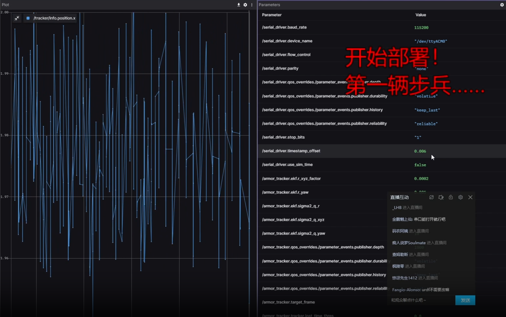

# 自瞄部署

部署自瞄到车上，会对每辆车做一些定制改动

## 电控要求

在调车前需要保证车的性能达标，以免对后续造成干扰

- 电控串口发送频率要为 1k Hz ，这样每 1ms 都有一个对应值
- 子弹散布在五米内应尽可能小，尽可集中在一个弹丸大小
- 云台 yaw pitch 的响应要快，这个可以后续看发给电控的 yaw pitch 有没有跟上

## NUC 设置

每台拿到手的新小电脑都要修改以下配置，以尽可能发挥小电脑的性能

详情见[NUC 设置](../environment_configuration\NUC_setting.md)

## 系统环境

由于使用的是 docker 所以系统的话随意，尽量选择 Ubuntu 系统，自瞄的测试是在 Ubuntu 22.04 上进行的

### 拉取代码

拉取代码前确认你有配置 git 密钥了，不然用 scp 把自己电脑的代码拷贝过去

```bash
git clone git@gitee.com:ouzhigui/rmvision2025.git ~/rmvision2025
```

### docker 配置

docker的安装详见[Docker](../Introduction_to_Linux\Docker.md)

- 拉取镜像

```bash
docker pull slirute/qidian:latest
```

如果在自己电脑有镜像了的话可以用这个方法传，省去外网下载

```bash
docker save slirute/qidian:latest | ssh qd2025@192.168.1.101 "docker load"
```

- 构建容器
  - 构建的容器不适用镜像模式，不然局域网里有多台车会串台
  - 直接转发 ssh 的 22 端口到主机的 2222 用于ssh连接（用户名 root 密码 password）和使用`ssh -Y`来进行容器内的 x11 转发（用于直接使用容器标定相机
  - 转发 8765 端口用于 foxglove 连接
  - 附加`.ros`用于保存日志
  - 附加`/dev`用于访问串口和摄像头
  - 附加自瞄代码到容器的`/ros_ws`目录，这个是必须，容器会自动`source /ros_ws/install/setup.bash`为全局变量

用 foxglove 调试时

```bash
docker run -it --name rv_devel_ \
--privileged -p 2222:22 -p 8765:8765 \
-v /dev:/dev -v $HOME/.ros:/root/.ros -v ~/rmvision2025:/ros_ws \
slirute/qidian:latest \
ros2 launch foxglove_bridge foxglove_bridge_launch.xml
```

赛场用自启动

```bash
docker run -it --name rv_runtime_ \
--privileged  -p 2222:22 -p 8765:8765 --restart always \
-v /dev:/dev -v $HOME/.ros:/root/.ros -v ~/rmvision2025:/ros_ws \
slirute/qidian:latest \
bash -c "source /ros_ws/src/rm_upstart/rm_watch_dog.sh"
```

### 固定串口

串口每次出现的路径可能不同，平常可能是`/dev/ttyUSB0`、`/dev/ttyACM0`这样，但有时拔插后会变成`/dev/ttyUSB1`、`/dev/ttyACM1`。所以我们要给串口一个固定路径

固定串口路径的教程详见[固定设备地址](../environment_configuration\Fixed_equipment_address.md)

## 自瞄代码设置

### 编译与运行

```bash
# 进去容器内
docker exec -it rv_devel_ bash
# 编译
cd /ros_ws
colcon build --symlink-install --parallel-workers 4 
# 运行
ros2 launch rm_bringup bringup.launch.py
```

- `--symlink-install`：采用软连接的方式编译，这样不用没修改 py 或 yaml 都要重新编译
- `--parallel-workers`： 限制编译线程数，没 32G 不要一次性编译，不然加 swap

### 基础设置

任何的修改只需要改动`src/rm_bringup/config`下的各个 yaml 文件即可

- 修改`launch_params.yaml`中的 odom2camera ，把 xyz 改成相机关心相对于车的 pitch 轴之间位置关系
- 修改`camera_info.yaml`为实际使用相机的参数，该文件可以直接用 ros 标定包里的 ost.yaml
- 修改`serial_driver_params.yaml`里的`port_name`为实际使用的串口路径

### 标定检验

标定好相机后还要确认这个标定数据对不对，开启自瞄后，查看装甲板距离，如果距离呈现一个稳态误差，例如距离稳定差 2cm ，则认为该标定成功


### 调参

总共有两个地方需要调，一个是串口节点，一个是自瞄 armor_solver 节点

#### serail

串口节点需要调节的是`serial_driver_params.yaml`中的`timestamp_offset`，这是手动时间补偿，单位秒。

由于电控发来的 yaw pitch 从发送到接收到存在一个延迟，该步骤就是为了手动补偿这个延迟

- 在 foxglove 中调出`/armor_solver/measurement.x`（坐标变换后装甲板在 odom 坐标系下的 x ）的图表
- 左右晃动车的头，使 yaw 发生变换
- 改变 timestamp_offset ，观察 measurement.x 的波动，减小波动范围



#### armor_solver

修改`armor_solver_params.yaml`中`ekf`的 r_x  r_y r_z r_yaw （卡尔曼的观测误差），一般 r_x = r_y , 只需要修改前三个即可。在有三分法求 yaw 的情况下误差很小了， r_yaw 随意

计算方法

通过观察卡尔曼预测的数据`/armor_solver/target`来进行计算，上面四个值分别对应 x y z yaw

- 在 foxglove 图表中调出相应的值，记下此时的值（稳态值）
- 持续晃动车的 yaw
- 从开始晃动头到结束，记录过程中 target 的极大值和极小值，然后根据以下公式计算出误差，写入 yaml 里

$$误差 = ((极大值-极小值)\div4)^{2}\div稳态值$$

### 打弹测试

调好后还需要打弹来微调`armor_solver_params.yaml`里的延迟和角度补偿

#### 角度补偿

由于机械装配误差，相机并不会完全平行于枪管，肉眼不可见地存在一定的偏移

通过打击禁止装甲板，观察子弹落点与装甲板中心的误差，修改`angle_offset`，手动给 yaw 和 pitch 加一点角度，使其打到正中心

#### 发弹延迟

调节`prediction_delay`，击打旋转装甲板，查看子弹是提前还是滞后打到，相应的减小增加该值

击打装甲板建议普通打旋转和只打中心都测试下

!> 根据上交博客所说，[每隔几个小时，延迟参数可能也需要重新测量](https://sjtu-robomaster-team.github.io/rm-cv-std-how-to-adjust-parameters/)
