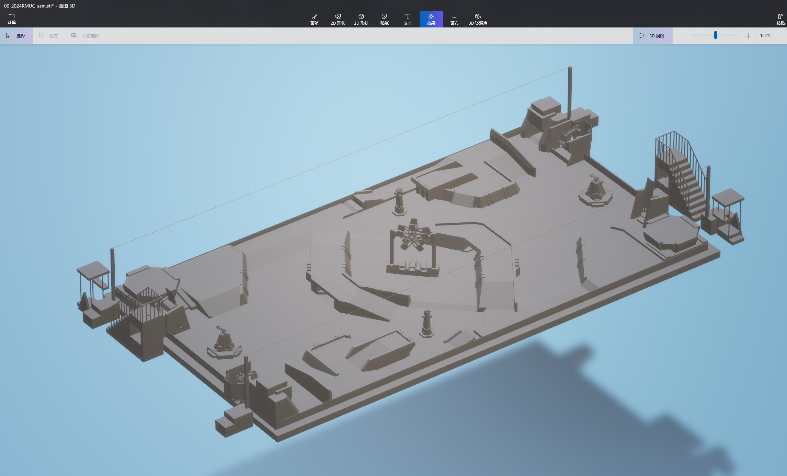
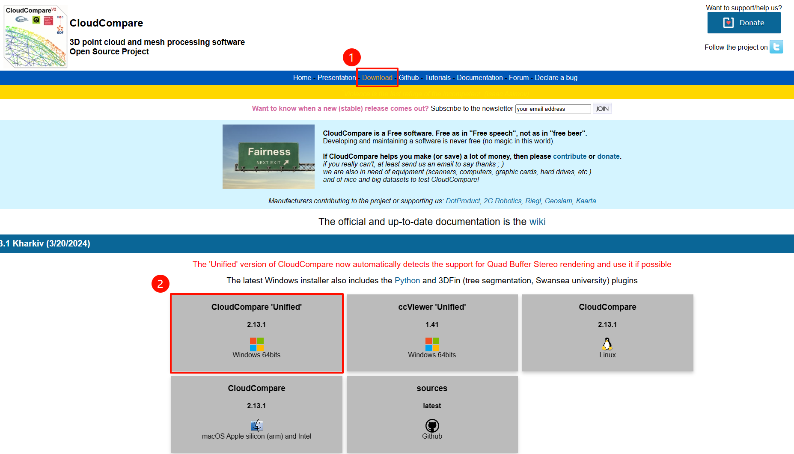
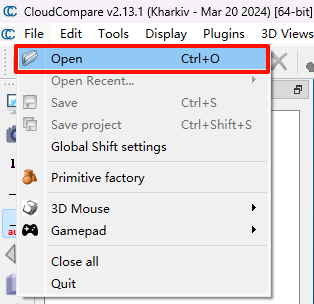
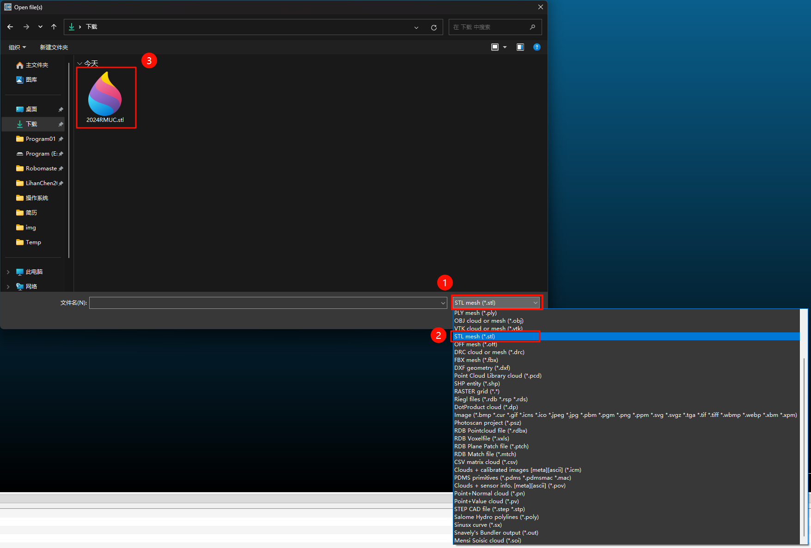
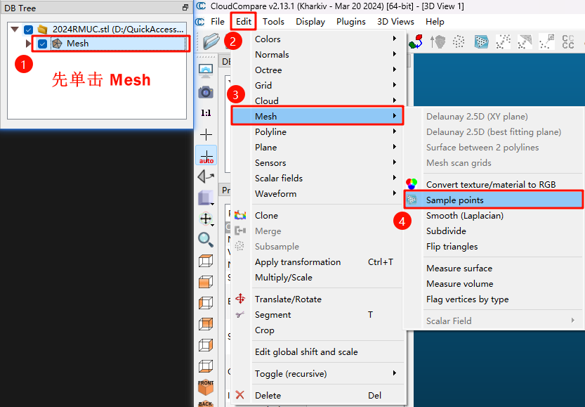
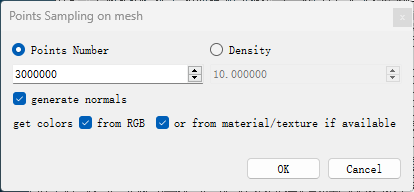
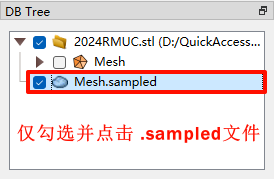
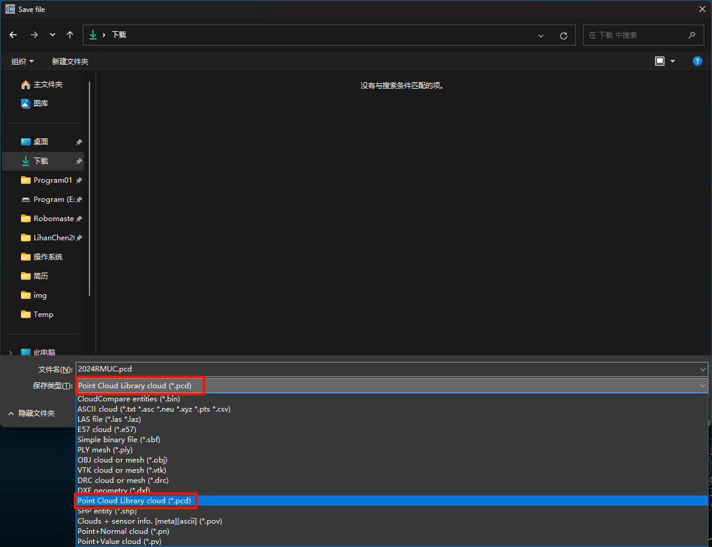
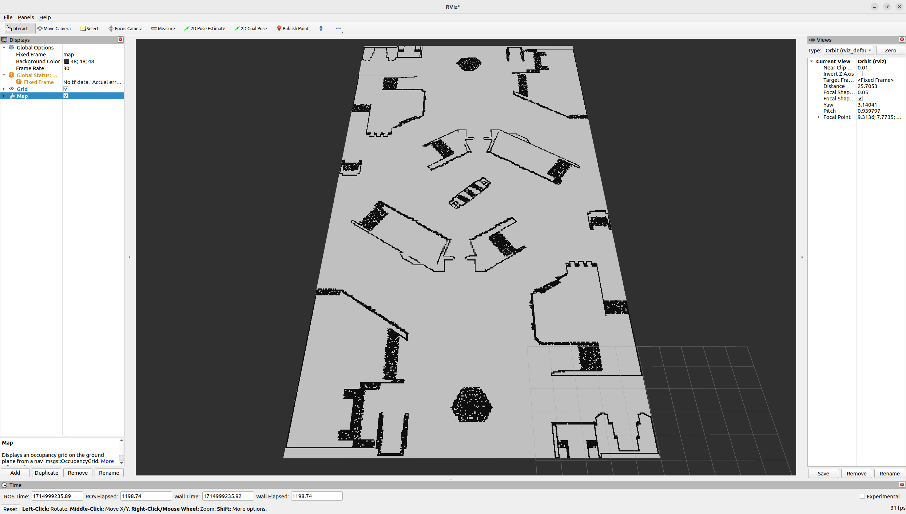

# STL模型文件转栅格地图

# 一、获取.STL文件

通过 SolidWorks （机械组） 把官方开源的地图文件转换为 .stl 文件。

官方开源地图模型为毫米为单位，务必导出米为单位的 .stl 文件！！！否则将导致栅格地图溢出



# 二、 stl to pcd

## 	2.1 安装 CloudCompare

    	以下操作在 Windows 中进行

    	请下载 Windows 版安装包。Linux 版本中无法导出 .pcd 格式的点云文件

   	 https://www.cloudcompare.org/




## 2.2 在 CloudCompare 中导入 stl 文件





## 2.3 在 CloudCompare 中将 stl 生成 pcd

### 2.3.1 生成 pcd





### 2.3.2 导出 pcd



点击菜单栏 File-Save



# 三、 pcd 2 pgm

以下操作在 Ubuntu 中进行

[GitHub - LihanChen2004/pcd2pgm: 基于 ROS2 和 PCL 库，用于将 pcd 点云文件转换为用于 Navigation 的栅格地图](https://github.com/LihanChen2004/pcd2pgm)

## 3.1 克隆并编译仓库

```shell
git clone https://github.com/LihanChen2004/pcd2pgm.git pcd2pgm/src
```

```shell
cd pcd2pgm
colcon build --symlink-install
```

## 3.2 运行

将 CloudCompare 导出的 .pcd 文件移动到文件夹中，并修改参数中的 `file_directory` 和 `file_name`

猛猛调参，比较关键的参数是 `thre_z_max` 和 `thre_z_min`

示例参数：

```shell
/pcd2pgm:
  ros__parameters:
    file_directory: /home/lihanchen/NAVIGATION_WS/pcd2pgm/
    file_name: 2024RMUC
    flag_pass_through: false
    map_resolution: 0.05
    map_topic_name: map
    thre_radius: 0.5
    thre_z_max: 0.48
    thre_z_min: 0.28
    thres_point_count: 10
    use_sim_time: false
```

启动 pcd2pgm

```shell
source install/setup.sh
ros2 launch pcd2pgm pcd2pgm.launch.py
```

打开 rviz 查看/map话题



新开一个终端，保存栅格地图

```shell
ros2 run nav2_map_server map_saver_cli -f RMUC2024
```

# 四、 精修编辑 pgm 地图

可在 Windows 中使用 Photoshop， 在 pgm 地图中使用铅笔工具添加或擦除围挡

# 五、选修：pgm 转 posegraph

如果你使用 `slam_toolbox` 算法，则需要提供特殊的 .posegraph 地图

教程如下

[地图文件：pgm 转 posegraph](https://flowus.cn/lihanchen/share/cd6f2a40-4376-4d57-b9fa-5f22c866b0ba)

# 参考

[三维图形文件转栅格地图](https://flowus.cn/lihanchen/share/00ffde73-9a62-4fdf-ac52-6785f7666b9a)
