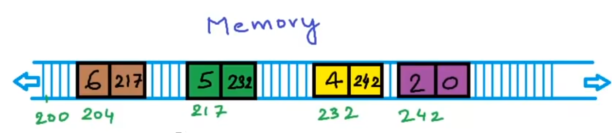

# 数据结构与算法

> 夜深人静学算法，没有学不会的算法

## **简介**

###  定义

   1. 广义上理解数据结构与算法：

    数据结构是指一组数据的存储结构。算法就是操作数据的一组方法。
    
    例：图书馆管理员将书籍分门别类“存储”，按照一定规律编号，就是书籍这种“数据的存储结构。
    
    而按照索引目录等方式查找指定书籍的方法叫做算法。

2. 从狭义上理解结构数据和算法

    指某些著名的数据结构和算法，如：列，栈，堆，二分查找，动态规划等。

3. 数据结构和算法的关系：

    数据结构和算法是相辅相成的。数据结构是为算法服务的，算法是要作用在特定的数据结构上。

###  作用

   1. 掌握数据结构和算法，不管对与于阅读框架源码，还是理解其后的设计思想，都是非常有用的。

   2. 对于优化算法，提高数据存取的效率，节省内存等有帮助。

   3. 数据结构与算法作为计算机的基础知识，核心知识，必须要掌握。能为我们的工作奠定基础。

## 学习重点

1. 首先要掌握复杂度分析。复杂度分析是数据结构和算法的精髓，能帮助我们解决如何更省，更快地存储和处理数据地问题。
2. 20 个重要的知识点：
   1. 10 个数据结构：数组，链表，栈，队列，散列表，三叉树，堆，跳表图，Trie 树。
   2. 10 个算法：递归，排序，二分查找，搜索，哈希算法，贪心算法，分治算法，回溯算法，动态规划，字符串匹配算法。
3. 注意，在这里，我们通常所说该算法的 时间复杂度 是指 最差情况下的时间复杂度 

### 认识时间复杂度

时间复杂度是衡量算法运行时间的量度，它描述了算法执行时间随输入数据规模增长的变化趋势。

在计算机科学中，时间复杂度通常用大O符号（Big O notation）来表示，它描述了算法性能的上界，即在最坏情况下的时间成本。

时间复杂度的表示方法如下：

- **常数时间**：O(1)，算法的执行时间不随输入数据规模的变化而变化，例如定义一个静态变量。
- **对数时间**：O(log n)，算法的执行时间随着输入数据规模的增长而缓慢增长，例如二分查找。
- **线性时间**：O(n)，算法的执行时间随着输入数据规模的增长而线性增长，例如遍历一个列表。
- **线性对数时间**：O(n log n)，算法的执行时间是输入数据规模与其对数的乘积，例如快速排序的平均情况。
- **二次时间**：O(n^2)，算法的执行时间随着输入数据规模的平方增长，例如冒泡排序。
- **三次时间**：O(n^3)，算法的执行时间随着输入数据规模的立方增长，例如一些矩阵乘法算法。
- **指数时间**：O(2^n)，算法的执行时间随着输入数据规模的指数增长，例如暴力搜索算法。

时间复杂度不仅考虑了算法执行的绝对时间，还考虑了算法的效率和可扩展性。在实际应用中，我们通常追求时间复杂度较低的算法，因为它们在处理大规模数据时更加高效。然而，时间复杂度只是衡量算法性能的一个方面，还需要考虑空间复杂度、实际运行时间、资源消耗等因素。

### 排序算法

#### 选择排序

选择排序（Selection Sort）是一种简单直观的排序算法。它的工作原理是每次从待排序的数据元素中选出最小（或最大）的一个元素，存放在序列的起始位置，直到全部待排序的数据元素排完。

选择排序实现过程：

1. 在未排序的元素中找到最小（或最大）的元素。
2. 将找到的最小（或最大）元素与未排序序列的第一个元素交换位置。
3. 从剩余未排序的元素中继续寻找最小（或最大）元素，然后与下一个未排序的元素交换位置。
4. 重复步骤1~3，直到所有元素都排序完毕。

选择排序复杂度：

- 时间复杂度：$$O(n^2)$$（平均和最坏情况），$$O(n^2)$$（最佳情况）
- 空间复杂度：$$O(1)$$

代码演示：

```C
 #include <stdio.h>

// 交换两个元素的函数
void swap(int *a, int *b) {
    int temp = *a;
    *a = *b;
    *b = temp;
}

// 选择排序函数
void selectionSort(int arr[], int n) {
    int i, j, min_idx;

    // 遍历数组，每次找到最小的元素
    for (i = 0; i < n - 1; i++) {
        // 找到从i到n-1中最小的元素的索引
        min_idx = i;
        for (j = i + 1; j < n; j++) {
            if (arr[j] < arr[min_idx]) {
                min_idx = j;
            }
        }

        // 将找到的最小元素与第i个位置的元素交换
        swap(&arr[min_idx], &arr[i]);
    }
}

// 打印数组的函数
void printArray(int arr[], int n) {
    int i;
    for (i = 0; i < n; i++)
        printf("%d ", arr[i]);
    printf("\n");
}

// 主函数
int main() {
    int arr[] = {64, 25, 12, 22, 11};
    int n = sizeof(arr) / sizeof(arr[0]);

    printf("Original array: \n");
    printArray(arr, n);
    selectionSort(arr, n);
    printf("Sorted array: \n");
    printArray(arr, n);
    return 0;
}
```

#### 冒泡排序

冒泡排序（Bubble Sort）是一种较简单的排序算法。它重复地走访过要排序的元素列，依次比较两个相邻的元素，如果顺序（如从大到小、首字母从Z到A）错误就把他们交换过来。走访元素的工作是重复地进行直到没有相邻元素需要交换，也就是说该元素列已经排序完成。

这个算法的名字由来是因为越小的元素会经由交换慢慢“浮”到数列的顶端（升序或降序排列），就如同碳酸饮料中二氧化碳的气泡最终会上浮到顶端一样，故名“冒泡排序”。

冒泡排序的实现步骤：

1. 从数组的开始到结束，比较每对相邻元素。如果第一个元素比第二个元素大，则交换它们的位置。
2. 在进行了一次完整的数组遍历后，最大的元素会被“冒泡”到它应该在的位置（数组的末尾）。然后，对数组的剩余部分（除了最后一个元素）**重复步骤1**。
3. 继续这个过程，每次遍历后，最大的元素都会被放到它正确的位置上。每次遍历都排除最后一个元素，因为它们已经在正确的位置上了。
4. 持续进行这个过程，直到你完成了数组长度减去1次遍历（n-1次遍历），这时数组已经完全排序。

冒泡排序复杂度：

- 时间复杂度：$$O(n^2)$$（平均和最坏情况），$$O(n)$$（最佳情况）
- 空间复杂度：$$O(1)$$

代码演示：

```C
#include <stdio.h>

// 交换两个元素的函数
void swap(int *a, int *b) {
    int temp = *a;
    *a = *b;
    *b = temp;
}

// 冒泡排序函数
void bubbleSort(int arr[], int n) {
    int i, j;
    for (i = 0; i < n - 1; i++) {
        // 最后i个元素已经是排好序的了，不需要再比较
        for (j = 0; j < n - i - 1; j++) {
            // 当前元素比下一个元素大，则交换之
            if (arr[j] > arr[j + 1]) {
                swap(&arr[j], &arr[j + 1]);
            }
        }
    }
}

// 打印数组的函数
void printArray(int arr[], int size) {
    for (int i = 0; i < size; i++) {
        printf("%d ", arr[i]);
    }
    printf("\n");
}

// 主函数
int main() {
    int arr[] = {64, 34, 25, 12, 22, 11, 90};
    int n = sizeof(arr) / sizeof(arr[0]);
    printf("Original array: \n");
    printArray(arr, n);
    bubbleSort(arr, n);
    printf("Sorted array: \n");
    printArray(arr, n);
    return 0;
}
```

由于每次只能保证一个属被排好顺序和需要重复遍历剩下的数据，总的遍历次数是 n+(n-1)+(n-2)+(n-3)+......

所以无论什么情况时间复杂度都是 $$O(n^2)$$

#### 插入排序

插入排序（Insertion Sort）是一种简单直观的排序算法，它的工作原理是通过构建有序序列，对于未排序数据，在已排序序列中从后向前扫描，找到相应位置并插入。插入排序在实现上，通常采用in-place排序（即只需用到O(1)的额外空间的排序），因而在从后向前扫描过程中，需要反复把已排序元素逐步向后挪位，为新元素提供插入空间。

插入排序实现过程：

1. 从第一个元素开始，该元素可以认为已经被排序。
2. 取出下一个元素，在已经排序的元素序列中从后向前扫描。
3. 如果该元素（已排序）大于新元素，将该元素移到下一位置。
4. 重复步骤3，直到找到已排序的元素小于或者等于新元素的位置。
5. 将新元素插入到该位置后。
6. 重复步骤2~5。

插入排序复杂度：

- 时间复杂度：$$O(n^2)$$（平均和最坏情况），$$O(n )$$（最佳情况，已经排序）
- 空间复杂度：$$O(1)$$

动画演示：


代码实现：

```C
#include <stdio.h>

// 函数用于打印数组
void printArray(int arr[], int size) {
    for (int i = 0; i < size; i++)
        printf("%d ", arr[i]);
    printf("\n");
}

// 插入排序函数
void insertionSort(int arr[], int n) {
    int i, key, j;
    for (i = 1; i < n; i++) {
        key = arr[i];
        j = i - 1;

        // 将arr[i]插入已排序序列arr[0...i-1]中的适当位置
        while (j >= 0 && arr[j] > key) {
            arr[j + 1] = arr[j];
            j = j - 1;
        }
        arr[j + 1] = key;
    }
}

// 主函数
int main() {
    int arr[] = {12, 11, 13, 5, 6};
    int n = sizeof(arr) / sizeof(arr[0]);

    // 打印原始数组
    printf("Original array: \n");
    printArray(arr, n);

    // 插入排序
    insertionSort(arr, n);

    // 打印排序后的数组
    printf("Sorted array: \n");
    printArray(arr, n);
    return 0;
}
```

时间复杂度 $$O(n^2)$$，额外空间复杂度 $$O(1)$$

> 动画演示：[插入排序动画演示_哔哩哔哩_bilibili](https://www.bilibili.com/video/BV1er4y1b7o4/?spm_id_from=333.337.search-card.all.click&vd_source=92ef131399ba8bfa8cb741db15e7ec0c)

#### 递归

递归函数是一种可以在函数中调用自身的技术（因为后面的排序用到了，所以先讲）。

例子：用递归的方法寻找数组中的一个最大值

```C
int process(int arr[], int L, int R);

int process(int arr[], int L, int R){
    if(L == R){
        return arr[L];
    }
    int mid = L + (R - L) / 2; // 等同于 (L + R) / 2, 但是这样写可以避免溢出
    int leftMax = process(arr, L, mid);
    int rightMax = process(arr, mid, R);
    return max(leftMax, rightMax);
}
```

##### master公式

对一些特殊的递归行为时间复杂度估算：master公式

$$T(N)=a*T(N/b) + O(N^d)$$

$$N$$是母问题的规模，$$N/b$$是子问题的规模。

$$a$$是子问题被调用的次数，$$O(N^d)$$是除了调用之外，剩下的过程的时间复杂度。

先判断这个递归函数是否符合master公式，每个递归的子问题规模相同才可以使用。

- 如果我将mid定在从左往右数1/2长度的地方，那两次递归的子问题规模分别是1/2、1/2，相同，能用master公式。
- 如果我将mid定在从左往右数1/3长度的地方，那两次递归的子问题规模分别是1/3、2/3，不相同，不能用master公式。

**例如，上面这个问题可以用master公式来估计时间复杂度。**

我们只对一次调用的函数分析，调用了两次 `process` ，所以 a=2，每次调用子问题的规模是母问题的1/2，所以 b=2，最后只执行了`max(leftMax, rightMax)`，时间复杂度是O(1)，所以 d=0。

最后写出  $$T(N) = 2 * T(N/2) + O(1)$$

根据下面公式可得出时间复杂度：

https://sip23ceo24h.feishu.cn/sync/U7c4dNiWCsFMHtbvg6ucbMwrnlj

$$log_22 > 0$$ 所以时间复杂度为$$O(N)$$

#### 归并排序

归并排序（Merge sort）是建立在归并操作上的一种有效的排序算法，该算法是采用分治法（Divide and Conquer）的一个非常典型的应用。将已有序的子序列合并，得到完全有序的序列；即先使每个子序列有序，再使子序列段间有序。

归并排序实现过程：

1. 用到递归的思维，每次将数组分成两个部分先进行排序
2. 用两个指针都分别指向两个部分的第一个元素
3. 开始比较两个指针指向元素的大小，符合顺序 (从大到小或者从小到大) 的拷贝到一个数组中
4. 直到其中一个部分的指针到达最后一个元素后，另一部分的指针之后的数直接复制到 新数组中
5. 最后将新数组替换原数组

归并排序复杂度：

- 时间复杂度：$$O(nlogn)$$（平均和最坏情况）
- 空间复杂度：$$O(n)$$

代码实现：

```C
void process(int arr[], int L, int R);
void merge(int arr[], int L, int M, int R);

void process(int arr[], int L, int R){
    if(L == R){
        return;
    }
    int mid = L + ((R - L) / 2);
    process(arr, L, mid);
    process(arr, mid + 1, R);
    merge(arr, L, mid, R);
}

void merge(int arr[], int L, int M, int R){
    int help[R - L + 1]; 
    int i = 0;
    int p1 = L;
    int p2 = M + 1;
    while(p1 <= M && p2 <= R){
        help[i++] = arr[p1] > arr[p2] ? arr[p1++] : arr[p2++];
    }
    while(p1 <= M){
        help[i++] = arr[p1++];
    }
    while(p2 <= R){
        help[i++] = arr[p2++];
    }
    for(i = 0; i < R - L + 1; i++){
        arr[i] = help[i];
    }
}
```

这个排序算法用到了递归，我们尝试是否能使用master公式来计算它的时间复杂度。

我们只对一次调用的函数分析，调用了两次 `process` ，所以 a=2，每次调用子问题的规模是母问题的1/2，所以 b=2，最后执行了`merge(arr, L, mid, R)`，其实是两个指针分别遍历一半的规模，时间复杂度是O(N)，所以 d=1。

根据：

https://sip23ceo24h.feishu.cn/sync/U7c4dNiWCsFMHtbvg6ucbMwrnlj

$$log_22 == 1$$ 所以时间复杂度为$$O(Nlog_2N)$$   一般2省略不写->$$O(NlogN)$$

为什么归并排序的时间复杂度可以做到$$O(NlogN)$$呢，因为它很好地利用了`比较行为`，从部分有序组成整体有序，每一次的`比较行为`的信息都在往下一次传递。

因为排序过程中最多准备额外的空间为N，所以它的额外空间复杂度是$$O(N)$$。

例题：

#### 快速排序

 快速排序（Quick sort）是对[冒泡排序](https://blog.csdn.net/justidle/article/details/104153903)的一种改进。快速排序由C. A. R. Hoare在1960年提出。

##### 快速排序1.0

快速排序<1.0>实现过程：

1. 用到递归的思维，每次在一段数据上选择最后一个数作为基准数(假设为 n )
2. 在基准数之前的数据上，设定两个指针，左指针和右指针
3. 在n之前数据中，通过左右指针遍历交换，使得小于等于n的区域在左侧，大于n的区域在右侧
4. 最后将大于n区域的第一个数，与n做交换，扩充小于等于n的区域
5. 将分隔开的两个区域再次从步骤1执行

数据演示如下图所示：

| 原始数据 | n    |
| -------- | ---- |
|          |      |

| 小于等于n | 大于n | n    |
| --------- | ----- | ---- |
|           |       |      |

| 小于等于n | n    | 大于n |
| --------- | ---- | ----- |
|           |      |       |

| 小于等于n | 大于n |
| --------- | ----- |
|           |       |

快速排序动画演示：


代码实现：

```C
void quickSort(int arr[], int low, int high);
int partition(int arr[], int low, int high)；
void swap(int* a, int* b)；

// 用于交换数组中的两个元素
void swap(int* a, int* b) {
    int t = *a;
    *a = *b;
    *b = t;
}

// 快速排序的分区函数
int partition(int arr[], int low, int high) {
    int pivot = arr[high];    // 选择最后一个元素作为基准
    int i = (low - 1);  // i是小于pivot的元素的索引

    for (int j = low; j <= high - 1; j++) {
        // 如果当前元素小于或等于pivot
        if (arr[j] <= pivot) {
            i++;    // 增加小于或等于pivot的元素的索引
            swap(&arr[i], &arr[j]);
        }
    }
    swap(&arr[i + 1], &arr[high]);    // 将大于基准中的第一个数，与基准（最后一个数）做交换
    return (i + 1);
}

// 快速排序函数
void quickSort(int arr[], int low, int high) {
    if (low < high) {
        // pi是分区后的索引，arr[pi]现在在正确的位置
        int pi = partition(arr, low, high);

        // 分别对分区前后的子数组进行递归排序
        quickSort(arr, low, pi - 1);
        quickSort(arr, pi + 1, high);
    }
}
```

##### 快速排序2.0

快速排序<2.0>实现过程：

1. 用到递归的思维，每次在一段数据上选择最后一个数作为基准数(假设为 n )
2. 在基准数之前的数据上，设定两个指针，左指针和右指针
3. 在n之前数据中，通过左右指针遍历交换，使得小于n的区域在左侧，等于n的区域在中间，大于n的区域在右侧
4. 最后将大于n区域的第一个数，与n做交换，扩充小于等于n的区域
5. 将分隔开的两个区域再次从步骤1执行

| 原始数据 | n    |
| -------- | ---- |
|          |      |

| 小于n | 等于n | 大于n | n    |
| ----- | ----- | ----- | ---- |
|       |       |       |      |

| 小于n | 等于n | 大于n |
| ----- | ----- | ----- |
|       |       |       |


再对大于区域和小于区域进行递归，做排序，总会有整体有序的时候

代码实现：

```C
#include <stdio.h>

// 函数声明
void quickSort(int arr[], int low, int high);
int partition(int arr[], int low, int high);
int median3(int arr[], int low, int high);

// 主快速排序函数
void quickSort(int arr[], int low, int high) {
    if (low < high) {
        // 找到分区索引
        int pi = partition(arr, low, high);

        // 分别对分区后的两部分进行递归排序
        quickSort(arr, low, pi - 1);
        quickSort(arr, pi + 1, high);
    }
}

// 分区函数
int partition(int arr[], int low, int high) {
    // 使用三数取中法选择基准
    int pivot = median3(arr, low, high);

    int i = low, j = high;
    while (true) {
        // 找到左边大于等于基准的元素
        while (arr[i] < pivot) {
            i++;
        }
        // 找到右边小于等于基准的元素
        while (arr[j] > pivot) {
            j--;
        }

        // 如果i和j相遇，则完成分区
        if (i >= j) {
            break;
        }

        // 交换i和j位置的元素
        int temp = arr[i];
        arr[i] = arr[j];
        arr[j] = temp;

        // 移动指针
        i++;
        j--;
    }

    // 将基准元素放到正确的位置
    int temp = arr[i];
    arr[i] = arr[high];
    arr[high] = temp;

    return i;
}

// 三数取中法选择基准
int median3(int arr[], int low, int high) {
    int mid = (low + high) / 2;
    if (arr[mid] < arr[low]) {
        int temp = arr[low];
        arr[low] = arr[mid];
        arr[mid] = temp;
    }
    if (arr[high] < arr[low]) {
        int temp = arr[low];
        arr[low] = arr[high];
        arr[high] = temp;
    }
    if (arr[high] < arr[mid]) {
        int temp = arr[mid];
        arr[mid] = arr[high];
        arr[high] = temp;
    }
    return arr[mid];
}

// 主函数
int main() {
    int arr[] = {10, 7, 8, 9, 1, 5};
    int n = sizeof(arr) / sizeof(arr[0]);
    
    quickSort(arr, 0, n - 1);
    
    printf("Sorted array: \n");
    for (int i = 0; i < n; i++)
        printf("%d ", arr[i]);
    printf("\n");
    
    return 0;
}
```

因为对等于n的区域做分隔，快排2.0会比快排1.0稍微快一些。

无论是快排1.0还是快排2.0，最差情况下时间复杂度都是$$O(n^2)$$。

- 最差情况是怎么样的？

最差情况就是整个数组本来就是有序的，每次选择最后一个作为基准n时，前面的排序只执行了指针遍历，没有交换过程，无法分出大于n，等于n，小于n的三个区域，只有一个区域，结果是每次递归只保证了一个数做到有序，所以时间复杂度就是$$O(n^2)$$。

- 既然有最差情况，那最好情况是如何的呢？

那就是基准刚好就是数组中的中位数，那进入递归的部分规模约为N/2，而递归外剩下的部分就是执行`partition`函数，时间复杂，根据master公式得到 $$T(N)=2T(N/2)+O(N)$$，时间复杂度是 $$O(nlogn)$$。

https://sip23ceo24h.feishu.cn/sync/U7c4dNiWCsFMHtbvg6ucbMwrnlj

根据上面的说法，我们可以得出基准是什么样的，就决定时间是怎么样的，当基准选在离中位数很偏，那就是差情况，离中位数较近，那就是好情况，最坏情况是无法避免的。由此我们引出 快排<3.0> 

##### 快速排序3.0

 快排<3.0>实现过程：只和2.0有一个小区别，基准是随机取的，所以遇到好情况和差情况是概率事件

快速排序复杂度：

- 时间复杂度：$$O(nlogn)$$（平均和最坏情况），$$O(n^2)$$（最坏情况，例如每次只能选择最小或最大元素作为基准）
- 空间复杂度：$$O(logn)$$（递归栈空间）

怎么理解？举例几种情况：

基准在整个数组有序时1/5的位置，那么master公式可以写为： $$T(N)=T(N/5)+T(4N/5)+O(N)$$。

基准在整个数组有序时1/3的位置，那么master公式可以写为： $$T(N)=T(N/3)+T(2N/3)+O(N)$$。

基准在整个数组有序时1/2的位置，那么master公式可以写为： $$T(N)=2T(N/2)+O(N)$$。

这些情况都是等概率出现的，权重都是1/n，根据概率论，所有概率乘时间复杂度累加的平均值，求出长期期望。

最后结果是 $$O(nlogn)$$  ，额外空间复杂度 $$O(logn)$$。

代码实现：

```C
#include <stdio.h>
#include <stdlib.h>
#include <time.h>

// 交换两个元素
void swap(int *a, int *b) {
    int temp = *a;
    *a = *b;
    *b = temp;
}

// 随机选择基准
int randomPivot(int arr[], int left, int right) {
    int randomIndex = left + rand() % (right - left + 1);
    swap(&arr[randomIndex], &arr[right]); // 将随机选择的基准放到最后
    return arr[right]; // 返回基准值
}

// 分区函数
int partition(int arr[], int left, int right) {
    int pivot = randomPivot(arr, left, right);
    int i = left; // 小于基准的元素的边界
    for (int j = left; j < right; j++) {
        if (arr[j] < pivot) {
            swap(&arr[i], &arr[j]);
            i++;
        }
    }
    swap(&arr[i], &arr[right]); // 将基准放到正确的位置
    return i; // 返回基准的新索引
}

// 快速排序函数
void quickSort(int arr[], int left, int right) {
    if (left < right) {
        int pi = partition(arr, left, right); // 获取分区索引
        quickSort(arr, left, pi - 1); // 对左子数组进行排序
        quickSort(arr, pi + 1, right); // 对右子数组进行排序
    }
}

// 主函数
int main() {
    srand(time(NULL)); // 初始化随机数种子
    int arr[] = {10, 7, 8, 9, 1, 5};
    int n = sizeof(arr) / sizeof(arr[0]);
    
    printf("未排序的数组: \n");
    for (int i = 0; i < n; i++) {
        printf("%d ", arr[i]);
    }
    printf("\n");

    quickSort(arr, 0, n - 1); // 调用快速排序

    printf("排序后的数组: \n");
    for (int i = 0; i < n; i++) {
        printf("%d ", arr[i]);
    }
    printf("\n");

    return 0;
}
```

#### 堆排序

堆排序（Heap Sort），是一种基于比较的排序算法，它利用了二叉堆的数据结构。堆排序的主要步骤可以分为两个部分：将无序数组构建成一个堆（通常是一个最大堆），然后将堆顶元素（最大值）与数组末尾元素交换，减少堆的大小，然后重新调整剩余元素构成最大堆，直到堆的大小为1。

首先二叉堆是完全二叉树。对于第i个节点，都有 i的左孩节点是 $$2*i+1$$，右孩节点是 $$2*i+2$$，若超出数组最大数量，则就说明不存在，父节点是 $$(i - 1)/2$$ 取整。


其次堆分为大根堆和小根堆

- 大根堆是以每一个节点为头为子树，这颗子树上的头节点，就是这棵树的最大值，例如下图三个圈所示：
  - 以6为头节点的整棵树，最大值是6；
  - 以5为头节点的整棵树，最大值是5；
  - 以4为头节点的整棵树，最大值是4。


- 小根堆和大根堆相反，是以每一个节点为头为子树，这颗子树上的头节点，就是这棵树的最小值。

如何把一个数组，变成一个堆？

如果要实现一个大(小)根堆

1. 遍历数组，每个新进来的数都与它父节点的数作比较
2. 如果大于(小于)父节点的数，就与父节点作交换
3. 继续步骤2，直到没有大于(小于)父节点的数或者到达第一个位置
4. 结束当前排序，进行数组下一个数的排序，继续步骤1，直到最后一个数完成排序

时间复杂度为$$O(nlog_n)$$。

#### 计数排序

计数排序（Counting Sort）是一种非比较型排序算法，适用于一定范围内的整数排序。它的核心思想是使用一个额外的数组来统计每个数字出现的次数，然后根据这些统计信息来确定每个数字在排序后数组中的位置。

**计数排序的实现步骤：**

1. **确定范围**：找出待排序数组中的最大值和最小值，以确定排序时需要的存储范围。
2. **创建计数数组**：初始化一个计数数组，长度为最大值和最小值之差加一（如果数组元素都是非负整数，则最小值为0）。
3. **计数**：遍历待排序数组，对于数组中的每个元素，增加计数数组中对应位置的计数。
4. **累加计数**：将计数数组中的每个元素都加上前一个元素的值，这样每个元素的累计值就表示该元素在排序后数组中的最终位置。
5. **回填**：遍历待排序数组，对于数组中的每个元素，将其放到排序后数组的相应位置，并减少计数数组中对应位置的计数。

**计数排序复杂度：**

- **时间复杂度**： $$O(n+k)$$  $$k是最大值和最小值的差$$
- **空间复杂度**： $$O(k)$$        $$k是最大值和最小值的差$$

代码实现：

```C
#include <stdio.h>
#include <stdlib.h>
#include <limits.h>

// 函数声明
void countingSort(int arr[], int n);
void printArray(int arr[], int size);

// 计数排序的主函数
void countingSort(int arr[], int n) {
    int i = 0;
    int count[256] = {0};
    int max = arr[0], min = arr[0];

    // 找出最大值和最小值
    for (i = 0; i < n; i++) {
        if (arr[i] > max)
            max = arr[i];
        if (arr[i] < min)
            min = arr[i];
    }

    // 统计每个数字出现的次数
    for (i = 0; i < n; i++)
        count[arr[i] - min]++;
    
    // 累加计数，确定原数组的数在排好序数组中的顺序
    for (i = 1; i < max - min + 1; i++)
        count[i] += count[i - 1];

    // 创建一个临时数组来存储排序后的数组
    int* output = (int*)malloc(n * sizeof(int));

    // 回填临时数组
    for (i = n - 1; i >= 0; i--) {
        // count[arr[i] - min] - 1 是数组中第i个数在排序好的位置
        output[count[arr[i] - min] - 1] = arr[i];
        count[arr[i] - min]--;
    }

    // 将临时数组复制到原数组
    for (i = 0; i < n; i++)
        arr[i] = output[i];

    // 释放临时数组的内存
    free(output);
}

// 打印数组的函数
void printArray(int arr[], int size) {
    int i;
    for (i = 0; i < size; i++)
        printf("%d ", arr[i]);
    printf("\n");
}

// 主函数
int main() {
    int arr[] = {4, 2, 2, 8, 3, 3, 1};
    int n = sizeof(arr) / sizeof(arr[0]);
    
    printf("Original array: \n");
    printArray(arr, n);
    
    countingSort(arr, n);
    
    printf("Sorted array: \n");
    printArray(arr, n);
    
    return 0;
}
```

#### 桶排序

桶排序（Bucket Sort）是一种分布式排序算法，它将数组分为多个“桶”，每个桶中包含一定范围的元素，然后对每个桶内的数据进行排序，最后将所有桶中的元素合并成一个有序数组。

**桶排序的实现步骤：**

1. **确定桶的数量**：确定需要多少个桶，通常取决于输入数据的范围和数量。
2. **初始化桶**：创建一个数组来存储桶，每个桶可以是另一个数组或链表。
3. **分配元素到桶**：遍历待排序数组，根据元素的值分配到相应的桶中。
4. **对每个桶进行排序**：对每个桶内的元素进行排序，可以使用其他排序算法，如插入排序、快速排序等。
5. **合并桶**：按顺序合并所有桶中的元素，得到最终的有序数组。

代码实现：

```C
#include <stdio.h>
#include <stdlib.h>
#include <math.h>

// 函数声明
void bucketSort(float arr[], int n);
void insertionSort(float arr[], int n);
void printArray(float arr[], int size);

// 桶排序的主函数
void bucketSort(float arr[], int n) {
    // 创建桶
    float min = arr[0];
    float max = arr[0];
    for (int i = 1; i < n; i++) {
        if (arr[i] < min)
            min = arr[i];
        if (arr[i] > max)
            max = arr[i];
    }
    int size = (int)(max - min) + 1;
    float **buckets = (float **)malloc(n * sizeof(float *));
    for (int i = 0; i < n; i++)
        buckets[i] = (float *)malloc(size * sizeof(float));
    
    // 分配元素到桶
    for (int i = 0; i < n; i++) {
        int index = (int)((arr[i] - min) * (n - 1) / size);
        buckets[index][(int)buckets[index][0]++] = arr[i];
    }
    
    // 对每个桶进行排序
    int idx = 0;
    for (int i = 0; i < n; i++) {
        insertionSort(buckets[i], (int)buckets[i][0]);
        for (int j = 1; j <= (int)buckets[i][0]; j++) {
            arr[idx++] = buckets[i][j];
        }
    }
    
    // 释放内存
    for (int i = 0; i < n; i++)
        free(buckets[i]);
    free(buckets);
}

// 插入排序
void insertionSort(float arr[], int n) {
    int i, j;
    float key;
    for (i = 1; i < n; i++) {
        key = arr[i];
        j = i - 1;
        while (j >= 0 && arr[j] > key) {
            arr[j + 1] = arr[j];
            j = j - 1;
        }
        arr[j + 1] = key;
    }
}

// 打印数组的函数
void printArray(float arr[], int size) {
    int i;
    for (i = 0; i < size; i++)
        printf("%0.2f ", arr[i]);
    printf("\n");
}

// 主函数
int main() {
    float arr[] = {0.897, 0.565, 0.656, 0.1234, 0.665, 0.3434};
    int n = sizeof(arr) / sizeof(arr[0]);
    
    printf("Original array: \n");
    printArray(arr, n);
    
    bucketSort(arr, n);
    
    printf("Sorted array: \n");
    printArray(arr, n);
    
    return 0;
}
```

#### 基数排序

### 数组 (array)

####  初始化

        在定义开始，在内存中申请了连续的空间，后续不可扩展。

   ```C
   int x = 8;
   int A[4] = {6, 5, 4, 2};
   ```

   

    若还需更多空间，只能重新定义容量更大新数组。

####  访问

        通过 “数组名[下标]“的方式进行访问。

   ```C
   printf("A[0] = %d\n", A[0]);
   ```

    时间复杂度是O(1)。

####  插入

        在数组的某个位置添加新的元素，在插入位置之后的每个元素需向后移动一个位置。

   ```C
   // 下面是在数组第一位插入一个元素3的例子
   
   int A[7] = {2, 4, 6, 5};
   int dataSize = 5; // 初始数据个数
   int insertIndex = 0; // 想要插入数据的位置
   int insertValue = 3; // 要插入的数据
   
   // 从数组末尾开始，将每个元素向后移动一个位置
   for (int i = dataSize; i > insertIndex; i--) {
       array[i] = array[i - 1];
   }
   
   // 将新数据插入到指定位置
   array[insertIndex] = insertValue;
   
   // 打印新的数组
   printf("Array after insertion: ");
   for (int i = 0; i <= dataSize; i++) {
       printf("%d ", array[i]);
   }
   ```

   

    在数组为空或从最后插入时间复杂度为O(1)，其他情况时间复杂度平均为O(n)。

####  查找

    可通过遍历进行查找，例如我需要查找值为6的元素的位置

   ```C
   int find_val = 6;
   int i;
   for(i = 0; i < 6; i++)
   {
       if(A[i] == find_val)
       {
           cout<<"index = "<<i<<endl;
       }
   }
   ```

    时间复杂度平均为O(n)。

####  删除

    删除后重置数组长度，可以选择直接覆盖平移的方法，例如我需要删除第三个元素

   ```C
   int remove_index = 2;
   int i;
   for(i = 0; i < 6 - 1; i++)
   {
       if(i >= remove_index)
       {
           A[i] = A[i+1];
       }
   }
   ```

时间复杂度平均为O(n)。

### 链表 (list)

    链表存储在内存中可以是不连续的空间，每个元素除了包含值外，还包含下一个元素的地址(指针)，可扩展大小。

   

   ```C
   struct Node{
       int data;
       Node* next;
   };
   ```

####  初始化

   ```C
   // 创建头节点，初始化链表
   Node *head = NULL;
   
   // 动态创建节点并添加到链表
   // 由于链表开始为空，新创建的节点将成为头节点
   head = (Node*)malloc(sizeof(Node)); 
   head->data = 6;
   head->next = NULL;
   
   // 创建第二个节点，并将其添加到链表尾部
   Node* newNode = (Node*)malloc(sizeof(Node));
   newNode->data = 5;
   newNode->next = NULL;
   
   // 建立联系
   head->next = newNode;
   
   // 创建第三个节点，并将其添加到链表尾部
   newNode = (Node*)malloc(sizeof(Node));
   newNode->data = 4;
   newNode->next = NULL;
   
   // 将新节点追加到链表末尾 或者(*(head->next))->next = newNode;(不推荐)
   Node* current = head;
   while (current->next != NULL) {
       current = current->next; // 移动到末尾
   }
   current->next = newNode; // 连接新节点
   
   // 中间添加省略 ...
   ```

   

    以上向后插入的做法虽然符合我们直觉，但编写代码十分不便，推荐从前方插入元素

   ```C
   // 创建头节点，初始化链表
   Node *head = NULL;
   
   // 动态创建节点并添加到链表
   // 创建第一个节点，并将其添加到链表头部
   Node* newNode = new Node(); // 简写
   newNode->data = 2;
   newNode->next = NULL;
   
   head = newNode;
   
   // 创建第二个节点，并将其添加到链表头部
   newNode = new Node();
   newNode->data = 4;
   newNode->next = NULL;
   
   newNode->next = head->next;
   head = newNode;
   
   // 中间添加省略 ...
   ```

    以上图为例，在内存使用上，一个元素不但要包含数值，还要包含指向下一个元素的地址的指针。

####  访问

        需要通过遍历访问到某个元素，不能和数组一样通过索引访问元素。
    
      ```C
      Node* temp = head;
      
      while(temp != NULL) // 从链表头遍历到最后
      {
          printf("%d", temp->data);
          temp = temp->next; // 转移到下一个节点
      }
      ```
    
    最坏情况下时间复杂度是O(n)，平均O(n)。

####  插入

        我们写一个函数来实现插入操作
    
      ```C
      
      ```
    
        例：将data = 10的Node插入链表成为第三个元素

   

   

    在链表无元素或者前方插入时间复杂度为O(1)，在最后插入时间复杂度是O(n)， 中间插入平均时间复杂度是O(n)

####  查找

    链表中查找元素时间复杂度是O(n)

####  删除

    链表中删除元素时间复杂度是O(n)

####  双向链表*

    相比于链表，每个节点多出一个指针，用于指向前一个节点，解决了链表无法得到上一个节点的问题。

   ```C
   struct Node{
       int data;
       struct Node* next;
       struct Node* prev;
   }
   
   struct Node* head;
   ```

    当然这样的代价就是花费更多的空间，且在插入或者删除时，要做更多的操作。


```C
struct Node* GetNewNode(int x){
    struct Node* newNode = (struct Node*)malloc(sizeof(struct Node));
    newNode->data = x;
    newNode->next = NULL;
    newNode->prev = NULL;
    return newNode;
}
 
void InsertAtHead(int x){
    struct Node* newNode = GetNewNode(x);
    if(head == NULL){ 
        head = newNode;
        return;
    }
    head->prev = newNode;
    newNode->next = head;
    head = newNode
}

void Print(){
    struct Node* temp = nead;
    printf("Forward:");
    while(temp != NULL){
        printf("%d", temp->data);
        temp = temp->next;
    }
    printf("\n");
}

int main(){
    head = NULL;
    InsertAtHead(1);
    InsertAtHead(5);
    InsertAtHead(7);
    Print();
}
```

#### 数组和链表对比

在C/C++中，两者在增删改查上各有优劣，数组在易用性上优于列表，因为列表涉及指针，所以比较容易出错。

### 小总结

不存在一种数据结构优于另外一个数据结构的说法，一种数据结构可能适应一种需求，而另一种数据结构可能在另一个需求中表现更好，这与在数据结构中最频繁的操作和数据量的大小有关。在不同场景和需求下，能够在多种数据结构中选择更合适的是最终目的

### 栈 (stack)

生活中像 **栈** 一样的东西，栈的元素必须从 **栈顶** 的那一端插入和删除，这不仅是一种属性，也是一种限制。


栈也被称作 “Last In Ftrst Out”  LIFO ，后进先出。

实际应用：举个例子，我们可以用` Ctrl + z `实现撤回操作，这个其实就用到栈。

####  栈的实现

 使用C语言数组来实现**栈**。

```C
#include <stdio.h>

#defind MAX_SIZE 10

int A[MAX_SIZE];
int top = -1; // 栈顶

void Push(int x){ // 入栈
    if(top == MAX_SIZE - 1){
        printf("Error: Stack overflow\n");
        return;
    }
    A[++top] = x;
}

void Pop(){ // 出栈
    if(top == -1){
        printf("Error: No element to pop\n");
        return;
    }
    top--;
}

int Top(){ // 访问栈顶
    if(top == -1){
        printf("Error: Stack is void\n");
        return;
    }
    return A[top];
}

void Print(){ // 打印栈
    int i;
    printf("Stack: ");
    for(i = 0; i <= top; i++){
        printf("%d", A[i]);
    }
    printf("\n");
}

int main(){
    Push(10);
    Push(9);
    Push(8);
    Pop();
    Print();
    int top_val = Top();
    printf("top_val = %d", top_val);
}
```

题目：检查一串字符中`() [] {}`括号是否匹配，例如`“{(a+b)}”`匹配  `“[(a + b)}”`不匹配 

 `“[(a * b }[”` 不匹配

思路：只对字符串中` () [] {} `处理，遍历，并用一个**栈**逐个存入，如果栈顶的括号和下一个括号左右匹配时，即`() [] {}`左右匹配，则删除最后一个括号，继续遍历，如果是匹配的字符串，最后的**栈**一定是空的，因为都匹配完了，不为空的就是不匹配的。

### 队列 (queue)

队列的特征就和我们日常生活中的排队一样，先进入队列的元素，先出去队列，


队列也被称作 "Frist In First Out (FIFO)"，先进先出。

应用：在服务端中，多个需要服务需要响应，这时候需要用到队列，先接收到的请求就先处理。

### 树 (tree)

 **树** 这种数据结构就如我们现实世界中倒着生长的树，它可以很好地存储和组织具有层级结构的数据，比如公司的人员结构。


用一个家族去比较的话，1 自上而下第一个节点是树根节点    4、6、8、9、10、11 没有孩子的节点被称为叶子节点


#### 树的定义

树是n（n>=0）个结点的有限集。当n = 0时，称为空树。在任意一棵非空树中应满足：

- 有且仅有一个特定的称为根的结点。
-  当n>1时，其余节点可分为m（m>0）个互不相交的有限集T1,T2,…,Tm，其中每个集合本身又是一棵树，并且称为根的子树。

显然，树的定义是递归的，即在树的定义中又用到了自身，树是一种递归的数据结构。树作为一种逻辑结构，同时也是一种分层结构，具有以下两个特点：

- 树的根结点没有前驱，除根结点外的所有结点有且只有一个前驱。
- 树中所有结点可以有零个或多个后继。

因此n个结点的树中有n-1条边。

#### 树的性质

树具有如下最基本的性质：

- 树中的结点数等于所有结点的度数加1。
- 度为m的树中第i层上至多有$$m^{i-1}$$ 个结点（i > = 1）
- 高度为h的m叉树至多有$$(m^h-1)/(m-1)$$个结点。
- 具有n个结点的m叉树的最小高度为$$log_m^{(n(m-1)+1)}$$ 。


#### 树的应用

- 在计算机系统中，文件夹的层级结构就是按照树的形式储存的。
- 在组织数据中，让集合能够快速做到快速查找，插入和删除，例如二叉搜查树。
- 应用为“字典”时，可以快速高效地查找数据。

#### 二叉树

关于 **树** ，我们主要讨论二叉树

二叉树是另一种树形结构，其特点是每个结点至多只有两棵子树( 即二叉树中不存在度大于2的结点)，并且二叉树的子树有左右之分，其次序不能任意颠倒。

与树相似，二叉树也以递归的形式定义。二叉树是n (n≥0) 个结点的有限集合:

- 或者为空二叉树，即n=0。
- 或者由一个根结点和两个互不相交的被称为根的左子树和右子树组成。左子树和右子树又分别是一棵二叉树。

二叉树是有序树，若将其左、右子树颠倒，则成为另一棵不同的二叉树。即使树中结点只有一棵子树，也要区分它是左子树还是右子树。二叉树的5种基本形态如图所示。


##### 几个特殊的二叉树

- 斜树
  -  所有的结点都只有左子树的二叉树叫左斜树。所有结点都是只有右子树的二叉树叫右斜树。这两者统称为斜树。
- 满二叉树

一棵高度为h，且含有$$2^h-1$$个结点的二叉树称为满二叉树，即树中的每层都含有最多的结点。满二叉树的叶子结点都集中在二叉树的最下一层，并且除叶子结点之外的每个结点度数均为2。可以对满二叉树按层序编号:约定编号从根结点(根结点编号为1)起，自上而下，自左向右。这样，每个结点对应一个编号,对于编号为$$i$$的结点，若有双亲，则其双亲为$$i/2$$ ,若有左孩子，则左孩子为$$2i$$;若有右孩子，则右孩子为$$2i+1$$。


- 完全二叉树

 高度为h、有n个结点的二叉树，当且仅当其每个结点都与高度为h的满二叉树中编号为1~n的结点一一对应时，称为完全二叉树，如图所示。其特点如下:


- 若 $$i ≤ n / 2$$ , 则结点i为分支结点，否则为叶子结点。
- 叶子结点只可能在层次最大的两层上出现。对于最大层次中的叶子结点，都依次排列在该层最左边的位置上。
- 若有度为 1 的结点，则只可能有一个，且该结点只有左孩子而无右孩子(重要特征)。
- 按层序编号后，一旦出现某结点(编号为 $$i $$)为叶子结点或只有左孩子，则编号大于$$i $$的结点均为叶子结点。
- 若 n 为奇数，则每个分支结点都有左孩子和右孩子;若 n 为偶数，则编号最大的分支结点(编号为 $$n / 2$$)只有左孩子，没有右孩子，其余分支结点左、右孩子都有。

- 平衡二叉树

平衡二叉树的特点是：对于任何节点，左右子树的高度差不大于1。


##### 二叉树代码实现

定义一个节点，一个整型变量来存储数据，两个指向节点的指针。

```C
struct Node{
    int data;
    struct Node* left;  // 指向左孩，也就是左子树的根
    struct Node* right; // 指向右孩，也就是右子树的根
}
```


#### 二叉搜索树（BST）

二叉搜索树在查找，插入和删除的时间复杂度都为$$O(logn)$$

它的性质是：

任意一个节点，所有左子树上的节点值都比该节点的值要小，所有右子树上的节点值都比该节点的值要大。

这些性质保证了二叉搜索树的中序遍历结果是有序的。

下面是一棵二叉搜索树：


以15为父节点来看，左侧的所有节点（10、8、12）都小于15以及右侧的所有节点，而右侧的所有节点（20、17、25）都大于15以及左侧的所有节点。

这种规则在每一个节点都成立。

横向对比数组(无序)  链表  数组(有序)  二叉搜索树(BST)的查找，插入和删除的时间复杂度


如果插入的元素总是导致树向一个方向生长，那么树可能会退化成一个链表，其高度为n（n是节点数），这样操作的时间复杂度就会退化到$$O(n)$$。


所以我们通过保持二叉搜索树的平衡来避免最坏情况的场景。  

> 原文链接：[【数据结构与算法】树(Tree)【详解】_数据结构树-CSDN博客](https://blog.csdn.net/u011397981/article/details/129751663)

### 图

> 数据结构和算法可视化
>
> 视频：[图码的个人空间-图码个人主页-哔哩哔哩视频](https://space.bilibili.com/282816112)
>
> 可视化网站：[数据结构可视化交互动画版 数据结构可视化](http://totuma.cn)

## 参考

> 【【强烈推荐】深入浅出数据结构 - 顶尖程序员图文讲解 】 [数据结构：课程导论_哔哩哔哩_bilibili](https://www.bilibili.com/video/BV1Fv4y1f7T1?p=1&vd_source=92ef131399ba8bfa8cb741db15e7ec0c)