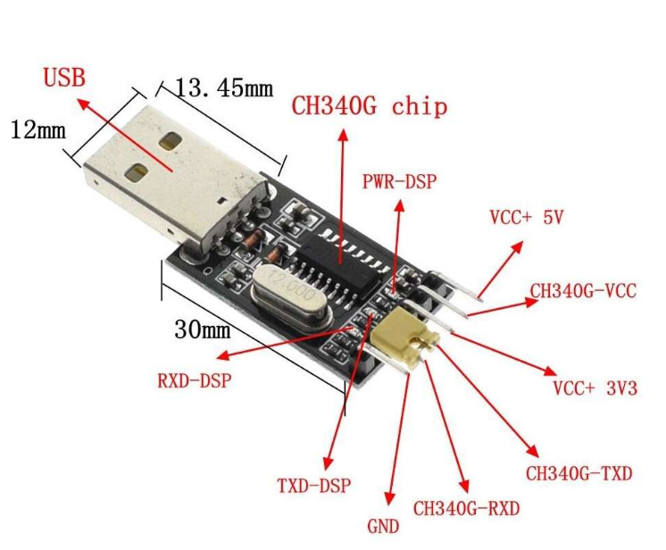

# 串口通信

## 1\. 为什么使用串口通信？

在项目协作中，**算法组**通常负责数据处理和决策，并将结果发送给**电控系统（单片机）执行控制动作。为了实现这种跨系统的信息传递，我们必须使用串口通信（Serial Communication）**。

### 核心概念

  * **串口（Serial Port/Interface）：** 全称串行接口，是一种计算机接口，数据**逐位（bit-by-bit）顺序传输**。想象数据像在排队一样，一位接一位地按顺序发送和接收。

## 2\. 建立通信：硬件与协议转换

电脑和电控设备使用不同的通信协议：

  * **电控设备**使用**串口协议**（例如 TTL 电平）。
  * **电脑**使用 **USB 协议**。

因此，我们需要一个“翻译官”来连接设备并转换协议。

| 硬件/外设 | 功能描述 | 常见形式 |
| :--- | :--- | :--- |
| **USB 转串口外设** | 建立电脑的 USB 接口和设备的串口之间的**翻译通道**，实现协议转换。 | **CH340 模块** |
| **USB 线缆** | 指 Type-C/USB-A 转 Micro USB/Type-C 等线。电控通过**虚拟串口技术**，将串口信息通过单片机上的 USB 口转换为电脑能理解的 USB 协议。 | |

> **CH340**：是一种常用的串口转 USB 芯片/模块的型号。



### 串口通信参数

要使设备间能正确“听懂”彼此的消息，必须正确设置以下两个参数：

| 参数名称 | 解释 | 常见取值示例 |
| :--- | :--- | :--- |
| **端口名称（`port_name`）** | 串口设备在 Linux 下的路径 | 使用 CH340：`/dev/ttyUSB0` <br> 使用虚拟串口：`/dev/ttyACM0` |
| **波特率（`baud_rate`）** | 两个设备进行串口通信所**协商的数据传输频率**（速率）。双方波特率必须一致才能正确通信。 | `115200` |

## 3\. 数据的最小单位与存储

在串口通信中，数据是以**包（Packet）**为单位传输的，一个包通常是 **8 比特（bit）**，即 **1 字节（byte）**。

### 3.1. 8 位整型：`int8_t` 和 `uint8_t`

由于电控一次只能发送 8 bit，通信中的最小数据类型是 8 位整型：

| 类型 | 含义 | 字节/位数 | 数值范围 | 备注 |
| :--- | :--- | :--- | :--- | :--- |
| **`uint8_t`** | **无符号** 8 位整型 | 1 字节 / 8 bit | $0$ 到 $255$ | 8 位都用于存储数值。 |
| **`int8_t`** | **有符号** 8 位整型 | 1 字节 / 8 bit | $-128$ 到 $127$ | 其中 $1$ 位（最高位）用于存储**符号位**（$0$ 为正，$1$ 为负）。 |

### 3.2. 使用 16 位整型 (`int16_t`) 传输更大的数据

`int8_t` 最大只能表示 $127$。如果我们要传输的角度范围在 $\pm 180^{\circ}$，就需要更大的数据类型。

| 数据类型 | 所需字节数（包数） | 适用场景 |
| :--- | :--- | :--- |
| **`int8_t`** | 1 字节 | 仅需传输小范围整数。 |
| **`int16_t`** | **2 字节** | 传输如 $\pm 18000$ 等较大范围的整数（$\pm 32,767$）。**（推荐）** |
| **`float32`** | 4 字节 | 传输浮点数，但占用带宽较大。 |

**数据缩放技巧：** 既然选择了 `int16_t`，为了传输浮点数（如角度 $180.00$），我们通常将数据**放大**（例如 $\times 100$）成整数后再发送，接收端再**缩小**（$\div 100$）还原。

  * 发送 $180.00$ 时，实际发送 $18000$，在 `int16_t` 的范围 ($\pm 32,767$) 内不会溢出。

## 4\. 数据封装：解包与发包

数据传输的核心是将大容量数据**拆分成 8 bit 的小包**（发包），然后在接收端将**小包重新组合**（解包）。

### 4.1. 数据读取（接收）

使用封装好的 `UartTransporter` 类（详见附录）开启串口并读取原始数据：

```cpp
#include "uart_transporter.hpp"

// 1. 开启串口
std::string port_name = "/dev/ttyUSB0";  // 串口设备路径
int baud_rate = 115200;                  // 波特率
auto uart_transporter = std::make_unique<UartTransporter>(port_name, baud_rate);

// 2. 读取串口数据
#define capacity 16 // 预期接收的字节数
uint8_t tmp_buffer_[capacity];
// 从串口读取 capacity 个字节（包）到 tmp_buffer_ 临时存储
int recv_len = uart_transporter->read(tmp_buffer_, capacity);
if (recv_len != capacity) {
    // 检查是否收到了预期的字节数，如果不够则返回
    return;
}
```

### 4.2. 数据解包：合并 8 bit 数据为 16 bit

电控将一个 `int16_t` 数据拆成**高八位**和**低八位**两个 `uint8_t` 包发送。我们需要使用**位运算符**将其合并。

**合并原理：**

1.  将**高八位**数据**左移 8 位**（`<< 8`），使其占据 $16$ 位数据的高 $8$ 位位置。
2.  将左移后的结果与**低八位**数据进行**按位或（`|`）**运算，完成合并。

<!-- end list -->

```cpp
// 假设：tmp_buffer_[1] 是高八位，tmp_buffer_[2] 是低八位（需与电控约定顺序）

// 使用位运算将两个 8-bit 数据合并成 16-bit
int16_t yaw_raw = (tmp_buffer_[1] << 8) | tmp_buffer_[2];

// 还原为浮点数（如果发送时乘以了 100，这里需要除以 100.0f）
float yaw_receive = static_cast<float>(yaw_raw) / 100.0f; 
```

### 4.3. 数据发包：拆分 16 bit 数据为两个 8 bit

发送过程是解包的逆过程，将 `int16_t` 拆分成高八位和低八位：

```cpp
// 初始化数据包
#define capacity 16
uint8_t tmp_buffer_[capacity] = {0}; // 初始化缓冲区

// 1. 定义和转换数据
float num = 233.233;
// 转换为 int16_t（乘以 100）
int16_t yaw = static_cast<int16_t>(num * 100);

// 2. 打包数据：拆分成高八位和低八位
tmp_buffer_[0] = (yaw >> 8);      // 高八位：右移 8 位，取出高 8 位
tmp_buffer_[1] = (yaw & 0xFF);    // 低八位：与 0xFF (即 1111 1111) 按位与，取出低 8 位

// 3. 发送数据
uart_transporter->write(tmp_buffer_, capacity);
```

## 5\. 提高可靠性：数据检测与冗余校验

### 5.1. 帧头/帧尾检测（数据同步）

当发送一连串数据包时，接收端需要知道数据流的**起始位置**。通过在数据包的第一个（或最后一个）字节写入一个特定的、独一无二的值作为**帧头/帧尾**，来实现数据同步。

  * **发送数据（加入帧头）：**
    ```cpp
    tmp_buffer_[0] = 0xff;          // 帧头
    tmp_buffer_[1] = yaw >> 8;      // 高八位
    tmp_buffer_[2] = yaw & 0xFF;    // 低八位
    // ... 发送
    ```
  * **接收数据（检测帧头）：**
    ```cpp
    // ... 读取数据到 tmp_buffer_
    if (tmp_buffer_[0] != 0xff) {
        // 帧头不匹配，说明接收位置不正确，跳过当前数据
        continue;
    }
    // 帧头匹配，开始解析数据
    int16_t yaw = (tmp_buffer_[1] << 8) | tmp_buffer_[2];
    ```

### 5.2. 冗余校验（错误检测）

为了检测数据在传输过程中是否被干扰（例如 $0$ 变成 $1$），我们需要在数据包中加入**校验位**。

  * 异或校验 (XOR)：将数据部分的所有字节进行**异或**运算，将结果作为校验位发送。它能检测出奇数位的错误。

    ```cpp
    // 假设 data[8] 是校验位
    data[8] = data[1] ^ data[2] ^ data[3] ^ data[4] ^ data[5] ^ data[6] ^ data[7];
    ```

  * **其他校验方式：**

      * 奇偶校验 (Parity)：通过控制数据中 $1$ 的总数为奇数或偶数，用于检测 $1$ 位错误。
      * CRC 校验 (循环冗余校验)：检错能力最强，应用最广泛。

-----

## 附录：`UartTransporter` 类（C++ 代码）

此部分包含用于串口操作的 C++ 类定义和实现，用于简化上层应用的串口打开、配置、读写操作。

### `uart_transporter.hpp`

```cpp
#ifndef SERIAL_DRIVER_UART_TRANSPORTER_HPP_
#define SERIAL_DRIVER_UART_TRANSPORTER_HPP_

// std
#include <string>
// project


// 串口数据传输设备，符合通用传输接口。
class UartTransporter {
public:
    UartTransporter(
        const std::string& device_path = "/dev/ttyUSB0",
        int speed = 115200,
        int flow_ctrl = 0,
        int databits = 8,
        int stopbits = 1,
        int parity = 'N'
    ):
        device_path_(device_path),
        speed_(speed),
        flow_ctrl_(flow_ctrl),
        databits_(databits),
        stopbits_(stopbits),
        parity_(parity) {}

    bool open();
    void close();
    bool isOpen();
    int read(void* buffer, size_t len);
    int write(const void* buffer, size_t len);
    std::string errorMessage() {
        return error_message_;
    }

private:
    bool setParam(
        int speed = 115200,
        int flow_ctrl = 0,
        int databits = 0,
        int stopbits = 1,
        int parity = 'N'
    );

private:
    // 设备文件描述符
    int fd_ { -1 };
    // 设备状态
    bool is_open_ { false };
    std::string error_message_;
    // 设备参数
    std::string device_path_;
    int speed_;
    int flow_ctrl_;
    int databits_;
    int stopbits_;
    int parity_;
};


#endif // SERIAL_DRIVER_UART_TRANSPORTER_HPP_

```

### `uart_transporter.cpp`

```cpp
#include "uart_transporter.hpp"
// System
#include <errno.h> /*错误号定义*/
#include <fcntl.h> /*文件控制定义*/
#include <stdio.h> /*标准输入输出定义*/
#include <stdlib.h> /*标准函数库定义*/
#include <string.h>
#include <sys/stat.h>
#include <sys/types.h>
#include <termios.h> /*PPSIX 终端控制定义*/
#include <unistd.h> /*Unix 标准函数定义*/


bool UartTransporter::setParam(int speed, int flow_ctrl, int databits, int stopbits, int parity) {
    // 设置串口数据帧格式
    int speed_arr[] = { B921600, B115200, B19200, B9600, B4800, B2400, B1200, B300 };
    int name_arr[] = { 921600, 115200, 19200, 9600, 4800, 2400, 1200, 300 };
    struct termios options;
    // tcgetattr(fd,&options)得到与fd指向对象的相关参数，并将它们保存于options,该函数还可以测试配置是否正确，
    // 该串口是否可用等。若调用成功，函数返回值为0，若调用失败，函数返回值为1.
    if (tcgetattr(fd_, &options) != 0) {
        error_message_ = "Setup Serial err";
        return false;
    }
    // 设置串口输入波特率和输出波特率
    for (size_t i = 0; i < sizeof(speed_arr) / sizeof(int); i++) {
        if (speed == name_arr[i]) {
            cfsetispeed(&options, speed_arr[i]);
            cfsetospeed(&options, speed_arr[i]);
        }
    }
    // 修改控制模式，保证程序不会占用串口
    options.c_cflag |= CLOCAL;
    // 修改控制模式，使得能够从串口中读取输入数据
    options.c_cflag |= CREAD;
    // 设置数据流控制
    switch (flow_ctrl) {
        case 0: // 不使用流控制
            options.c_cflag &= ~CRTSCTS;
            break;
        case 1: // 使用硬件流控制
            options.c_cflag |= CRTSCTS;
            break;
        case 2: // 使用软件流控制
            options.c_cflag |= IXON | IXOFF | IXANY;
            break;
    }
    // 设置数据位
    // 屏蔽其他标志位
    options.c_cflag &= ~CSIZE;
    switch (databits) {
        case 5:
            options.c_cflag |= CS5;
            break;
        case 6:
            options.c_cflag |= CS6;
            break;
        case 7:
            options.c_cflag |= CS7;
            break;
        case 8:
            options.c_cflag |= CS8;
            break;
        default:
            error_message_ = "Unsupported data size";
            return false;
    }
    // 设置校验位
    switch (parity) {
        case 'n':
        case 'N': // 无奇偶校验位。
            options.c_cflag &= ~PARENB;
            options.c_iflag &= ~INPCK;
            break;
        case 'o':
        case 'O': // 设置为奇校验
            options.c_cflag |= (PARODD | PARENB);
            options.c_iflag |= INPCK;
            break;
        case 'e':
        case 'E': // 设置为偶校验
            options.c_cflag |= PARENB;
            options.c_cflag &= ~PARODD;
            options.c_iflag |= INPCK;
            break;
        case 's':
        case 'S': // 设置为空格
            options.c_cflag &= ~PARENB;
            options.c_cflag &= ~CSTOPB;
            break;
        default:
            error_message_ = "Unsupported parity";
            return false;
    }
    // 设置停止位
    switch (stopbits) {
        case 1:
            options.c_cflag &= ~CSTOPB;
            break;
        case 2:
            options.c_cflag |= CSTOPB;
            break;
        default:
            error_message_ = "Unsupported stop bits";
            return false;
    }

    // 修改输出模式，原始数据输出
    options.c_oflag &= ~OPOST;
    options.c_lflag &= ~(ICANON | ECHO | ECHOE | ISIG);
    // 传输特殊字符，否则特殊字符0x0d,0x11,0x13会被屏蔽或映射。
    options.c_iflag &= ~(BRKINT | ICRNL | INPCK | ISTRIP | IXON);

    // 设置等待时间和最小接收字符
    options.c_cc[VTIME] = 1; // 读取一个字符等待1*(1/10)s
    options.c_cc[VMIN] = 1; // 读取字符的最少个数为1
    tcflush(fd_, TCIFLUSH);

    // 激活配置 (将修改后的termios数据设置到串口中）
    if (tcsetattr(fd_, TCSANOW, &options) != 0) {
        error_message_ = "com set error";
        return false;
    }
    return true;
}

bool UartTransporter::open() {
    if (is_open_) {
        return true;
    }
    fd_ = ::open(device_path_.c_str(), O_RDWR | O_NOCTTY | O_NDELAY);
    if (-1 == fd_) {
        error_message_ = "can't open uart device: " + device_path_;
        return false;
    }
    // 恢复串口为阻塞状态
    if (fcntl(fd_, F_SETFL, 0) < 0) {
        error_message_ = "fcntl failed";
        return false;
    }
    // 测试是否为终端设备
    // 避免自启动无法读取数据
    // if (0 == isatty(STDIN_FILENO)) {
    //   error_message_ = "standard input is not a terminal device";
    //   return false;
    // }
    // 设置串口数据帧格式
    if (!setParam(speed_, flow_ctrl_, databits_, stopbits_, parity_)) {
        return false;
    }
    is_open_ = true;
    return true;
}

void UartTransporter::close() {
    if (!is_open_) {
        return;
    }
    ::close(fd_);
    fd_ = -1;
    is_open_ = false;
}

bool UartTransporter::isOpen() {
    return is_open_;
}

int UartTransporter::read(void* buffer, size_t len) {
    int ret = ::read(fd_, buffer, len);
    // tcflush(fd_, TCIFLUSH);
    return ret;
}

int UartTransporter::write(const void* buffer, size_t len) {
    int ret = ::write(fd_, buffer, len);
    return ret;
}

```
