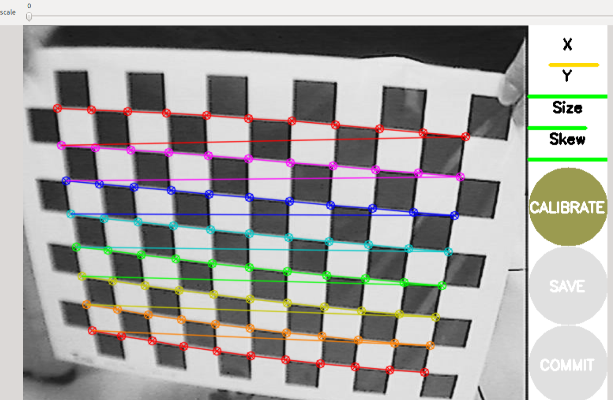
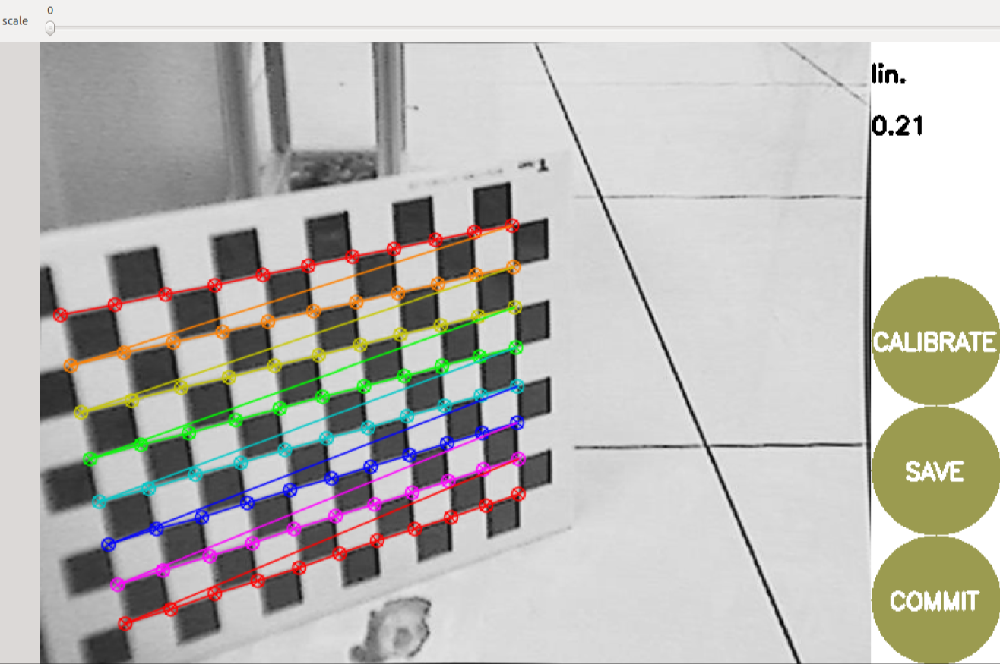

# 相机标定

相机标定开源选择上分为使用 ROS 标定和使用 matlab 标定。matlbal 标定不如 ROS 方便，这里不做讨论。当然标定的原理都是一样的，甚至你可以用 opencv 自己写一个标定程序出来

## 依赖

```terminal
sudo apt install ros-${ROS_DISTRO}-camera-calibration
sudo apt install ros-${ROS_DISTRO}-camera-info-manager
sudo apt install ros-${ROS_DISTRO}-launch-testing-ament-cmake
```

## 发布图像节点

标定程序需要订阅一个图像话题。拉取相机的驱动包或自己编写，修改`config`中的曝光和增益使画面能看清标定板，或者使用`rqt`或`foxglove`来调节参数

### 海康工业相机

```terminal
git clone https://github.com/chenjunnn/ros2_hik_camera.git
```

### USB 相机

```terminal
git clone https://gitee.com/slime0rimiru0/usb_cam.git
```


---

```terminal
# 确认话题发布
ros2 topic list
# 看能否订阅话题
ros2 topic hz /image_raw
```

## 启动相机标定节点

```terminal
ros2 run camera_calibration cameracalibrator --size 7x10 --square 0.015 image:=/image_raw camera:=/image_raw
```

`--size`：棋盘格尺寸，注意不是指格子数量，是黑白格相交的角点数量

`--square`：棋盘格格子大小，单位米

`image:=`：用来进行标定的图像话题

[官方标定指南](https://docs.ros.org/en/rolling/p/camera_calibration/doc/tutorial_mono.html)

---

- 在图像上改变标定板距离、角度，直到四条都绿（除了 Size 其他都是能攒满的，不知道为什么 Size 就是不行）

- 满后点击`CALIBRATE`开始计算标定数据，此时 GUI 无响应，等待即可。通过看终端可以看到标的一些数据，这个标定时间很长（笔者的 cpu AMD 7940h 在收集一百多张耗时几分钟，两百多耗时 1h ，三百张 2h 多）。完成后终端会输出标定的相机参数



- 标定完成后 GUI 可以查看重投影误差，误差越小越好，一般在 0.5 左右。然后按`SAVE`，会在`/tmp`下生成压缩包，里面有标定的图片和相机参数，我们需要的是里面的`ost.yaml`



## [标定板下载网站](https://calib.io/pages/camera-calibration-pattern-generator)