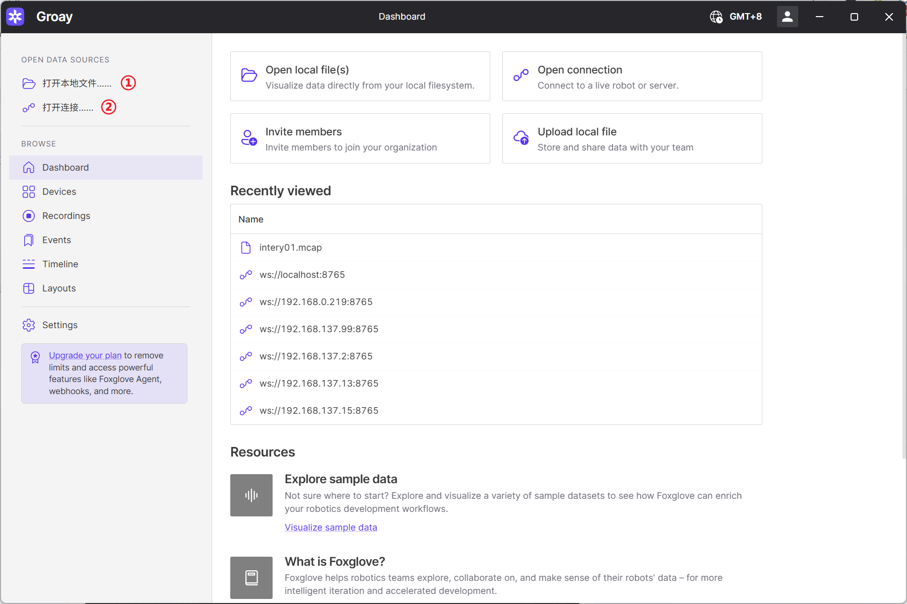
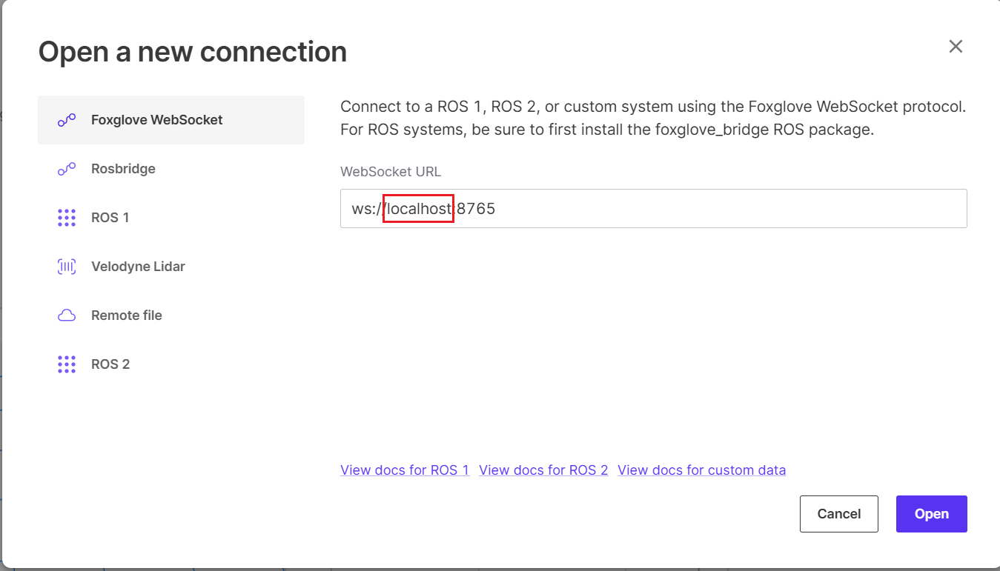
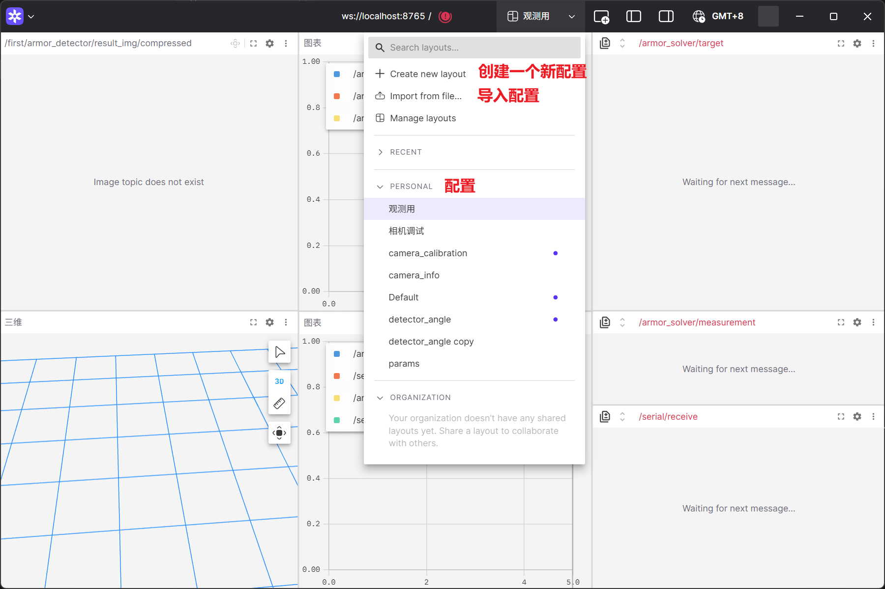
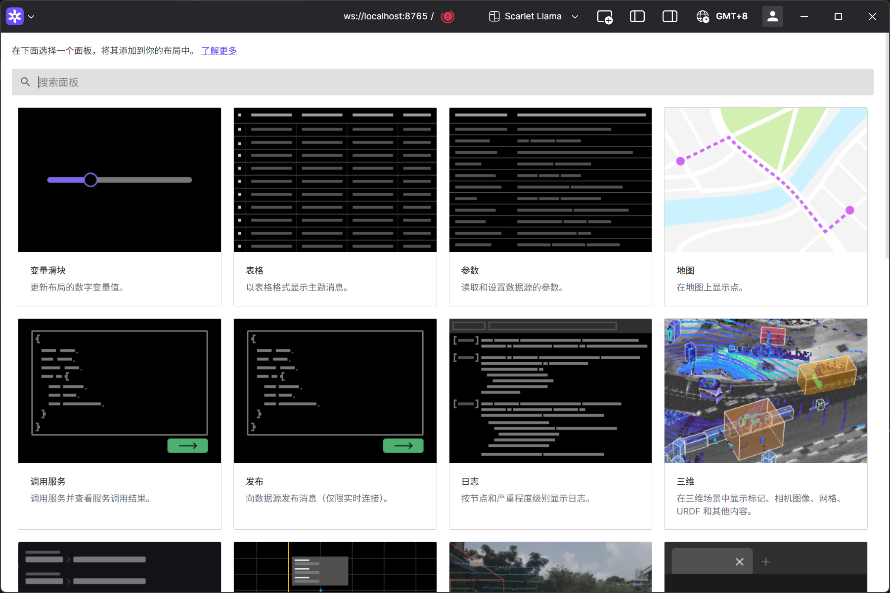
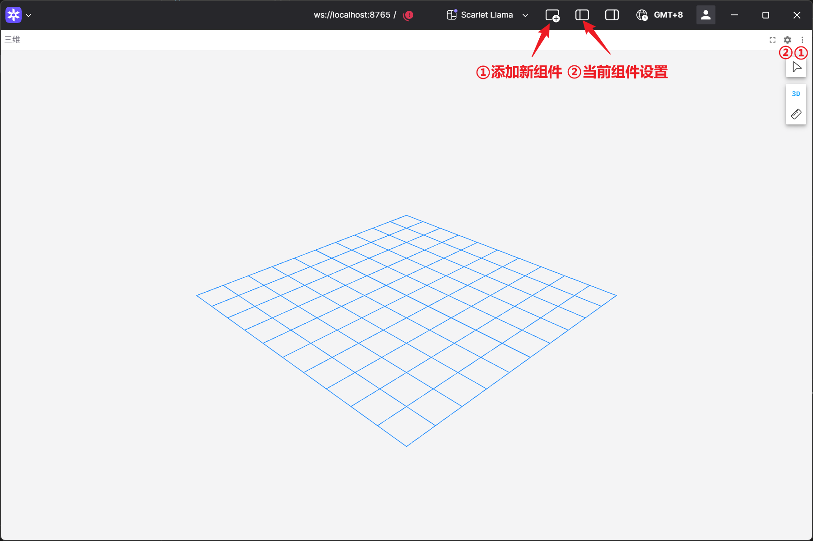

# Foxglove

Foxglove是一个专为机器人团队打造的平台，能够帮助团队可视化调试机器人、构建可靠的自主系统，并实现规模化开发。其功能与 ROS 自带的 rviz 相似

## 客户端安装

下载 Foxglove 软件以使用其功能

从[官网 https://foxglove.dev/download](https://foxglove.dev/download) 下载

## 中间件安装

想使用 Foxglove 还需要一个 ROS 包（foxglove-bridge）做转发

```bash
sudo apt install ros-$ROS_DISTRO-foxglove-bridge
```

## 使用 Foxglove

### 中间件

使用前，需要在发布 ROS 信息的那台设备所在的局域网内任意设备下运行一个 ROS 节点做转发

```bash
# 如果有自定义消息或使用参数通信，需要先声明环境变量
source install/setup.bash
# 转发节点
ros2 launch foxglove_bridge foxglove_bridge_launch.xml
```

### 客户端

打开安装的 Foxglove 软件，需要登录账号才能使用



- ① ： 打开 rosbag 录制的包，支持播放暂停和播放速度控制
- ② ： 连接在线的 foxglove_bridge 节点

将`localhost`替换成发布 foxglove_bridge 节点的设备 ip , 然后 `open`



> 如果都是在同一台设备上的话，默认的 localhost 就行，相当于 ip 127.0.0.1

!> 请确保所有设备都在同一个局域网里

### 使用详情



使用时以组件做区分，每一个组件相互独立，互不影响，常用的组件有 参数 三维 图表 图像



添加组件后还要在设置中订阅或可视化话题才行



!> 原始图像信息的带宽非常大，建议订阅压缩话题（ image-transport ）查看图像
