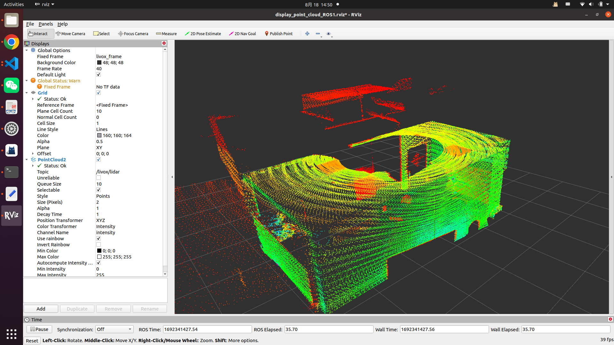

# Livox mid360使用

## 接线和供电

如图，航空插接雷达，网线接电脑，功能线可以暂时不需要管。


供电非常重要，雷达需要稳定的外部供电，电源参照以下设计：


## IP设置

在设置中将有线IP地址设为`192.168.1.50`，子网掩码`255.255.255.0`，网关`192.168.1.1`。


## 安装livox sdk

```bash
# 安装依赖包CMAKE
sudo apt install cmake

# 下载Livox-SDK文件
git clone https://github.com/Livox-SDK/Livox-SDK2.git

cd Livox-SDK2
mkdir build && cmake ..
make
sudo make install
```

## 安装LivoxViewer2

下载对应版本：

https://www.livoxtech.com/downloads

解压后进入目录，运行

```bash
sh ./LivoxViewer2.sh  
```

如果一切正常，将会看到雷达点云。


## 编译livox_ros_driver2

克隆源代码

```bash
git clone https://github.com/Livox-SDK/livox_ros_driver2.git
```

编译

终端进入到/src/livox_ros_driver2目录下

```bash
source /opt/ros/humble/setup.sh
./build.sh humbl
```

编译完成后，配置ip：

找到`config`目录下的`MID360_config.json`，将里面的ip改为电脑和雷达的

```json
{
  "lidar_summary_info" : {
    "lidar_type": 8
  },
  "MID360": {
    "lidar_net_info" : {
      "cmd_data_port": 56100,
      "push_msg_port": 56200,
      "point_data_port": 56300,
      "imu_data_port": 56400,
      "log_data_port": 56500
    },
    "host_net_info" : {
      "cmd_data_ip" : "192.168.1.50",
      "cmd_data_port": 56101,
      "push_msg_ip": "192.168.1.50",
      "push_msg_port": 56201,
      "point_data_ip": "192.168.1.50",
      "point_data_port": 56301,
      "imu_data_ip" : "192.168.1.50",
      "imu_data_port": 56401,
      "log_data_ip" : "",
      "log_data_port": 56501
    }
  },
  "lidar_configs" : [
    {
      "ip" : "192.168.1.1XX",
      "pcl_data_type" : 1,
      "pattern_mode" : 0,
      "extrinsic_parameter" : {
        "roll": 0.0,
        "pitch": 0.0,
        "yaw": 0.0,
        "x": 0,
        "y": 0,
        "z": 0
      }
    }
  ]
}
```

注意，`"192.168.1.1XX"`中，XX是雷达序列号末两位。

然后可以验尝试运行驱动：

```bash
roslaunch livox_ros_driver2 rviz_MID360.launch
```


