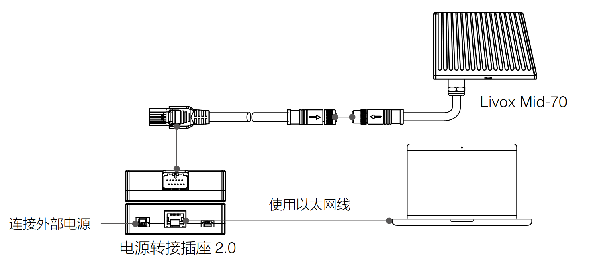
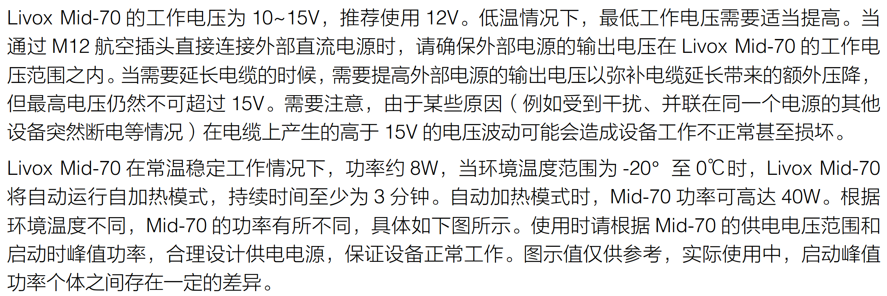
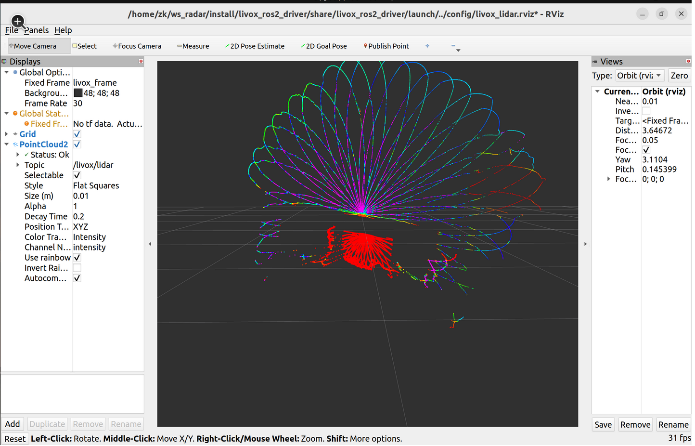

# Livox Mid-70 连接和驱动

## 接线和供电
如图，用航空线链接雷达和中控，中控另一边接网线和电源线。



网线连接电脑网口。电源线接中控，使用分电板或者连接可调电源给激光雷达供电。
注意供电电压和电流，请严格按照下图设计电源。
(其实只要按照主控Power口的输入电压范围提供合适电压就好，最好12V以上)



## 设置IP

在设置中将有线IP地址设为`192.168.1.50`，子网掩码`255.255.255.0`，网关`192.168.1.1`。


## 尝试连接到雷达

将网线连接雷达和电脑，打开终端

```bash
#尝试ping一下雷达地址(XX改为雷达SN码的后两位)
ping 192.168.1.1XX

#如果实在ping不到，检查一下雷达和电脑的连接或者执行以下命令
ping 192.168.1.100
```
下图所示，为连接成功。

！[img](images/2025-10-19-23-55-25.png)

## 安装livox-SDK
### 安装相关依赖

```bash
#1、安装CMake(装过可以忽略此步骤)
sudo apt install cmake

#2、下载Livox-SDK文件
git clone https://github.com/Livox-SDK/Livox-SDK.git
```
### 修复编译报错问题

注意：克隆完不要立刻编译。Livox-SDK包里sdk_core功能包中src下的base文件夹里的thread_base.cpp和
thread_base.h文件都缺少了一个头文件，我们要进入到VSCode为这两个文件添加头文件#include<memory>。

```bash
#进入Livox-SDK文件夹并打开VSCode添加头文件
cd Livox-SDK&&code .
```
添加完如图

！[img](images/2025-10-20-00-04-55.png)

！[img](images/2025-10-20-00-05-06.png)

### 编译

```bash
cd Livox-SDK/build

cmake -DCMAKE_CXX_FLAGS="-fPIC" \
      -DCMAKE_C_FLAGS="-fPIC" \
      -DCMAKE_POSITION_INDEPENDENT_CODE=ON \
      ..

make j-8

sudo make install

#Livox-SDK安装到此结束
#(安装和编译过程中要是有任何问题请及时反馈)
```
## 安装驱动Livox-ros2-driver

首先创建一个工作空间，将官方驱动放在该工作空间的src目录下。

```bash
#创建工作空间
mkdir livox_ws
cd livox_ws
mkdir src
cd src

#克隆官方驱动
git clone https://github.com/Livox-SDK/livox_ros2_driver.git

#回到livox_ws目录下进行编译(可以选择重启终端cd到livox_ws工作空间下编译)
cd livox_ws
colcon build

#更新环境变量
. install/stup.bash

#启动激光雷达驱动并打开rviz2显示激光雷达云点图
ros2 launch livox_ros2_driver livox_lidar_rviz_launch.py
```
rviz2中激光雷达的云点图



至此，恭喜你已经成功安装了Mid-70激光雷达的驱动!下面还有些其他启动Mid-70的方式。

```bash
#启动激光雷达驱动(默认Piontcloud2模式)
ros2 launch livox_ros2_driver livox_lidar_launch.py

#启动激光雷达驱动(自定义云点模式)
ros2 launch livox_ros2_driver livox_lidar_msg_launch.py

#启动激光雷达驱动+RVIZ可视化(默认)
ros2 launch livox_ros2_driver livox_lidar_rviz_launch.py

#启动激光雷达驱动+RVIZ可视化(含退出联动)
ros2 launch livox_ros2_driver livox_templte_launch.py
```

## 参考博客

[Ubuntu22.04在ROS2环境配置Livox-Mid70激光雷达-CSDN博客](https://blog.csdn.net/2501_90423119/article/details/151406043?ops_request_misc=&request_id=&biz_id=102&utm_term=mid70&utm_medium=distribute.pc_search_result.none-task-blog-2~all~sobaiduweb~default-2-151406043.142^v102^pc_search_result_base8&spm=1018.2226.3001.4187)