# NUC设置

拿到一台新的NUC时一般都要对他进行设置，不同品牌的设置方法有可能不同，在知道要设置什么的情况下查找方法

## 上电自启动

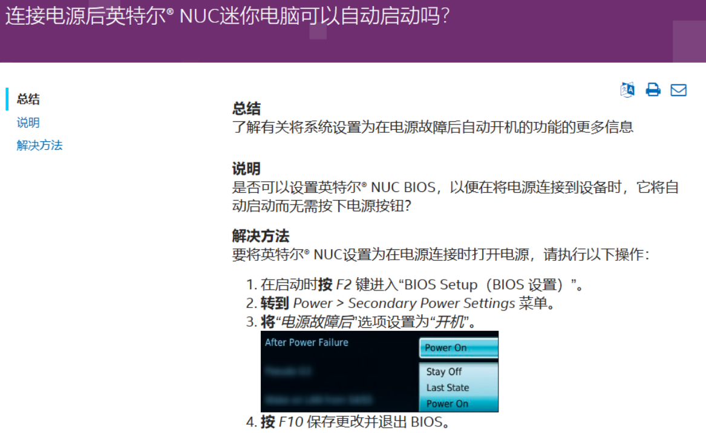

## 设置高性能模式

开机按F2进入Bios，选择Cooling设置风扇，Fan Control Mode选择Cool

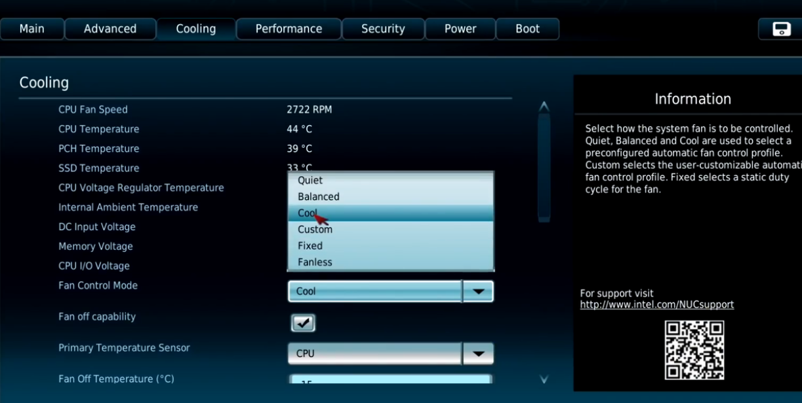

选择Power设置功率，选择Custom自定义功率（默认是Ener Efficient Performance节能）

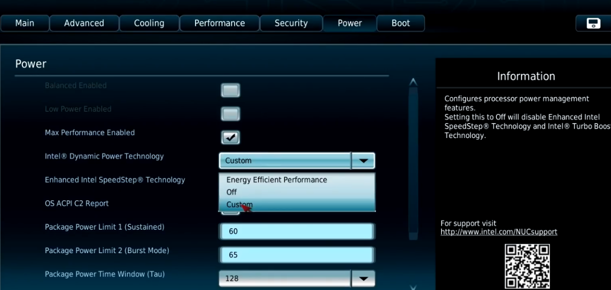

Sustained持续功率选60，Burst Mode爆发模式65(超过65w进入)，Time Window时间窗口选择最大值，这里最大是128

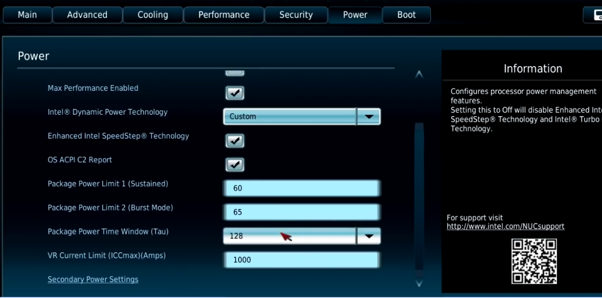

**最后记得按F10保存并退出**

## 关闭英特尔小核（如果有）

英特尔的大小核架构就有可能出现“一核干活，多核围观”的现象

- bios里关

进入bios，新版的bios，选择Power Performance and Cooling，选择Performance

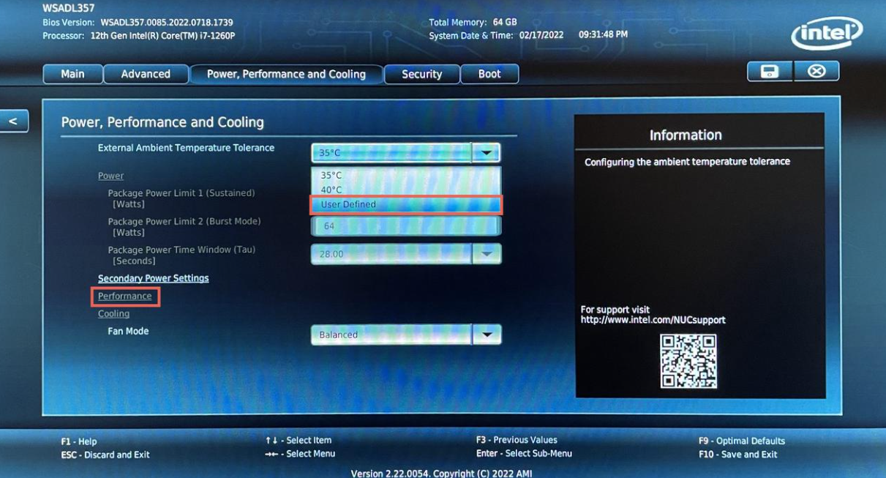

选择Processor

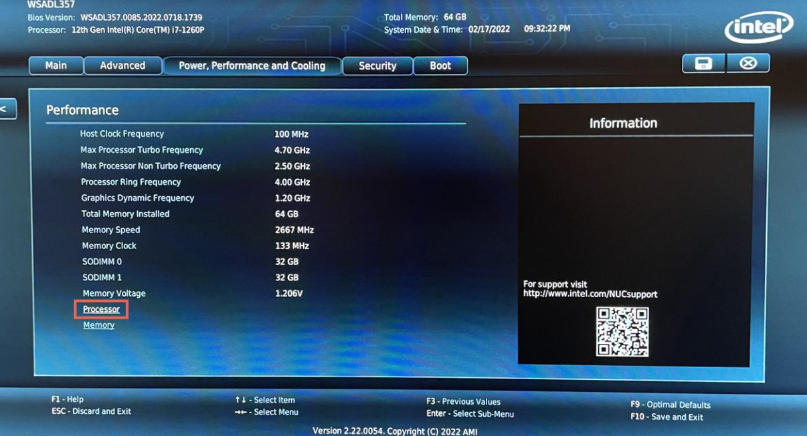

把Active Efficient Core设置成0，完成！

**注：E核是小核，P核是大核，Hyper-Threading是超线程，大核专属的，一个核心可运行两个线程，一定要开**

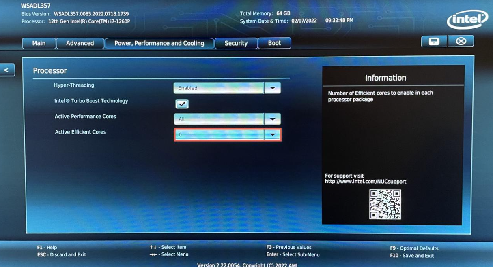

老版的bios设置如下，同理

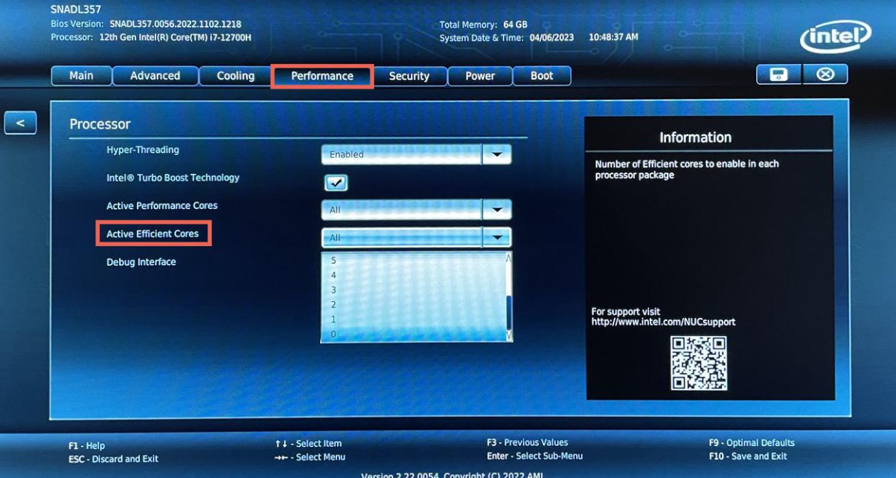

设置完成后可进入系统，使用性能监测器(系统自带)，或者htop(sudo apt install htop 下载)查看核心情况，如果4个大核，开启超线程，就是有八个线程，不开启就是4个线程。4大核，6小核开启超线程就是有4 * 2 + 6 = 16个线程

- 系统里关

linux系统里是可以主动控制cpu核心的使用的

```bash
# 查看 cpu 频率，确认要关闭的核
lscpu -e
# 关闭 cpu 核心
echo 0 > /sys/devices/system/cpu/cpu5/online
```

## 取消fast boot方法：

不小心设置fastboot(快速启动)，电脑会忽略所有usb设备操作，直接启动，无法再进入bios，无法选择引导项来重装系统。断电，打开外壳，**按几下电源键释放静电**，在主板上有一个跳线帽(如下图所示)，先拔掉它，让主板强制进入bios选项

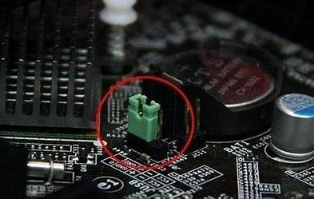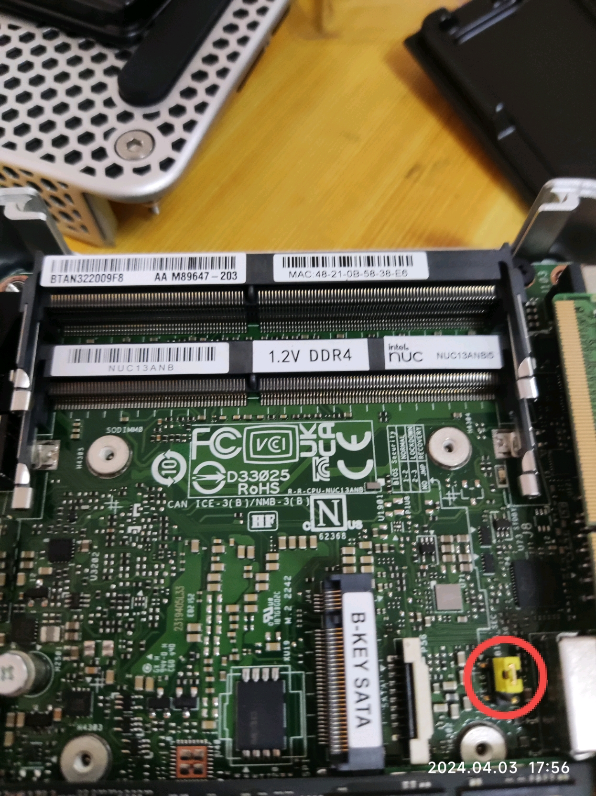

然后F2进入bios，进入Boot选项，取消fastboot的勾选（如下图所示），然后F10保存更改，**断电**(不放心可以重启进bios再看一次有没有取消掉)

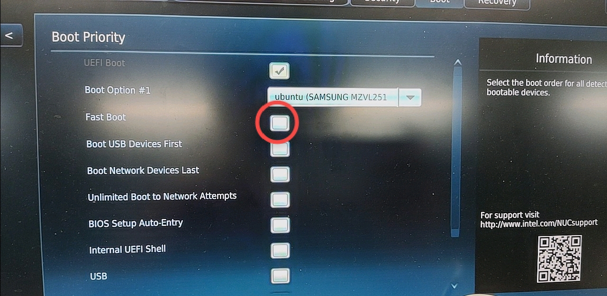

然后将跳线帽盖回1，2两个接口（如下图所示），上电启动，看按F2能不能正常进入bios，应该到这里就解决了

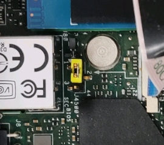
