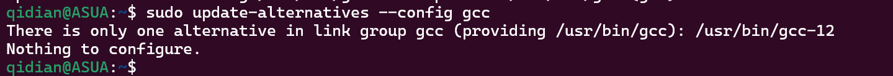
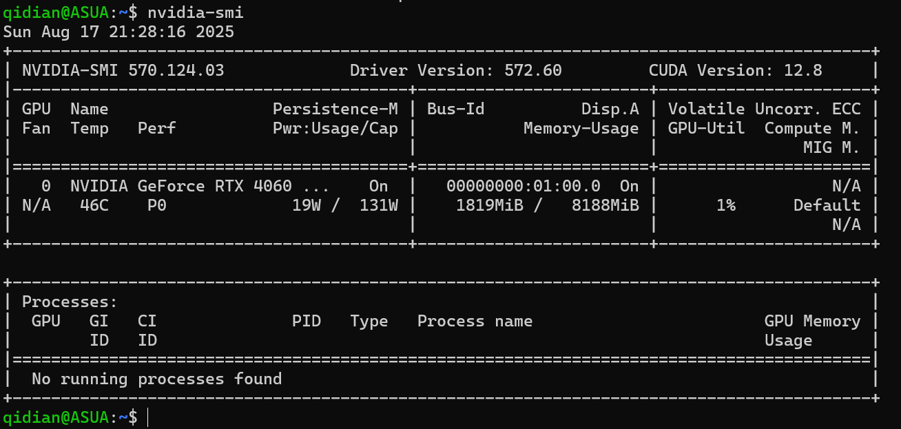
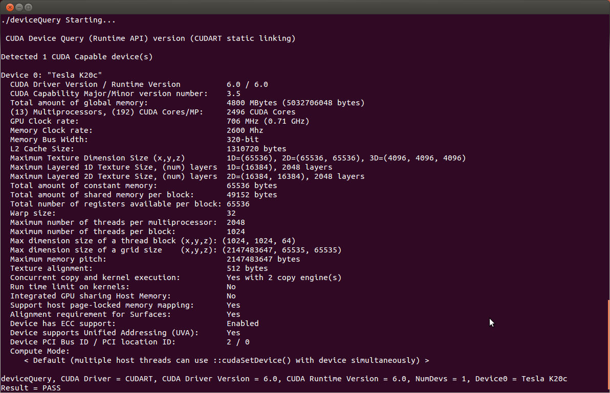

# NVIDIA

安装 NVIDIA 驱动、 CUDA-Toolkit 、 cuDNN，以下教程适合 Debian/Ubuntu ，其他系统参见 NVIDIA 官方文档

?> 为什么要装？<br>想多显示屏输出就要显卡驱动，想用显卡来训练神经网络就要 cuda 和 cudnn

以下内容的撰写均基于官方文档

> [NVIDIA driver 文档](https://docs.nvidia.com/datacenter/tesla/driver-installation-guide/contents.html)
>
> [CUDA 文档](https://docs.nvidia.com/cuda/cuda-installation-guide-linux/contents.html)
>
> [cuDNN 文档](https://docs.nvidia.com/deeplearning/cudnn/latest/)

## 安装内核头文件

```bash
sudo apt install linux-headers-$(uname -r)
```

## 添加软件仓库

### 环境变量

在使用时会多次使用到一些自定义参数，为了方便这里设置成环境变量

```bash
# ubuntu2204 ubuntu2404 debian12
export distro=ubuntu2204
# x86_64 不要用 amd64 ！
export arch=x86_64
```

> 更详细的参见[文档](https://docs.nvidia.com/datacenter/tesla/driver-installation-guide/index.html#linux-system-requirements)

### 添加网络仓库（ Network Repository ）

这里使用网络仓库而不使用本地仓库（ Local Repository ）安装是因为网络仓库同时也是安装 CUDA Toolkit 的步骤

```bash
wget https://developer.download.nvidia.com/compute/cuda/repos/$distro/$arch/cuda-keyring_1.1-1_all.deb
sudo dpkg -i cuda-keyring_1.1-1_all.deb
sudo apt update
```

> 更详细的参见[文档](https://docs.nvidia.com/datacenter/tesla/driver-installation-guide/index.html#ubuntu-installation-network)

## NVIDIA driver 英伟达显卡驱动

### 安装编译器

安装显卡驱动需要 gcc12 编译器，系统默认是 gcc11，所以要我们手动指定编译器

```bash
sudo apt install gcc-12
sudo update-alternatives --install /usr/bin/gcc gcc /usr/bin/gcc-12 100
```

- `/usr/bin/gcc` 主链接
- `gcc` 组名
- `/usr/bin/gcc-12` 要添加进组的链接
- `100` 优先级，越高约优先

验证gcc的链接设置

```bash
sudo update-alternatives --config gcc
```



### 安装驱动（ apt ）

```bash
# Open Kernel Modules  开放内核模块
sudo apt install nvidia-open
# Proprietary Kernel Modules 专有内核模块
sudo apt install cuda-drivers
```

> 从 515 驱动程序发布系列开始，提供了内核模块的两种“风格”
>
> Open :  仅适用于图灵和较新的体系结构
>
> Proprietary : NVIDIA 历史上发布的风格。适用于 Maxwell、Pascal 或 Volta 架构的旧 GPU。开源 GPU 内核模块与您的平台不兼容，因此您需要使用专有模块

从 560 驱动程序版本系列开始，开放内核模块风格是默认安装

开放式 GPU 内核模块仅在图灵和更新一代上受支持。要验证您的 NVIDIA GPU 是否至少是图灵（`Turing`）或更新版本使用下面的命令查看

```bash
lspci | grep VGA
```

> GeForce RTX 20系列 在消费级显卡上才有图灵架构

### 安装驱动（ .run ）

下载驱动： <https://www.nvidia.cn/download/index.aspx>

```bash
# 添加执行权限
sudo chmod +x "NVIDIA-Linux-x86_64-550.78.run"
# 执行安装
sudo bash "NVIDIA-Linux-x86_64-550.78.run"
```

### 验证驱动安装

安装完成后重启`sudo reboot`生效，输入`nvidia-smi`确认有无输出



## CUDA Toolkit

NVIDIA CUDA 工具包

### 安装 cuda-toolkit

```bash
sudo apt-get -y install cuda-toolkit
```

### 声明环境变量

```bash
export PATH=$PATH:/usr/local/cuda/bin
export LD_LIBRARY_PATH=$LD_LIBRARY_PATH:/usr/local/cuda/lib64
```

### 验证安装

```bash
git clone https://github.com/NVIDIA/cuda-samples.git
cd cuda-samples
mkdir build && cd build
cmake ..
make -j$(nproc)
```



## cuDNN

深度神经网络库（cuDNN）是一个用于深度神经网络的 GPU 加速基元库

```bash
sudo apt-get -y install cudnn
```
