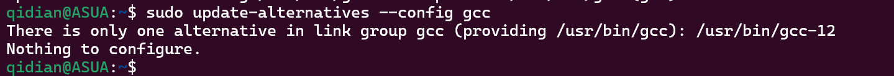
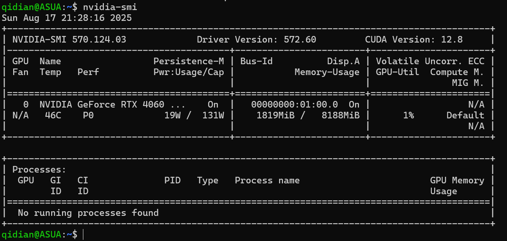
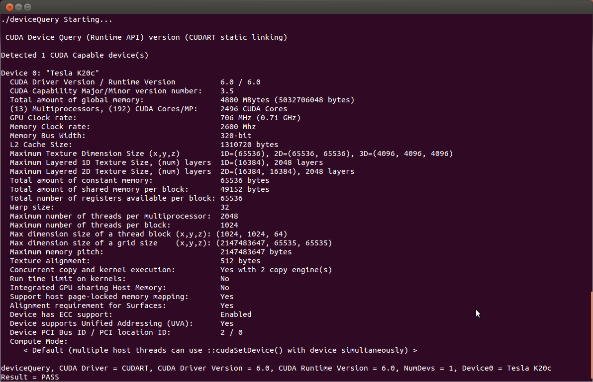

# NVIDIA

安装 NVIDIA 驱动、 CUDA-Toolkit 、 cuDNN

!> 以下教程仅在 Debian/Ubuntu 测试过，其他发行版理论上思路相同，但建议还是看 NVIDIA 官方文档

!> 安装前需要进 BIOS 关闭“安全启动”，这是因为驱动的 dkms 需要自己签证书（安全启动需要检测这个证书），由于官方文档也没说且笔者没去细研究，就一刀切直接关安全启动解决了

?> 为什么要显卡驱动？
</br> 1、nvidia 驱动是闭源的，并没有内置在 Linux 内核里，需要单独安装
</br> 2、想多显示屏输出就要显卡驱动，想用利用 nvidia 显卡来训练神经网络就要 cuda 和 cudnn

该教程的撰写均基于官方文档，并且由于官方文档文本量大，所以笔者会在每一步的最后标注依据的官方文档位置

> [NVIDIA driver 文档](https://docs.nvidia.com/datacenter/tesla/driver-installation-guide/)
>
> [CUDA 文档](https://docs.nvidia.com/cuda/cuda-installation-guide-linux/)
>
> [cuDNN 文档](https://docs.nvidia.com/deeplearning/cudnn/)

## 安装内核头文件

```bash
sudo apt install linux-headers-$(uname -r)
```

> [Verify the System has the Correct Kernel Packages Installed](https://docs.nvidia.com/datacenter/tesla/driver-installation-guide/pre-installation-actions.html#verify-the-system-has-the-correct-kernel-packages-installed)

## 添加软件仓库

### 环境变量

先声明环境变量方便后面直接 CV

- 先查看自己系统的发行版和架构
```bash
# 查看 Linux 发行版
hostnamectl
```

- 这里我以 Ubuntu24 和 x86 架构为例，其他的发行版见下表
``` bash
export distro=ubuntu2404
export arch=amd64 # 这个其他后面也没用到，根据文档后面的步骤推测疑似 nvidia 写错，amd64 应为 x86_64 
```

| Distribution | Codename | Architecture|
|:-:|:-:|:-:|
|Ubuntu 24.04 LTS | ubuntu2404 | amd64 |
|Ubuntu 22.04 LTS | ubuntu2204 | amd64 |
|Debian 12 | debian12 | amd64 |
|Debian 13 | debian13 | amd64 |

> [Linux System Requirements](https://docs.nvidia.com/datacenter/tesla/driver-installation-guide/introduction.html#linux-system-requirements)

### 添加网络仓库（ Network Repository ）

这里使用网络仓库而不使用本地仓库（ Local Repository ）安装是因为网络仓库同时也是安装 CUDA Toolkit 的步骤

```bash
wget https://developer.download.nvidia.com/compute/cuda/repos/$distro/x86_64/cuda-keyring_1.1-1_all.deb
sudo dpkg -i cuda-keyring_1.1-1_all.deb
sudo apt update
```

> [Network Repository Enablement (amd64)](https://docs.nvidia.com/datacenter/tesla/driver-installation-guide/ubuntu.html#network-repository-enablement-amd64)

## NVIDIA driver 英伟达显卡驱动

### 验证 Linux 配置

确认版本是否满足最低版本要求，最低版本要求如下

``` bash
# 内核版本
uname -r
# 编译器版本
gcc --version
# GLIBC 版本
ldd --version
``` 

|Distribution|OS Version|KernelDefault|GCC|GLIBC|
|:-:|:-:|:-:|:-:|:-:|
|Ubuntu 24.04 LTS|24.04.3|6.14.0-29|13.3.0|2.39|
|Ubuntu 22.04 LTS|22.04.5|6.5.0-45|12.3.0|2.35|
|Debian 13|13.1|6.12.43-1|14.2.0|2.41|
|Debian 12|12.12|6.1.148-1|12.2.0|2.36|


这里主要遇到的是 gcc 版本要求，以下演示 **Ubuntu22** 如何安装教程

```bash
sudo apt install gcc-12
sudo update-alternatives --install /usr/bin/gcc gcc /usr/bin/gcc-12 100
```

- `/usr/bin/gcc` 主链接
- `gcc` 组名
- `/usr/bin/gcc-12` 要添加进组的链接
- `100` 优先级，越高约优先

验证gcc的链接设置

```bash
sudo update-alternatives --config gcc
```



> [Validated Linux Configurations](https://docs.nvidia.com/datacenter/tesla/driver-installation-guide/introduction.html#validated-linux-configurations)

### 安装驱动（ apt ）

20系显卡及其以上选 open

```bash
# Open Kernel Modules  开放内核模块
sudo apt install nvidia-open
# Proprietary Kernel Modules 专有内核模块
sudo apt install cuda-drivers
```

> [Driver Installation](https://docs.nvidia.com/datacenter/tesla/driver-installation-guide/ubuntu.html#driver-installation)

### 安装驱动（ .run ）

!> 该方法已没有使用了，所以教程不完整。实际上还需要注意：禁用默认开源驱动，进入 tty3 安装，gcc 版本要求

下载驱动： <https://www.nvidia.cn/download/index.aspx>

```bash
# 添加执行权限
sudo chmod +x "NVIDIA-Linux-x86_64-550.78.run"
# 执行安装
sudo bash "NVIDIA-Linux-x86_64-550.78.run"
```

### 验证驱动

安装完成后重启`sudo reboot`生效，输入`nvidia-smi`确认有无输出



``` bash
# 验证驱动版本
cat /proc/driver/nvidia/version
```

> [Verify the Driver Version](https://docs.nvidia.com/datacenter/tesla/driver-installation-guide/post-installation-actions.html#verify-the-driver-version)

### 使用显卡

一般把鼠标放在软件图标上，右键选项里就有“使用独立显卡启动”选项

[Optimus 笔记本与多 GPU 台式机系统](https://docs.nvidia.com/datacenter/tesla/driver-installation-guide/optimus-laptops-and-multi-gpu-desktop-systems.html)

### 卸载驱动

以 Ubuntu 22.04/24.04 为例

```bash
sudo apt remove --autoremove --purge -V \
   cuda-compat\* \
   cuda-drivers\*  \
   libnvidia-cfg1\* \
   libnvidia-compute\* \
   libnvidia-decode\* \
   libnvidia-encode\* \
   libnvidia-extra\* \
   libnvidia-fbc1\* \
   libnvidia-gl\* \
   libnvidia-gpucomp\* \
   libnvidia-nscq\* \
   libnvsdm\* \
   libxnvctrl\* \
   nvidia-dkms\* \
   nvidia-driver\* \
   nvidia-fabricmanager\* \
   nvidia-firmware\* \
   nvidia-headless\* \
   nvidia-imex\* \
   nvidia-kernel\* \
   nvidia-modprobe\* \
   nvidia-open\* \
   nvidia-persistenced\* \
   nvidia-settings\* \
   nvidia-xconfig\* \
   xserver-xorg-video-nvidia\*
```

> [Removing the Driver](https://docs.nvidia.com/datacenter/tesla/driver-installation-guide/removing-the-driver.html)

## CUDA Toolkit

NVIDIA CUDA 工具包

### 安装 cuda-toolkit

```bash
sudo apt-get -y install cuda-toolkit
```

> [Network Repository Installation](https://docs.nvidia.com/cuda/cuda-installation-guide-linux/#network-repo-installation-for-debian)

### 声明环境变量

记得先确认路径是否存在

```bash
export PATH=$PATH:/usr/local/cuda/bin
export LD_LIBRARY_PATH=$LD_LIBRARY_PATH:/usr/local/cuda/lib64
```
> [Environment Setup](https://docs.nvidia.com/cuda/cuda-installation-guide-linux/#environment-setup)

### 验证安装

```bash
git clone https://github.com/NVIDIA/cuda-samples.git
cd cuda-samples
mkdir build && cd build
cmake ..
make -j$(nproc)
./Samples/1_Utilities/deviceQuery/deviceQuery 
```



> [Verify the Installation](https://docs.nvidia.com/cuda/cuda-installation-guide-linux/#verify-the-installation)

### 卸载 CUDA

以 Debian/Ubuntu 为例

```bash
sudo apt remove --autoremove --purge "*cuda*" "*cublas*" "*cufft*" "*cufile*" "*curand*" "*cusolver*" "*cusparse*" "*gds-tools*" "*npp*" "*nvjpeg*" "nsight*" "*nvvm*"
```

> [Removing CUDA Toolkit](https://docs.nvidia.com/cuda/cuda-installation-guide-linux/#removing-cuda-toolkit)

## cuDNN

深度神经网络库（cuDNN）是一个用于深度神经网络的 GPU 加速基元库

``` bash
# 要安装 CUDA 12，请运行：
sudo apt-get -y install cudnn9-cuda-12
# 要安装 CUDA 13，请运行：
sudo apt-get -y install cudnn9-cuda-13
``` 

> [Ubuntu and Debian Network Installation](https://docs.nvidia.com/deeplearning/cudnn/installation/latest/linux.html#ubuntu-and-debian-network-installation)