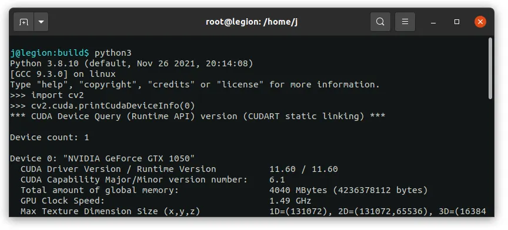
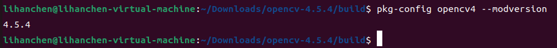
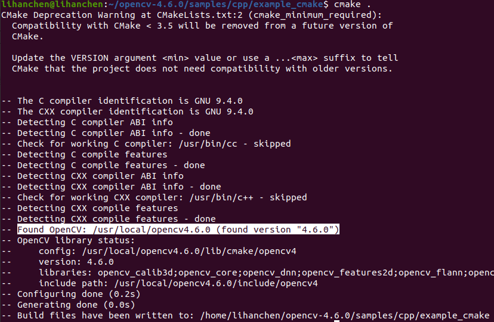

# OpenCV

OpenCV是一个C++的库。opnencv中有两个库，一个是[基础库`opencv`](https://github.com/opencv/opencv)，包含大部分常用的函数,还有一个是[扩展库`opencv_contrib`](https://github.com/opencv/opencv_contrib)，包含大部分常用的函数,还有一个是[扩展库`opencv_contrib`](https://github.com/opencv/opencv_contrib)，这个库主要是为了使用GPU（cuda）来加速opencv图像处理

## apt 安装

使用`apt`安装预编译好的opencv，版本为4.5.4，想要更新的话需要自己编译

```terminal
sudo apt install libopencv-dev
```

## 源码编译安装（多版本共存）

### apt 依赖安装

在编译前需安装一些包，以保证一些功能正常使用，如 GUI 可视化

OpnCV 默认有开启一些功能，像 GUI 可视化这些，但只有它检测到你有装相应的包才会编译进去

```bash
# 编译依赖 
sudo apt install git cmake build-essential pkg-config 
# GUI ，很重要，关系到可视化
sudo apt install libgtk-3-dev libgtk2.0-dev
# 视频编码
sudo apt install libavcodec-dev libavformat-dev libswscale-dev
# GStreamer
sudo apt install libgstreamer1.0-dev libgstreamer-plugins-base1.0-dev libgstreamer-plugins-good1.0-dev
# 图像处理库​​
sudo apt install libjpeg-dev libpng-dev libtiff-dev libwebp-dev
# ​​Eigen优化​
sudo apt install libeigen3-dev     
# 硬件加速视频解码
sudo apt install libva-dev
# 加速编译
sudo apt install ccache
# VTK 支持（用于 3D 可视化），1G超大，慎装
sudo apt install libvtk9-dev
```

嫌麻烦一条龙命令,不含 VTK

```bash
sudo apt install git cmake build-essential pkg-config libgtk-3-dev libgtk2.0-dev libavcodec-dev libavformat-dev libswscale-dev libgstreamer1.0-dev libgstreamer-plugins-base1.0-dev libgstreamer-plugins-good1.0-dev libjpeg-dev libpng-dev libtiff-dev libwebp-dev libeigen3-dev libva-dev ccache
```

### 编译

获取源码，`-b`确认拉下来哪个版本

```bash
git clone -b 4.5.4 https://github.com/opencv/opencv.git
```

编译安装

```bash
cd opencv
mkdir build && cd build
# 构建
cmake .. \
    -D CMAKE_BUILD_TYPE=Release \
    -D BUILD_EXAMPLES=OFF \
    -D CMAKE_INSTALL_PREFIX=/usr/local/opencv4.5.4 \
    -D OPENCV_GENERATE_PKGCONFIG=ON \
    -D BUILD_opencv_python3=ON
# 编译
make -j4    # 4线程编译，看你电脑内存选择加
# 安装
make install
```

- `CMAKE_BUILD_TYPE`:构建类型为 ​​Release​​ / Debug
- `BUILD_EXAMPLES`:编译例程，关闭减少编译开销
- `CMAKE_INSTALL_PREFIX`:make install 的安装路径
- `OPENCV_GENERATE_PKGCONFIG`:生成 pkg-config 的配置文件，对不使用 CMake 进行构建的项目可能很有用
- `BUILD_opencv_python3`:构建 Python3 绑定

> 更多 cmake 可配置选项参见[配置文档](https://docs.opencv.org/4.12.0/db/d05/tutorial_config_reference.html)

## opencv_contrib 编译

> 该库旨在开发所谓的“额外”模块，即贡献的功能。新模块的 API 通常不稳定，而且没有经过充分测试。因此，它们不应作为官方 OpenCV 版本的一部分发布，因为该库需要保持二进制兼容性，并努力提供良好的性能和稳定性。
>所以，所有新模块都应首先单独开发，并在 opencv_contrib 库中发布。之后，当模块成熟并受到欢迎时，它将被转移到中央 OpenCV 库，由开发团队为其提供生产质量的支持。

使用 opencv_contrib 最主要就是为了它里面的 CUDA 模块，能使用带 CUDA 加速的函数。因为该库是一个 OpenCV 模块，所以是在编译 OpenCV 就基础上附加的

### 前置

要为了 CUDA 编译的话，先保证自己装了显卡驱动、 `NVIDIA CUDA Toolkit` 和 `NVIDIA CUDA Deep Neural Network (cuDNN) library`

### 查看显卡算力

查看显卡型号

```bash
nvidia-smi -L
```

然后去[CUDA GPU Compute Capability](https://developer.nvidia.com/cuda-gpus)看你对应显卡的算力（Compute Capability），下面给出一个表参考

| Compute Capability | GeForce/RTX                                                  | Jetson                                                  |
| ------------------ | ------------------------------------------------------------ | ------------------------------------------------------- |
| 12.0               | GeForce RTX 5090<br/>GeForce RTX 5080<br/>GeForce RTX 5070 Ti<br/>GeForce RTX 5070<br/>GeForce RTX 5060 Ti<br/>GeForce RTX 5060<br/>GeForce RTX 5050 |                                                         |
| 8.9                | GeForce RTX 4090<br/>GeForce RTX 4080<br/>GeForce RTX 4070 Ti<br/>GeForce RTX 4070<br/>GeForce RTX 4060 Ti<br/>GeForce RTX 4060<br/>GeForce RTX 4050 |                                                         |
| 8.7                |                                                              | Jetson AGX Orin<br/>Jetson Orin NX<br/>Jetson Orin Nano |
| 8.6                | GeForce RTX 3090 Ti<br/>GeForce RTX 3090<br/>GeForce RTX 3080 Ti<br/>GeForce RTX 3080<br/>GeForce RTX 3070 Ti<br/>GeForce RTX 3070<br/>GeForce RTX 3060 Ti<br/>GeForce RTX 3060<br/>GeForce RTX 3050 Ti<br/>GeForce RTX 3050 |                                                         |
| 7.5                | GeForce GTX 1650 Ti<br/>GeForce RTX 2080 Ti<br/>GeForce RTX 2080<br/>GeForce RTX 2070<br/>GeForce RTX 2060 |                                                         |
| 7.2                |                                                              | Jetson AGX Xavier<br/>Jetson Xavier NX                  |
| 6.2                |                                                              | Jetson TX2                                              |
| 6.1                | GeForce GTX 1080 Ti<br/>GeForce GTX 1080<br/>GeForce GTX 1070 Ti<br/>GeForce GTX 1070<br/>GeForce GTX 1060<br/>GeForce GTX 1050 |                                                         |
| 5.3                |                                                              | Jetson Nano                                             |

### CUDA 版本编译

!> 记得修改`CUDA_ARCH_BIN`

```bash
# OpenCV
git clone https://github.com/opencv/opencv.git
# opencv_contrib
git clone https://github.com/opencv/opencv_contrib.git
mkdir build && cd build
# cmake
cmake ../opencv \
-D CMAKE_BUILD_TYPE=RELEASE \
-D CMAKE_INSTALL_PREFIX=/usr/local/opencv \
-D BUILD_EXAMPLES=OFF \
-D WITH_CUDA=ON \
-D WITH_CUDNN=ON \
-D WITH_CUBLAS=ON \
-D WITH_TBB=ON \
-D OPENCV_DNN_CUDA=ON \
-D OPENCV_ENABLE_NONFREE=ON \
-D HAVE_opencv_python3=ON \
-D OPENCV_EXTRA_MODULES_PATH=../opencv_contrib/modules \
-D CUDA_ARCH_BIN=6.1 \
# install
make install
```

- `OPENCV_ENABLE_NONFREE`：编译一些带专利的算法，cuda 使用需要用到
- `HAVE_opencv_python3`：明确启用对 python3 绑定的支持
- `OPENCV_EXTRA_MODULES_PATH`：`opencv_contrib/modules`位置
- `CUDA_ARCH_BIN`：填上自己的显卡算力

### 链接 python 库

注意 python 版本

```bash
sudo ln -s /usr/local/lib/python3.8/site-packages/cv2 /usr/local/lib/python3.8/dist-packages/cv2
```

### 验证安装

```bash
python3 -c "import cv2; cv2.cuda.printCudaDeviceInfo(0)"
```



> 参考教程[Installing OpenCV 4 with CUDA in Ubuntu 22.04](https://medium.com/@juancrrn/installing-opencv-4-with-cuda-in-ubuntu-20-04-fde6d6a0a367)

## 环境变量

编译好后还要指定环境变量，这样运行程序时才能找到动态库。注意路径要对，可以把命令放入`~/.bashrc`中省的每次使用都要声明变量

```bash
export PKG_CONFIG_PATH=/usr/local/opencv4.5.4/lib/pkgconfig:$PKG_CONFIG_PATH
export LD_LIBRARY_PATH=/usr/local/opencv4.5.4/lib:$LD_LIBRARY_PATH
```

检验安装

```bash
pkg-config opencv4 --modversion
```


or

```bash
cd ~/opencv/samples/cpp/example_cmake # 拉取的源码里的代码
cmake .
```

注意检查 Found OpenCV: 路径是否正确


## CMaklists.txt

```cmake
cmake_minimum_required(VERSION 3.0.0) 
set(CMAKE_EXPORT_COMPILE_COMMANDS ON)
project(OpenCV) 

set(OpenCV_DIR /usr/local/opencv4.5.4/lib/cmake/opencv4/)   # 如果你自定义了安装路径要加
find_package( OpenCV REQUIRED )
include_directories( ${OpenCV_INCLUDE_DIRS} ) 

add_executable( ${PROJECT_NAME} *.cpp ) 
target_link_libraries( ${PROJECT_NAME} ${OpenCV_LIBS} )
```

## 交叉编译

在 x86 下编译出 arm 架构的 OpenCV

OpenCV 的一些功能需要依赖其他的 apt 包，典型的就是 GUI ，但是编译时又没法安装 arm 的 apt 包，所以这些功能会有缺失

```bash
# 安装编译工具
sudo apt install g++-aarch64-linux-gnu gcc-aarch64-linux-gnu
# 用这行 camke 即可，其他的与正常编译一样
cmake .. \
    -DCMAKE_INSTALL_PREFIX=../aarch64_install \
    -DWITH_CUDA=OFF \
    -DENABLE_PRECOMPILED_HEADERS=OFF \
    -DCMAKE_TOOLCHAIN_FILE=../platforms/linux/aarch64-gnu.toolchain.cmake \
    -DCMAKE_C_COMPILER=/usr/bin/aarch64-linux-gnu-gcc \
    -DCMAKE_CXX_COMPILER=/usr/bin/aarch64-linux-gnu-g++
```
