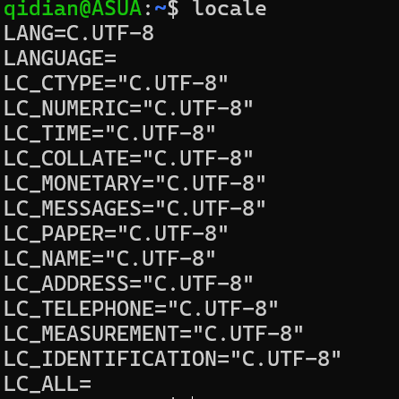

# ROS

安装 ROS 教程

## 预编译安装（Debian/Ubuntu）

直接下载已经编译好的 ROS ，我们需要的只是下载下来

但是预编译版本只有 Debian 和 Ubuntu 系统有

### 法一：鱼香 ROS

鱼香 ROS 提供一键安装脚本

```bash
wget http://fishros.com/install -O fishros && . fishros
```

### 法二：官方 apt 安装

根据 ROS 官方文档来进行 apt 安装

#### 查看本地语言是否支持 UTF-8

```bash
locale
```

输出如下


像这样有 `LANG=C.UTF-8` 即可，如果没有，则执行下面的命令

```bash
sudo apt update && sudo apt install locales
sudo locale-gen en_US en_US.UTF-8
sudo update-locale LC_ALL=en_US.UTF-8 LANG=en_US.UTF-8
# 声明环境变量
export LANG=en_US.UTF-8
```

#### 添加密钥

使用 apt 安装 ROS 还需要添加官方密钥，这样我们才有资格访问 ROS 的 apt 源

这里由于网络原因，我们不使用 ROS 的官方源，转而使用中科大提供的源

```bash
sudo curl -sSL https://raw.githubusercontent.com/ros/rosdistro/master/ros.key -o /usr/share/keyrings/ros-archive-keyring.gpg
echo "deb [arch=$(dpkg --print-architecture) signed-by=/usr/share/keyrings/ros-archive-keyring.gpg] http://mirrors.ustc.edu.cn/ros2/ubuntu $(lsb_release -sc) main" | sudo tee /etc/apt/sources.list.d/ros2.list > /dev/null
sudo apt update
```

#### 安装 ROS

这里安装的 ROS 版本根据你的系统版本来

ROS1 与 ROS2 主要版本支持系统对照表

| ROS 版本        | 代号      | 发布日期   | 官方支持的 Ubuntu 版本          | EOL 日期     |
|------------------|-----------|------------|----------------------------------|--------------|
| **ROS1 Melodic** | LTS       | 2018-05    | Ubuntu 18.04 (Bionic)           | 2023-05      |
| **ROS1 Noetic**  | LTS       | 2020-05    | **Ubuntu 20.04 (Focal)**         | **2025-05**  |
|                  |           |            |                                  |              |
| **ROS2 Foxy**    | LTS       | 2020-06    | Ubuntu 20.04 (Focal)            | 2023-05      |
| **ROS2 Galactic**| Standard | 2021-05    | Ubuntu 20.04 (Focal)            | 2022-11      |
| **ROS2 Humble**  | LTS       | **2022-05**| **Ubuntu 22.04 (Jammy)**         | **2027-05**  |
| **ROS2 Iron**    | Standard | 2023-05    | Ubuntu 22.04 (Jammy)            | 2024-11      |
| **ROS2 Rolling** | Rolling  | N/A        | Ubuntu 22.04 (Jammy)            | N/A          |
| **ROS2 Jazzy**   | LTS (新) | **2023-10** | **Ubuntu 22.04 (Jammy)**<br>**Ubuntu 24.04 (Noble)** | **2028-10**  |

```bash
# 以 Ubuntu22.04 的 Humble 为例
sudo apt install ros-humble-desktop
```

#### colcon

安装完 ROS 后你会发现没有`colcon`命令，使用下面的命令安装

```bash
sudo apt install python3-colcon-common-extensions
```

#### 添加环境变量

注意这里的 humble 需要替换成你的 ROS 版本

```bash
echo "source /opt/ros/humble/setup.bash" >> ~/.bashrc
```

> 如果你不是使用`.bash`，请将 `.bash` 替换为你的 shell。可能的值是： `setup.bash` ， `setup.sh` ， `setup.zsh`

---

> [中科大源](https://mirrors.ustc.edu.cn/help/rosdistro.html)
>
> [ROS Humble 官方安装教程](https://docs.ros.org/en/humble/Installation/Ubuntu-Install-Debs.html)

## 源码编译安装
