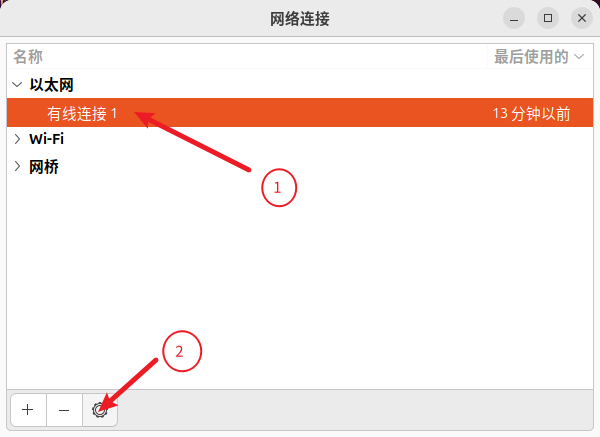
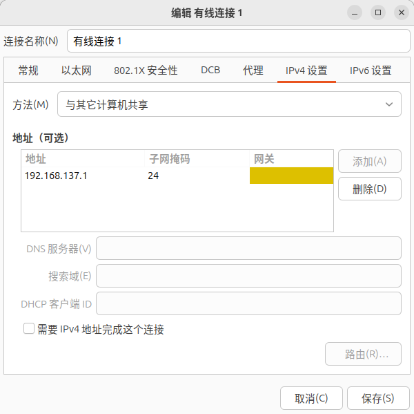
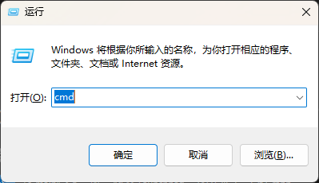
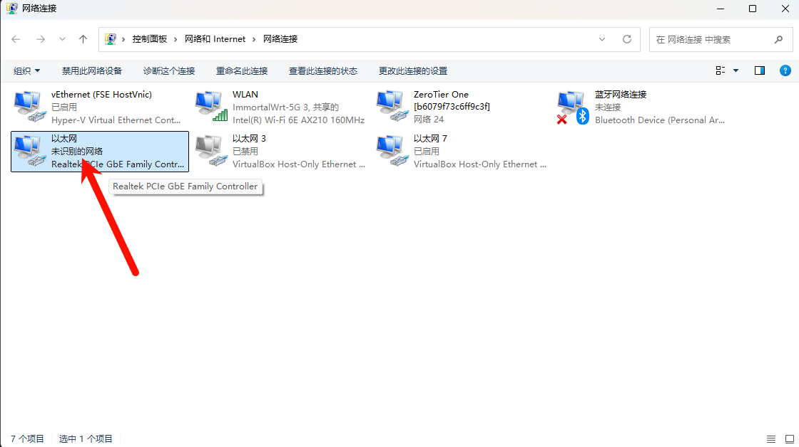
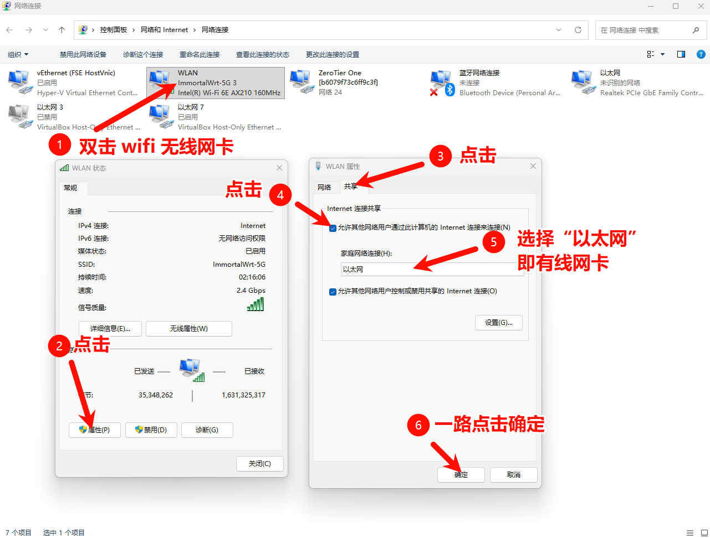
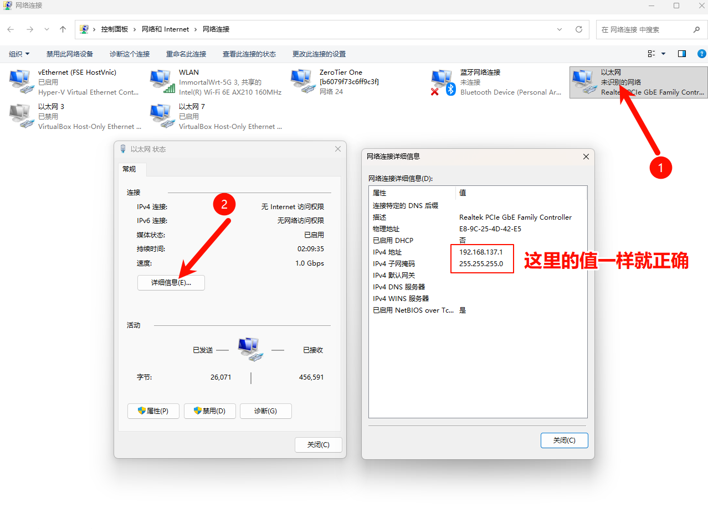
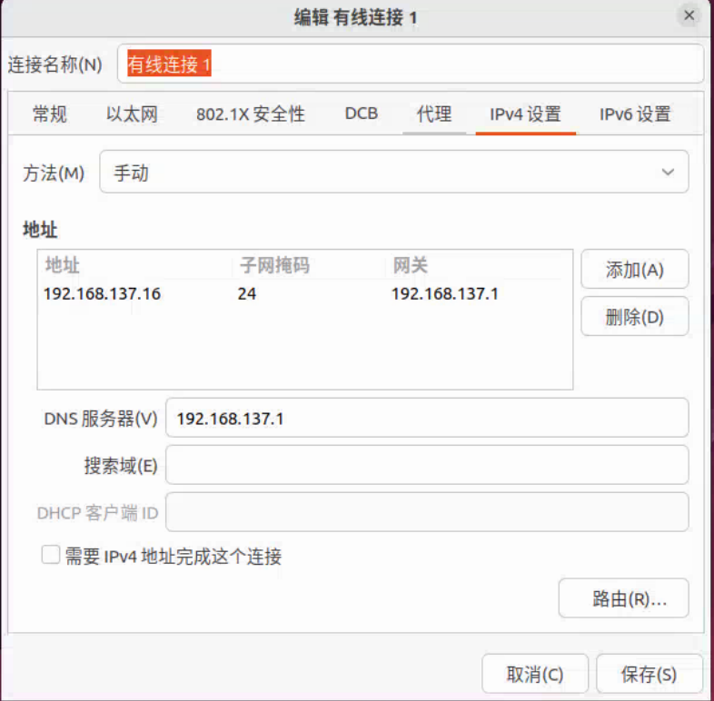

# 网络共享

负责共享网络的设备称之为服务端，想要联网的设备称为客户端，服务端需要有有线网卡和无线网卡

## 服务端

- 环境：Ubuntu 22.04

### Linux

打开“网络连接”设置网络共享

```bash
nm-connection-editor
```

打开设置



在`IPv4`设置中设置`方法`为`与其他计算机共享`，`添加` ip 地址和子网掩码



### Windows

快捷键`Win + r`打开 “运行” ，输入`cmd`打开终端



输入以下命令打开“网络连接”

```shell
ncpa.cpl
```

这里的“以太网”是你的网口，名称可能不一样，但会有`Realtek PCIe GbE`这种字样

WNAL 是你的 WIFI 网卡，会有你网卡的名称，像我的网卡是 AX210 ，这里就有显示





验证



## 客户端

打开“网络连接”设置网络共享

```bash
nm-connection-editor
```

打开设置


设置静态 ip

