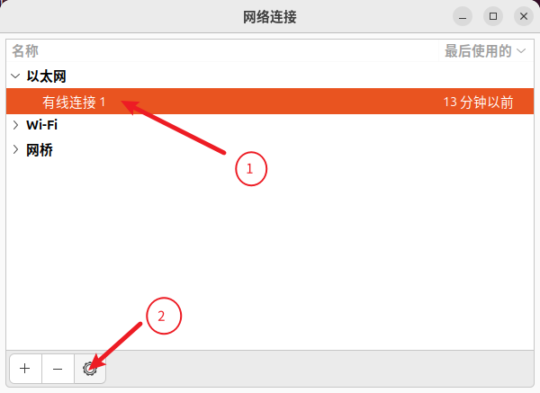
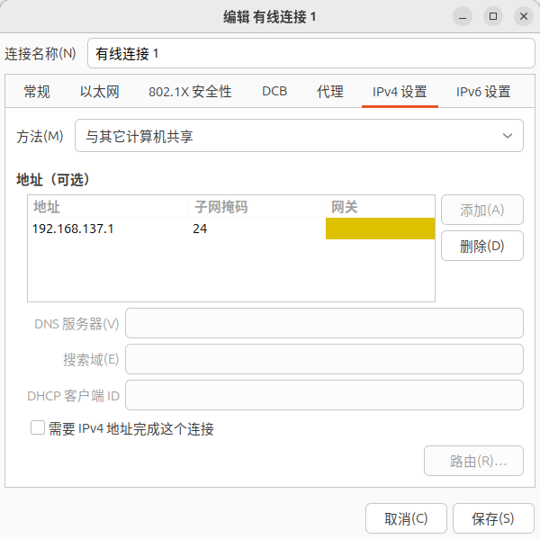
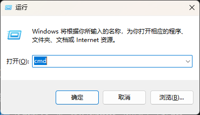
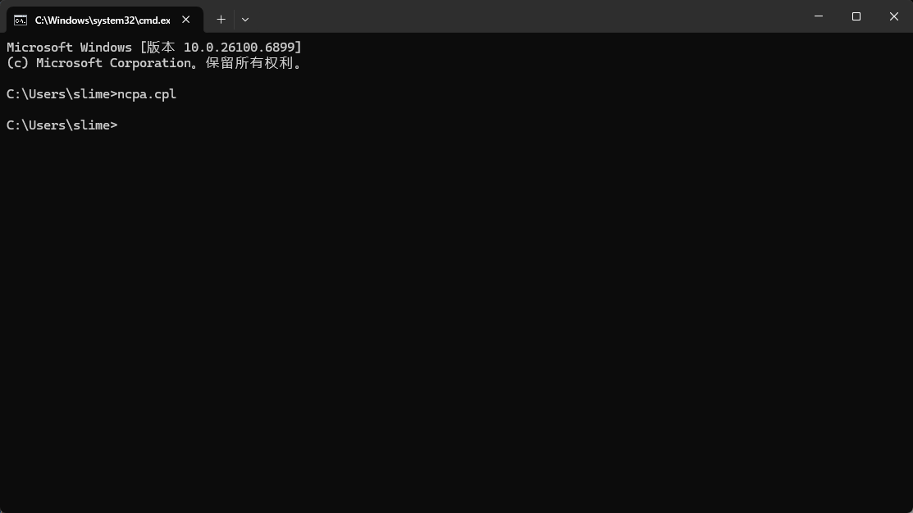
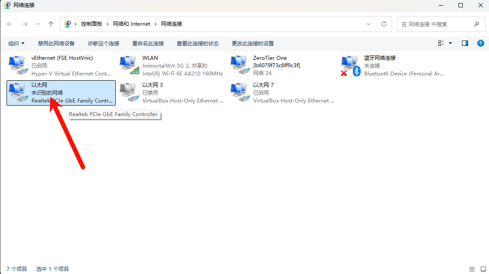
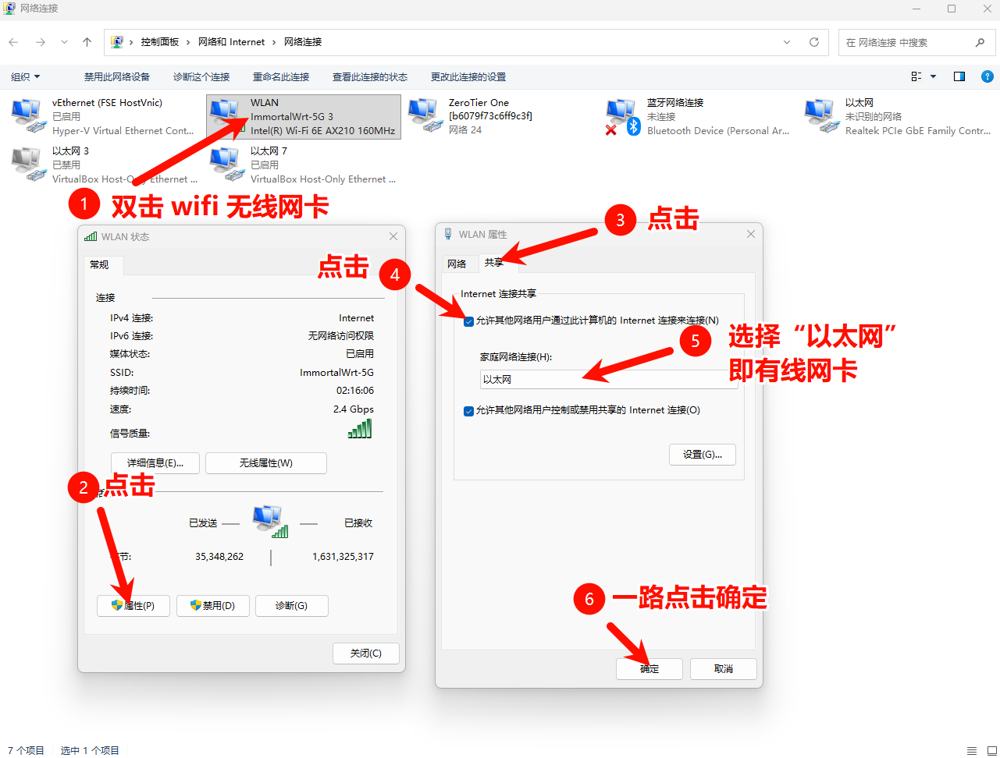
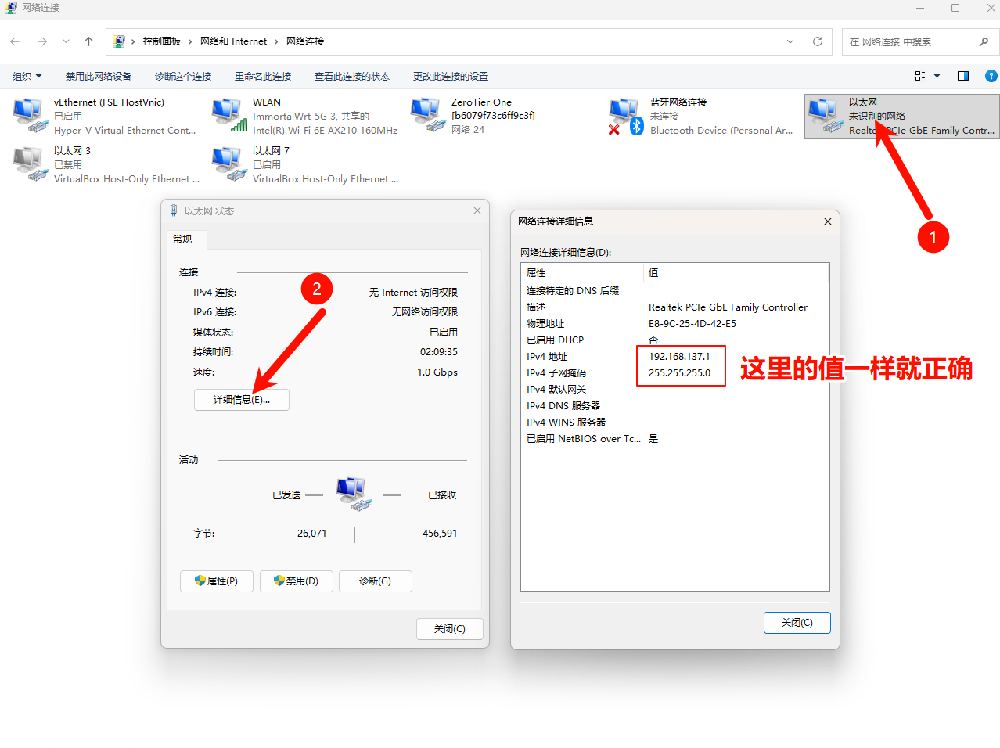
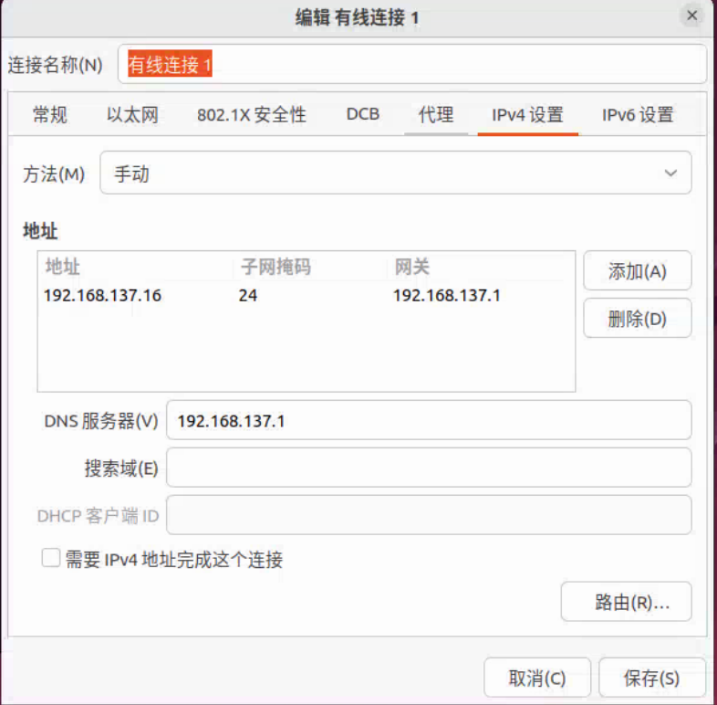

# 网络共享

负责共享网络的设备称之为服务端，想要联网的设备称为客户端，服务端需要有有线网卡和无线网卡

## 服务端

- 环境：Ubuntu 22.04

### Linux

#### 设置静态地址

打开“网络连接”设置网络共享

```bash
nm-connection-editor
```

打开设置



在`IPv4`设置中设置`方法`为`与其他计算机共享`，`添加` ip 地址和子网掩码



#### 启动包转发

检查当前的包转发设置

```bash 
sysctl -a | grep forward

# 需要有以下输出，没有的话在 /etc/sysctl.conf 中写入以下内容
# net.ipv4.ip_forward = 1
# net.ipv4.conf.all.forwarding = 1
# net.ipv6.conf.all.forwarding = 1
```

#### 启用 NAT

启用 NAT 来将无线网卡的网络供给有线网卡

这里默认 net0 为有线网卡，internet0 为无线网卡，使用`ip a`查看网卡名称

```bash
iptables -t nat -A POSTROUTING -o internet0 -j MASQUERADE
iptables -A FORWARD -m conntrack --ctstate RELATED,ESTABLISHED -j ACCEPT
iptables -A FORWARD -i net0 -o internet0 -j ACCEPT
```

> 该命令重启后会失效，如想一直使用建议写入自启动脚本

> 参考资料：[网络分享](https://wiki.archlinuxcn.org/wiki/%E7%BD%91%E7%BB%9C%E5%88%86%E4%BA%AB#)

### Windows

快捷键`Win + r`打开 “运行” ，输入`cmd`打开终端



输入以下命令打开“网络连接”

```shell
ncpa.cpl
```



这里的“以太网”是你的网口，名称可能不一样，但会有`Realtek PCIe GbE`这种字样

WNAL 是你的 WIFI 网卡，会有你网卡的名称，像我的网卡是 AX210 ，这里就有显示





验证



## 客户端

在服务端配置好后其实服务端就有 DHCP 能力了，但由于客户端的IP地址可能会改变，所以这里直接设置成静态地址

打开“网络连接”设置网络共享

```bash
nm-connection-editor
```

打开设置


设置静态 ip



## 扫描 HDCP 下发的 IP 地址

```bash
# Linux
sudo apt-get install nmap
nmap 192.168.137.1/24
```

## 其他方法

这里 RJ45 有线网卡为`net0`，无线网卡为`internet0`，可以使用以下 udev 规则修改网卡名称

```bash
# 将有线网卡重命名为 net0
SUBSYSTEM=="net", ACTION=="add", DRIVERS=="?*", ATTR{address}=="e8:9c:25:4d:42:e5", NAME="net0"

# 将无线网卡重命名为 internet0
SUBSYSTEM=="net", ACTION=="add", DRIVERS=="?*", ATTR{address}=="98:59:7a:d8:96:86", NAME="internet0"
```

```bash
# 显式地创建一个连接，将它绑定到现在的内网口 net0，并配置为共享模式
nmcli connection add type ethernet ifname net0 con-name "My_Share" ipv4.method shared ipv4.addresses 192.168.137.1/24
# 激活新连接
nmcli connection up "My_Share"
# 确保 IP 转发已开启
sudo sysctl -w net.ipv4.ip_forward=1
```
 
## 常见问题

1. 设置后客户端无法上网

在 Linux 服务端中，**Docker** 守护进程启动时，默认会将 iptables 里的 FORWARD 链（转发链）策略强制修改为 DROP。NetworkManager 的 shared 模式会自动配置 NAT 规则，但由于 FORWARD 默认被 Docker 改为了拒绝，导致 Host 接收到来自 Pi 的外网数据包后，直接在内核层被防火墙丢弃

```bash
# 查看当前 FORWARD 策略
sudo iptables -L FORWARD -n | head -n 3
# 如果输出的第一行包含 Chain FORWARD (policy DROP)
# 则证实服务端端 Docker 拦截了 FORWARD 转发流量
# 放行所有转发
sudo iptables -P FORWARD ACCEPT
```

2. 无法让客户端通过服务端的虚拟网卡（TUN模式）

```bash
# 服务端无条件放行来自 net0 的所有转发流量
sudo iptables -I FORWARD -i net0 -j ACCEPT
```

