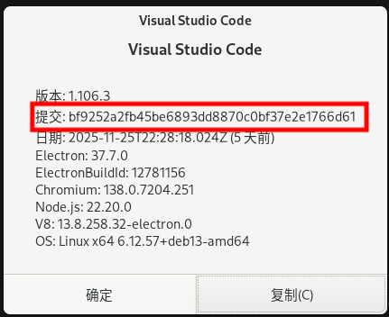

# 手动安装 VS Code Server 教程 (解决 SSH 连接下载卡死)

在 VS Code 使用 SSH 连接远程服务器时，VS Code 会自动在服务器端下载组件。如果服务器网络不佳，经常会卡在 "Downloading VS Code Server..." 或直接失败。

**解决方案：** 在本地电脑（或网络好的环境）先下载好安装包，手动上传到服务器进行安装。

-----

## 第一步：获取版本号 (Commit ID)

我们需要确保服务器端安装的版本与你本地 VS Code 的版本完全一致。

1.  在本地电脑打开 VS Code。
2.  点击顶部菜单栏的 `帮助 (Help)` -\> `关于 (About)`。
3.  找到 **提交 (Commit)** 这一行的字符串，复制它。



-----

## 第二步：下载安装包 (本地操作)

在这一步，请在**你自己的电脑**上下载以下两个文件。

> **注意**：请将下方链接中的 `${commit_id}` 替换为你刚才复制的实际 ID。

你可以直接在浏览器中访问下载，也可以在终端使用命令下载：

**1. VS Code Server (Linux x64):**

> `https://vscode.download.prss.microsoft.com/dbazure/download/stable/${commit_id}/vscode-server-linux-x64.tar.gz`

**2. VS Code CLI:**

> `https://vscode.download.prss.microsoft.com/dbazure/download/stable/${commit_id}/vscode_cli_alpine_x64_cli.tar.gz`

-----

## 第三步：上传并安装 (服务器端操作)

### 1\. 上传文件

请使用 SFTP 工具（如 FileZilla、WinSCP）或 `scp` 命令，将刚才下载的两个 `.tar.gz` 压缩包上传到服务器的任意目录（例如 `~/` 用户主目录）。

### 2\. 解压与安装

登录到远程服务器，在存放压缩包的目录下，**一次性复制并运行**以下脚本。

> **⚠️ 重要：** 运行前，请将第一行的 `你的commit_id` 替换为实际的 ID。

```bash
# === 配置区域 ===
# 请在此处填入之前获取的 Commit ID
commit_id=你的commit_id

# === 开始安装 ===
echo "正在准备安装目录..."
# 创建原本自动安装时会生成的目录结构
mkdir -p ~/.vscode-server/bin
mkdir -p ~/.vscode-server/cli/servers/Stable-${commit_id}

echo "正在解压文件..."
# 解压 Server 包
tar -zxf vscode-server-linux-x64.tar.gz
# 解压 CLI 包
tar -zxf vscode_cli_alpine_x64_cli.tar.gz

echo "正在移动文件到指定位置..."
# 移动 Server 文件
# 注意：若提示目录非空或已存在，可忽略或手动清理旧文件
mv vscode-server-linux-x64 ~/.vscode-server/cli/servers/Stable-${commit_id}/server

# 移动 CLI 工具 (code)
mv code ~/.vscode-server/code-${commit_id}

echo "安装完成！现在可以尝试重新连接 SSH 了。"
```

### 3\. 清理 (可选)

安装成功并验证连接无误后，你可以删除那两个 `.tar.gz` 压缩包以节省空间：

```bash
rm vscode-server-linux-x64.tar.gz vscode_cli_alpine_x64_cli.tar.gz
```

-----

至此大功告成！现在重新在 VS Code 中连接 SSH，应该会跳过下载阶段，直接连接成功。

-----

