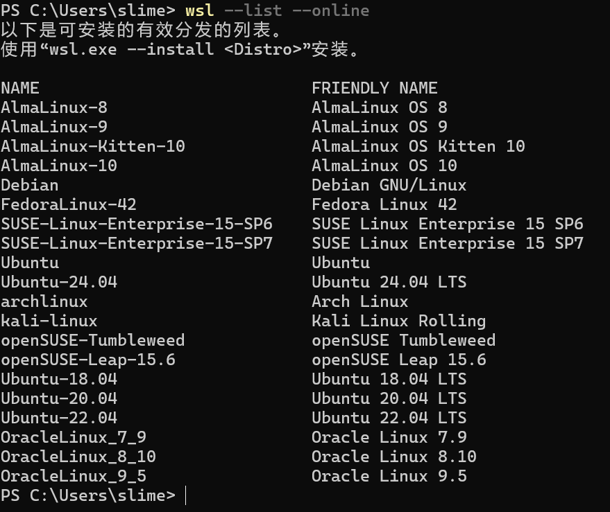
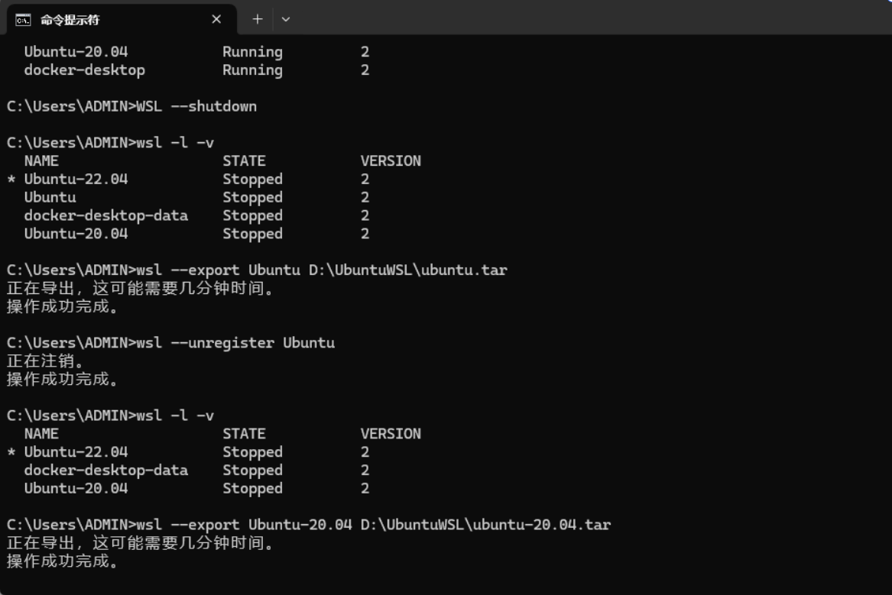
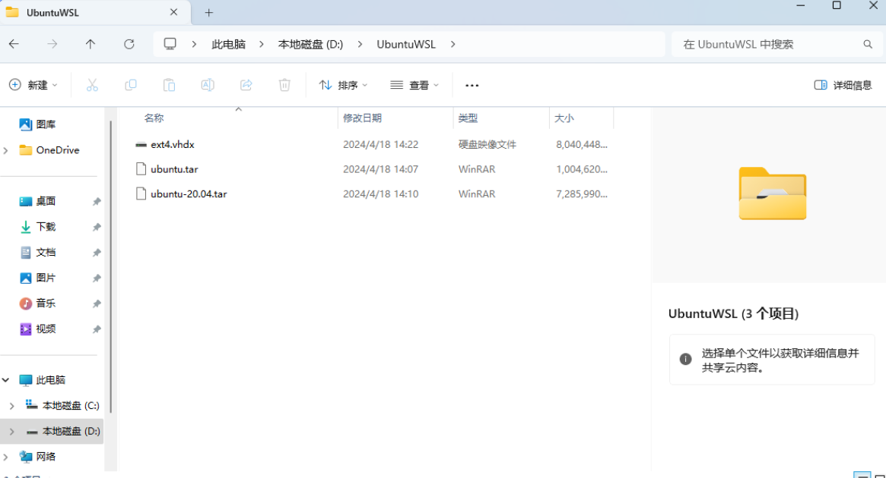

# WSL2

WSL2 (*Windows Subsystem for Linux* ) 是Windows上运行Linux发行版的最新架构。它使用虚拟化技术和Linux内核，提供更好的文件系统性能和完整的系统调用兼容性，从而支持更多的Linux应用程序和工作流程

## 安装

条件：Windows 10 版本 2004 和更新版本（組建 19041 和更新版本）或 Windows 11

- 以管理员身份启动``cmd`或`powershell`

```bash
wsl --install
```

- 查看可安装发行版

```bash
wsl --list --online
```



- 选择想安装的发行版的``NAME`

```bash
wsl --install -d <Name>
```

之后会让你输入用户名和密码

## [连接USB设备](https://learn.microsoft.com/zh-cn/windows/wsl/connect-usb)

使用 USB/IP 开源项目 [usbipd-win](https://github.com/dorssel/usbipd-win) 将 USB 设备连接到 WSL 2 

### 安装 USBIPD-WIN 项目

```bash
winget install --interactive --exact dorssel.usbipd-win
```

### 连接 USB 设备

```bash
# 显示 USB 设备
usbipd list

# 共享设备 必须使用管理员身份运行
usbipd bind --busid 4-4

# 附加 USB 设备
usbipd attach --wsl --busid <busid>

# 断开 USB 设备
usbipd detach --busid <busid>
```

## NVIDIA驱动

只要windows本体有安装显卡驱动，wsl会自动有的

输入`nvidia-smi`，如果有输出就是wsl有驱动了

## 迁移到其他盘

- 先关闭 WSL

```bash
WSL --shutdown
```



- 在D盘中创建UbuntuWSL文件夹：



- 以压缩包的形式导出到其他盘

```bash
wsl --export Ubuntu-20.04 E:\UbuntuWSL\ubuntu-20.04.tar
```

- 注销原有的linux系统

```bash
wsl --unregister Ubuntu-20.04
```

- 查看是否真的注销成功

```bash
wsl -l -v
```

- 导入系统

```bash
# wsl --import <导入的Linux名称> <导入盘的路径> <ubuntu.tar的路径> --version 2 (代表wsl2)
wsl --import Ubuntu-20.04 E:\UbuntuWSL\ E:\UbuntuWSL\ubuntu-20.04.tar --version 2
```

## 常见问题

### 终端卡顿、无响应

尝试关闭Docker Destop（如果有）

https://github.com/microsoft/WSL/issues/12830#issuecomment-2928886936